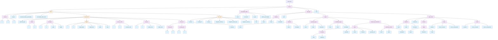

```mermaid
flowchart TD
    root["ferritic IDS"]

    n1[ferritic]
    root --> n1
    class n1 normalNode
    n2(object)
    n1 --> n2
    class n2 complexNode
    n3[centroid]
    n2 --> n3
    class n3 normalNode
    n4[x]
    n3 --> n4
    class n4 leafNode
    n5[y]
    n3 --> n5
    class n5 leafNode
    n6[z]
    n3 --> n6
    class n6 leafNode
    n7[volume]
    n2 --> n7
    class n7 leafNode
    n8[saturated_relative_permeability]
    n2 --> n8
    class n8 leafNode
    n9[permeability_table_index]
    n2 --> n9
    class n9 leafNode
    n10(axisymmetric)
    n2 --> n10
    class n10 complexNode
    n11[geometry_type]
    n10 --> n11
    class n11 leafNode
    n12[outline]
    n10 --> n12
    class n12 normalNode
    n13[r]
    n12 --> n13
    class n13 leafNode
    n14[z]
    n12 --> n14
    class n14 leafNode
    n15[rectangle]
    n10 --> n15
    class n15 normalNode
    n16[r]
    n15 --> n16
    class n16 leafNode
    n17[z]
    n15 --> n17
    class n17 leafNode
    n18[width]
    n15 --> n18
    class n18 leafNode
    n19[height]
    n15 --> n19
    class n19 leafNode
    n20(oblique)
    n10 --> n20
    class n20 complexNode
    n21[r]
    n20 --> n21
    class n21 leafNode
    n22[z]
    n20 --> n22
    class n22 leafNode
    n23[length_alpha]
    n20 --> n23
    class n23 leafNode
    n24[length_beta]
    n20 --> n24
    class n24 leafNode
    n25[alpha]
    n20 --> n25
    class n25 leafNode
    n26[beta]
    n20 --> n26
    class n26 leafNode
    n27[arcs_of_circle]
    n10 --> n27
    class n27 normalNode
    n28[r]
    n27 --> n28
    class n28 leafNode
    n29[z]
    n27 --> n29
    class n29 leafNode
    n30[curvature_radii]
    n27 --> n30
    class n30 leafNode
    n31[annulus]
    n10 --> n31
    class n31 normalNode
    n32[r]
    n31 --> n32
    class n32 leafNode
    n33[z]
    n31 --> n33
    class n33 leafNode
    n34[radius_inner]
    n31 --> n34
    class n34 leafNode
    n35[radius_outer]
    n31 --> n35
    class n35 leafNode
    n36[thick_line]
    n10 --> n36
    class n36 normalNode
    n37[first_point]
    n36 --> n37
    class n37 normalNode
    n38[r]
    n37 --> n38
    class n38 leafNode
    n39[z]
    n37 --> n39
    class n39 leafNode
    n40[second_point]
    n36 --> n40
    class n40 normalNode
    n41[r]
    n40 --> n41
    class n41 leafNode
    n42[z]
    n40 --> n42
    class n42 leafNode
    n43[thickness]
    n36 --> n43
    class n43 leafNode
    n44(time_slice)
    n2 --> n44
    class n44 complexNode
    n45[b_field_r]
    n44 --> n45
    class n45 leafNode
    n46[b_field_phi]
    n44 --> n46
    class n46 leafNode
    n47[b_field_z]
    n44 --> n47
    class n47 leafNode
    n48[magnetic_moment_r]
    n44 --> n48
    class n48 leafNode
    n49[magnetic_moment_phi]
    n44 --> n49
    class n49 leafNode
    n50[magnetic_moment_z]
    n44 --> n50
    class n50 leafNode
    n51[time]
    n44 --> n51
    class n51 leafNode
    n52[permeability_table]
    n1 --> n52
    class n52 normalNode
    n53[name]
    n52 --> n53
    class n53 leafNode
    n54[description]
    n52 --> n54
    class n54 leafNode
    n55[b_field]
    n52 --> n55
    class n55 leafNode
    n56[relative_permeability]
    n52 --> n56
    class n56 leafNode
    n57[grid_ggd]
    n1 --> n57
    class n57 normalNode
    n58[identifier]
    n57 --> n58
    class n58 normalNode
    n59[name]
    n58 --> n59
    class n59 leafNode
    n60[index]
    n58 --> n60
    class n60 leafNode
    n61[description]
    n58 --> n61
    class n61 leafNode
    n62[path]
    n57 --> n62
    class n62 leafNode
    n63[space]
    n57 --> n63
    class n63 normalNode
    n64[identifier]
    n63 --> n64
    class n64 normalNode
    n65[name]
    n64 --> n65
    class n65 leafNode
    n66[index]
    n64 --> n66
    class n66 leafNode
    n67[description]
    n64 --> n67
    class n67 leafNode
    n68[geometry_type]
    n63 --> n68
    class n68 normalNode
    n69[name]
    n68 --> n69
    class n69 leafNode
    n70[index]
    n68 --> n70
    class n70 leafNode
    n71[description]
    n68 --> n71
    class n71 leafNode
    n72[coordinates_type]
    n63 --> n72
    class n72 normalNode
    n73[name]
    n72 --> n73
    class n73 leafNode
    n74[index]
    n72 --> n74
    class n74 leafNode
    n75[description]
    n72 --> n75
    class n75 leafNode
    n76[objects_per_dimension]
    n63 --> n76
    class n76 normalNode
    n77[object]
    n76 --> n77
    class n77 normalNode
    n78[boundary]
    n77 --> n78
    class n78 normalNode
    n79[index]
    n78 --> n79
    class n79 leafNode
    n80[neighbours]
    n78 --> n80
    class n80 leafNode
    n81[geometry]
    n77 --> n81
    class n81 leafNode
    n82[nodes]
    n77 --> n82
    class n82 leafNode
    n83[measure]
    n77 --> n83
    class n83 leafNode
    n84[geometry_2d]
    n77 --> n84
    class n84 leafNode
    n85[geometry_content]
    n76 --> n85
    class n85 normalNode
    n86[name]
    n85 --> n86
    class n86 leafNode
    n87[index]
    n85 --> n87
    class n87 leafNode
    n88[description]
    n85 --> n88
    class n88 leafNode
    n89[grid_subset]
    n57 --> n89
    class n89 normalNode
    n90[identifier]
    n89 --> n90
    class n90 normalNode
    n91[name]
    n90 --> n91
    class n91 leafNode
    n92[index]
    n90 --> n92
    class n92 leafNode
    n93[description]
    n90 --> n93
    class n93 leafNode
    n94[dimension]
    n89 --> n94
    class n94 leafNode
    n95[element]
    n89 --> n95
    class n95 normalNode
    n96[object]
    n95 --> n96
    class n96 normalNode
    n97[space]
    n96 --> n97
    class n97 leafNode
    n98[dimension]
    n96 --> n98
    class n98 leafNode
    n99[index]
    n96 --> n99
    class n99 leafNode
    n100[base]
    n89 --> n100
    class n100 normalNode
    n101[jacobian]
    n100 --> n101
    class n101 leafNode
    n102[tensor_covariant]
    n100 --> n102
    class n102 leafNode
    n103[tensor_contravariant]
    n100 --> n103
    class n103 leafNode
    n104[metric]
    n89 --> n104
    class n104 normalNode
    n105[jacobian]
    n104 --> n105
    class n105 leafNode
    n106[tensor_covariant]
    n104 --> n106
    class n106 leafNode
    n107[tensor_contravariant]
    n104 --> n107
    class n107 leafNode
    n108[time]
    n1 --> n108
    class n108 leafNode

    classDef leafNode fill:#e1f5fe
    classDef complexNode fill:#fff3e0
    classDef normalNode fill:#f3e5f5
    classDef moreNode fill:#f5f5f5,stroke-dasharray: 5 5
```