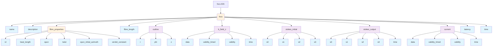

```mermaid
flowchart TD
    root["focs IDS"]

    n1(focs)
    root --> n1
    class n1 complexNode
    n2[name]
    n1 --> n2
    class n2 leafNode
    n3[description]
    n1 --> n3
    class n3 leafNode
    n4(fibre_properties)
    n1 --> n4
    class n4 complexNode
    n5[id]
    n4 --> n5
    class n5 leafNode
    n6[beat_length]
    n4 --> n6
    class n6 leafNode
    n7[spun]
    n4 --> n7
    class n7 leafNode
    n8[twist]
    n4 --> n8
    class n8 leafNode
    n9[spun_initial_azimuth]
    n4 --> n9
    class n9 leafNode
    n10[verdet_constant]
    n4 --> n10
    class n10 leafNode
    n11[fibre_length]
    n1 --> n11
    class n11 leafNode
    n12[outline]
    n1 --> n12
    class n12 normalNode
    n13[r]
    n12 --> n13
    class n13 leafNode
    n14[phi]
    n12 --> n14
    class n14 leafNode
    n15[z]
    n12 --> n15
    class n15 leafNode
    n16[b_field_z]
    n1 --> n16
    class n16 normalNode
    n17[data]
    n16 --> n17
    class n17 leafNode
    n18[validity_timed]
    n16 --> n18
    class n18 leafNode
    n19[validity]
    n16 --> n19
    class n19 leafNode
    n20[time]
    n16 --> n20
    class n20 leafNode
    n21[stokes_initial]
    n1 --> n21
    class n21 normalNode
    n22[s0]
    n21 --> n22
    class n22 leafNode
    n23[s1]
    n21 --> n23
    class n23 leafNode
    n24[s2]
    n21 --> n24
    class n24 leafNode
    n25[s3]
    n21 --> n25
    class n25 leafNode
    n26[stokes_output]
    n1 --> n26
    class n26 normalNode
    n27[s0]
    n26 --> n27
    class n27 leafNode
    n28[s1]
    n26 --> n28
    class n28 leafNode
    n29[s2]
    n26 --> n29
    class n29 leafNode
    n30[s3]
    n26 --> n30
    class n30 leafNode
    n31[time]
    n26 --> n31
    class n31 leafNode
    n32[current]
    n1 --> n32
    class n32 normalNode
    n33[data]
    n32 --> n33
    class n33 leafNode
    n34[validity_timed]
    n32 --> n34
    class n34 leafNode
    n35[validity]
    n32 --> n35
    class n35 leafNode
    n36[time]
    n32 --> n36
    class n36 leafNode
    n37[latency]
    n1 --> n37
    class n37 leafNode
    n38[time]
    n1 --> n38
    class n38 leafNode

    classDef leafNode fill:#e1f5fe
    classDef complexNode fill:#fff3e0
    classDef normalNode fill:#f3e5f5
    classDef moreNode fill:#f5f5f5,stroke-dasharray: 5 5
```