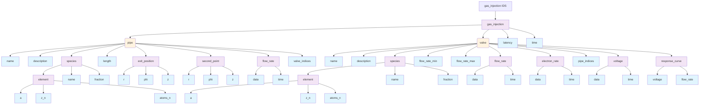

```mermaid
flowchart TD
    root["gas_injection IDS"]

    n1[gas_injection]
    root --> n1
    class n1 normalNode
    n2(pipe)
    n1 --> n2
    class n2 complexNode
    n3[name]
    n2 --> n3
    class n3 leafNode
    n4[description]
    n2 --> n4
    class n4 leafNode
    n5[species]
    n2 --> n5
    class n5 normalNode
    n6[element]
    n5 --> n6
    class n6 normalNode
    n7[a]
    n6 --> n7
    class n7 leafNode
    n8[z_n]
    n6 --> n8
    class n8 leafNode
    n9[atoms_n]
    n6 --> n9
    class n9 leafNode
    n10[name]
    n5 --> n10
    class n10 leafNode
    n11[fraction]
    n5 --> n11
    class n11 leafNode
    n12[length]
    n2 --> n12
    class n12 leafNode
    n13[exit_position]
    n2 --> n13
    class n13 normalNode
    n14[r]
    n13 --> n14
    class n14 leafNode
    n15[phi]
    n13 --> n15
    class n15 leafNode
    n16[z]
    n13 --> n16
    class n16 leafNode
    n17[second_point]
    n2 --> n17
    class n17 normalNode
    n18[r]
    n17 --> n18
    class n18 leafNode
    n19[phi]
    n17 --> n19
    class n19 leafNode
    n20[z]
    n17 --> n20
    class n20 leafNode
    n21[flow_rate]
    n2 --> n21
    class n21 normalNode
    n22[data]
    n21 --> n22
    class n22 leafNode
    n23[time]
    n21 --> n23
    class n23 leafNode
    n24[valve_indices]
    n2 --> n24
    class n24 leafNode
    n25(valve)
    n1 --> n25
    class n25 complexNode
    n26[name]
    n25 --> n26
    class n26 leafNode
    n27[description]
    n25 --> n27
    class n27 leafNode
    n28[species]
    n25 --> n28
    class n28 normalNode
    n29[element]
    n28 --> n29
    class n29 normalNode
    n30[a]
    n29 --> n30
    class n30 leafNode
    n31[z_n]
    n29 --> n31
    class n31 leafNode
    n32[atoms_n]
    n29 --> n32
    class n32 leafNode
    n33[name]
    n28 --> n33
    class n33 leafNode
    n34[fraction]
    n28 --> n34
    class n34 leafNode
    n35[flow_rate_min]
    n25 --> n35
    class n35 leafNode
    n36[flow_rate_max]
    n25 --> n36
    class n36 leafNode
    n37[flow_rate]
    n25 --> n37
    class n37 normalNode
    n38[data]
    n37 --> n38
    class n38 leafNode
    n39[time]
    n37 --> n39
    class n39 leafNode
    n40[electron_rate]
    n25 --> n40
    class n40 normalNode
    n41[data]
    n40 --> n41
    class n41 leafNode
    n42[time]
    n40 --> n42
    class n42 leafNode
    n43[pipe_indices]
    n25 --> n43
    class n43 leafNode
    n44[voltage]
    n25 --> n44
    class n44 normalNode
    n45[data]
    n44 --> n45
    class n45 leafNode
    n46[time]
    n44 --> n46
    class n46 leafNode
    n47[response_curve]
    n25 --> n47
    class n47 normalNode
    n48[voltage]
    n47 --> n48
    class n48 leafNode
    n49[flow_rate]
    n47 --> n49
    class n49 leafNode
    n50[latency]
    n1 --> n50
    class n50 leafNode
    n51[time]
    n1 --> n51
    class n51 leafNode

    classDef leafNode fill:#e1f5fe
    classDef complexNode fill:#fff3e0
    classDef normalNode fill:#f3e5f5
    classDef moreNode fill:#f5f5f5,stroke-dasharray: 5 5
```