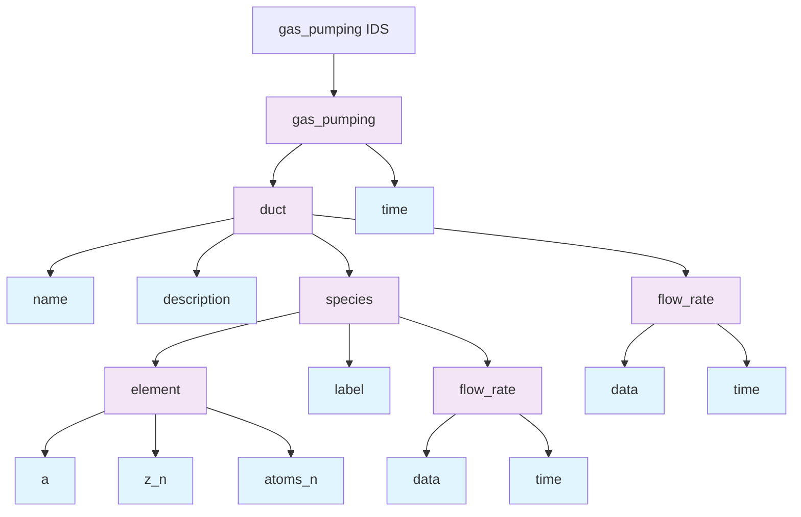

```mermaid
flowchart TD
    root["gas_pumping IDS"]

    n1[gas_pumping]
    root --> n1
    class n1 normalNode
    n2[duct]
    n1 --> n2
    class n2 normalNode
    n3[name]
    n2 --> n3
    class n3 leafNode
    n4[description]
    n2 --> n4
    class n4 leafNode
    n5[species]
    n2 --> n5
    class n5 normalNode
    n6[element]
    n5 --> n6
    class n6 normalNode
    n7[a]
    n6 --> n7
    class n7 leafNode
    n8[z_n]
    n6 --> n8
    class n8 leafNode
    n9[atoms_n]
    n6 --> n9
    class n9 leafNode
    n10[label]
    n5 --> n10
    class n10 leafNode
    n11[flow_rate]
    n5 --> n11
    class n11 normalNode
    n12[data]
    n11 --> n12
    class n12 leafNode
    n13[time]
    n11 --> n13
    class n13 leafNode
    n14[flow_rate]
    n2 --> n14
    class n14 normalNode
    n15[data]
    n14 --> n15
    class n15 leafNode
    n16[time]
    n14 --> n16
    class n16 leafNode
    n17[time]
    n1 --> n17
    class n17 leafNode

    classDef leafNode fill:#e1f5fe
    classDef complexNode fill:#fff3e0
    classDef normalNode fill:#f3e5f5
    classDef moreNode fill:#f5f5f5,stroke-dasharray: 5 5
```