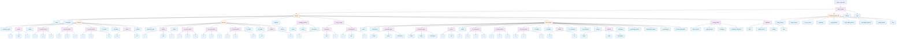

```mermaid
flowchart TD
    root["hard_x_rays IDS"]

    n1[hard_x_rays]
    root --> n1
    class n1 normalNode
    n2(channel)
    n1 --> n2
    class n2 complexNode
    n3[name]
    n2 --> n3
    class n3 leafNode
    n4[description]
    n2 --> n4
    class n4 leafNode
    n5(detector)
    n2 --> n5
    class n5 complexNode
    n6[geometry_type]
    n5 --> n6
    class n6 leafNode
    n7[centre]
    n5 --> n7
    class n7 normalNode
    n8[r]
    n7 --> n8
    class n8 leafNode
    n9[phi]
    n7 --> n9
    class n9 leafNode
    n10[z]
    n7 --> n10
    class n10 leafNode
    n11[radius]
    n5 --> n11
    class n11 leafNode
    n12[x1_unit_vector]
    n5 --> n12
    class n12 normalNode
    n13[x]
    n12 --> n13
    class n13 leafNode
    n14[y]
    n12 --> n14
    class n14 leafNode
    n15[z]
    n12 --> n15
    class n15 leafNode
    n16[x2_unit_vector]
    n5 --> n16
    class n16 normalNode
    n17[x]
    n16 --> n17
    class n17 leafNode
    n18[y]
    n16 --> n18
    class n18 leafNode
    n19[z]
    n16 --> n19
    class n19 leafNode
    n20[x3_unit_vector]
    n5 --> n20
    class n20 normalNode
    n21[x]
    n20 --> n21
    class n21 leafNode
    n22[y]
    n20 --> n22
    class n22 leafNode
    n23[z]
    n20 --> n23
    class n23 leafNode
    n24[x1_width]
    n5 --> n24
    class n24 leafNode
    n25[x2_width]
    n5 --> n25
    class n25 leafNode
    n26[outline]
    n5 --> n26
    class n26 normalNode
    n27[x1]
    n26 --> n27
    class n27 leafNode
    n28[x2]
    n26 --> n28
    class n28 leafNode
    n29[surface]
    n5 --> n29
    class n29 leafNode
    n30(aperture)
    n2 --> n30
    class n30 complexNode
    n31[geometry_type]
    n30 --> n31
    class n31 leafNode
    n32[centre]
    n30 --> n32
    class n32 normalNode
    n33[r]
    n32 --> n33
    class n33 leafNode
    n34[phi]
    n32 --> n34
    class n34 leafNode
    n35[z]
    n32 --> n35
    class n35 leafNode
    n36[radius]
    n30 --> n36
    class n36 leafNode
    n37[x1_unit_vector]
    n30 --> n37
    class n37 normalNode
    n38[x]
    n37 --> n38
    class n38 leafNode
    n39[y]
    n37 --> n39
    class n39 leafNode
    n40[z]
    n37 --> n40
    class n40 leafNode
    n41[x2_unit_vector]
    n30 --> n41
    class n41 normalNode
    n42[x]
    n41 --> n42
    class n42 leafNode
    n43[y]
    n41 --> n43
    class n43 leafNode
    n44[z]
    n41 --> n44
    class n44 leafNode
    n45[x3_unit_vector]
    n30 --> n45
    class n45 normalNode
    n46[x]
    n45 --> n46
    class n46 leafNode
    n47[y]
    n45 --> n47
    class n47 leafNode
    n48[z]
    n45 --> n48
    class n48 leafNode
    n49[x1_width]
    n30 --> n49
    class n49 leafNode
    n50[x2_width]
    n30 --> n50
    class n50 leafNode
    n51[outline]
    n30 --> n51
    class n51 normalNode
    n52[x1]
    n51 --> n52
    class n52 leafNode
    n53[x2]
    n51 --> n53
    class n53 leafNode
    n54[surface]
    n30 --> n54
    class n54 leafNode
    n55[etendue]
    n2 --> n55
    class n55 leafNode
    n56[etendue_method]
    n2 --> n56
    class n56 normalNode
    n57[name]
    n56 --> n57
    class n57 leafNode
    n58[index]
    n56 --> n58
    class n58 leafNode
    n59[description]
    n56 --> n59
    class n59 leafNode
    n60[line_of_sight]
    n2 --> n60
    class n60 normalNode
    n61[first_point]
    n60 --> n61
    class n61 normalNode
    n62[r]
    n61 --> n62
    class n62 leafNode
    n63[phi]
    n61 --> n63
    class n63 leafNode
    n64[z]
    n61 --> n64
    class n64 leafNode
    n65[second_point]
    n60 --> n65
    class n65 normalNode
    n66[r]
    n65 --> n66
    class n66 leafNode
    n67[phi]
    n65 --> n67
    class n67 leafNode
    n68[z]
    n65 --> n68
    class n68 leafNode
    n69(filter_window)
    n2 --> n69
    class n69 complexNode
    n70[name]
    n69 --> n70
    class n70 leafNode
    n71[description]
    n69 --> n71
    class n71 leafNode
    n72[geometry_type]
    n69 --> n72
    class n72 normalNode
    n73[name]
    n72 --> n73
    class n73 leafNode
    n74[index]
    n72 --> n74
    class n74 leafNode
    n75[description]
    n72 --> n75
    class n75 leafNode
    n76[curvature_type]
    n69 --> n76
    class n76 normalNode
    n77[name]
    n76 --> n77
    class n77 leafNode
    n78[index]
    n76 --> n78
    class n78 leafNode
    n79[description]
    n76 --> n79
    class n79 leafNode
    n80[centre]
    n69 --> n80
    class n80 normalNode
    n81[r]
    n80 --> n81
    class n81 leafNode
    n82[phi]
    n80 --> n82
    class n82 leafNode
    n83[z]
    n80 --> n83
    class n83 leafNode
    n84[radius]
    n69 --> n84
    class n84 leafNode
    n85[x1_unit_vector]
    n69 --> n85
    class n85 normalNode
    n86[x]
    n85 --> n86
    class n86 leafNode
    n87[y]
    n85 --> n87
    class n87 leafNode
    n88[z]
    n85 --> n88
    class n88 leafNode
    n89[x2_unit_vector]
    n69 --> n89
    class n89 normalNode
    n90[x]
    n89 --> n90
    class n90 leafNode
    n91[y]
    n89 --> n91
    class n91 leafNode
    n92[z]
    n89 --> n92
    class n92 leafNode
    n93[x3_unit_vector]
    n69 --> n93
    class n93 normalNode
    n94[x]
    n93 --> n94
    class n94 leafNode
    n95[y]
    n93 --> n95
    class n95 leafNode
    n96[z]
    n93 --> n96
    class n96 leafNode
    n97[x1_width]
    n69 --> n97
    class n97 leafNode
    n98[x2_width]
    n69 --> n98
    class n98 leafNode
    n99[outline]
    n69 --> n99
    class n99 normalNode
    n100[x1]
    n99 --> n100
    class n100 leafNode
    n101[x2]
    n99 --> n101
    class n101 leafNode
    n102[x1_curvature]
    n69 --> n102
    class n102 leafNode
    n103[x2_curvature]
    n69 --> n103
    class n103 leafNode
    n104[surface]
    n69 --> n104
    class n104 leafNode
    n105[material]
    n69 --> n105
    class n105 normalNode
    n106[name]
    n105 --> n106
    class n106 leafNode
    n107[index]
    n105 --> n107
    class n107 leafNode
    n108[description]
    n105 --> n108
    class n108 leafNode
    n109[thickness]
    n69 --> n109
    class n109 leafNode
    n110[wavelength_lower]
    n69 --> n110
    class n110 leafNode
    n111[wavelength_upper]
    n69 --> n111
    class n111 leafNode
    n112[wavelengths]
    n69 --> n112
    class n112 leafNode
    n113[photon_absorption]
    n69 --> n113
    class n113 leafNode
    n114[energy_band]
    n2 --> n114
    class n114 normalNode
    n115[lower_bound]
    n114 --> n115
    class n115 leafNode
    n116[upper_bound]
    n114 --> n116
    class n116 leafNode
    n117[energies]
    n114 --> n117
    class n117 leafNode
    n118[detection_efficiency]
    n114 --> n118
    class n118 leafNode
    n119[radiance]
    n2 --> n119
    class n119 normalNode
    n120[data]
    n119 --> n120
    class n120 leafNode
    n121[validity_timed]
    n119 --> n121
    class n121 leafNode
    n122[validity]
    n119 --> n122
    class n122 leafNode
    n123[time]
    n119 --> n123
    class n123 leafNode
    n124(emissivity_profile_1d)
    n1 --> n124
    class n124 complexNode
    n125[lower_bound]
    n124 --> n125
    class n125 leafNode
    n126[upper_bound]
    n124 --> n126
    class n126 leafNode
    n127[rho_tor_norm]
    n124 --> n127
    class n127 leafNode
    n128[emissivity]
    n124 --> n128
    class n128 leafNode
    n129[peak_position]
    n124 --> n129
    class n129 leafNode
    n130[half_width_internal]
    n124 --> n130
    class n130 leafNode
    n131[half_width_external]
    n124 --> n131
    class n131 leafNode
    n132[validity_timed]
    n124 --> n132
    class n132 leafNode
    n133[time]
    n124 --> n133
    class n133 leafNode
    n134[latency]
    n1 --> n134
    class n134 leafNode
    n135[time]
    n1 --> n135
    class n135 leafNode

    classDef leafNode fill:#e1f5fe
    classDef complexNode fill:#fff3e0
    classDef normalNode fill:#f3e5f5
    classDef moreNode fill:#f5f5f5,stroke-dasharray: 5 5
```