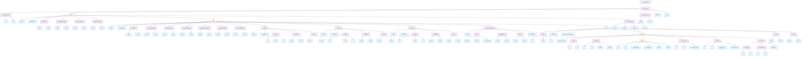

```mermaid
flowchart TD
    root["ic_antennas IDS"]

    n1[ic_antennas]
    root --> n1
    class n1 normalNode
    n2[reference_point]
    n1 --> n2
    class n2 normalNode
    n3[r]
    n2 --> n3
    class n3 leafNode
    n4[z]
    n2 --> n4
    class n4 leafNode
    n5(antenna)
    n1 --> n5
    class n5 complexNode
    n6[name]
    n5 --> n6
    class n6 leafNode
    n7[description]
    n5 --> n7
    class n7 leafNode
    n8[frequency]
    n5 --> n8
    class n8 normalNode
    n9[data]
    n8 --> n9
    class n9 leafNode
    n10[time]
    n8 --> n10
    class n10 leafNode
    n11[power_launched]
    n5 --> n11
    class n11 normalNode
    n12[data]
    n11 --> n12
    class n12 leafNode
    n13[time]
    n11 --> n13
    class n13 leafNode
    n14[power_forward]
    n5 --> n14
    class n14 normalNode
    n15[data]
    n14 --> n15
    class n15 leafNode
    n16[time]
    n14 --> n16
    class n16 leafNode
    n17[power_reflected]
    n5 --> n17
    class n17 normalNode
    n18[data]
    n17 --> n18
    class n18 leafNode
    n19[time]
    n17 --> n19
    class n19 leafNode
    n20(module)
    n5 --> n20
    class n20 complexNode
    n21[name]
    n20 --> n21
    class n21 leafNode
    n22[description]
    n20 --> n22
    class n22 leafNode
    n23[frequency]
    n20 --> n23
    class n23 normalNode
    n24[data]
    n23 --> n24
    class n24 leafNode
    n25[time]
    n23 --> n25
    class n25 leafNode
    n26[power_launched]
    n20 --> n26
    class n26 normalNode
    n27[data]
    n26 --> n27
    class n27 leafNode
    n28[time]
    n26 --> n28
    class n28 leafNode
    n29[power_forward]
    n20 --> n29
    class n29 normalNode
    n30[data]
    n29 --> n30
    class n30 leafNode
    n31[time]
    n29 --> n31
    class n31 leafNode
    n32[power_reflected]
    n20 --> n32
    class n32 normalNode
    n33[data]
    n32 --> n33
    class n33 leafNode
    n34[time]
    n32 --> n34
    class n34 leafNode
    n35[coupling_resistance]
    n20 --> n35
    class n35 normalNode
    n36[data]
    n35 --> n36
    class n36 leafNode
    n37[time]
    n35 --> n37
    class n37 leafNode
    n38[phase_forward]
    n20 --> n38
    class n38 normalNode
    n39[data]
    n38 --> n39
    class n39 leafNode
    n40[time]
    n38 --> n40
    class n40 leafNode
    n41[phase_reflected]
    n20 --> n41
    class n41 normalNode
    n42[data]
    n41 --> n42
    class n42 leafNode
    n43[time]
    n41 --> n43
    class n43 leafNode
    n44[voltage]
    n20 --> n44
    class n44 normalNode
    n45[name]
    n44 --> n45
    class n45 leafNode
    n46[description]
    n44 --> n46
    class n46 leafNode
    n47[position]
    n44 --> n47
    class n47 normalNode
    n48[r]
    n47 --> n48
    class n48 leafNode
    n49[phi]
    n47 --> n49
    class n49 leafNode
    n50[z]
    n47 --> n50
    class n50 leafNode
    n51[amplitude]
    n44 --> n51
    class n51 normalNode
    n52[data]
    n51 --> n52
    class n52 leafNode
    n53[time]
    n51 --> n53
    class n53 leafNode
    n54[phase]
    n44 --> n54
    class n54 normalNode
    n55[data]
    n54 --> n55
    class n55 leafNode
    n56[time]
    n54 --> n56
    class n56 leafNode
    n57[current]
    n20 --> n57
    class n57 normalNode
    n58[name]
    n57 --> n58
    class n58 leafNode
    n59[description]
    n57 --> n59
    class n59 leafNode
    n60[position]
    n57 --> n60
    class n60 normalNode
    n61[r]
    n60 --> n61
    class n61 leafNode
    n62[phi]
    n60 --> n62
    class n62 leafNode
    n63[z]
    n60 --> n63
    class n63 leafNode
    n64[amplitude]
    n57 --> n64
    class n64 normalNode
    n65[data]
    n64 --> n65
    class n65 leafNode
    n66[time]
    n64 --> n66
    class n66 leafNode
    n67[phase]
    n57 --> n67
    class n67 normalNode
    n68[data]
    n67 --> n68
    class n68 leafNode
    n69[time]
    n67 --> n69
    class n69 leafNode
    n70[pressure]
    n20 --> n70
    class n70 normalNode
    n71[name]
    n70 --> n71
    class n71 leafNode
    n72[description]
    n70 --> n72
    class n72 leafNode
    n73[position]
    n70 --> n73
    class n73 normalNode
    n74[r]
    n73 --> n74
    class n74 leafNode
    n75[phi]
    n73 --> n75
    class n75 leafNode
    n76[z]
    n73 --> n76
    class n76 leafNode
    n77[amplitude]
    n70 --> n77
    class n77 normalNode
    n78[data]
    n77 --> n78
    class n78 leafNode
    n79[time]
    n77 --> n79
    class n79 leafNode
    n80[phase]
    n70 --> n80
    class n80 normalNode
    n81[data]
    n80 --> n81
    class n81 leafNode
    n82[time]
    n80 --> n82
    class n82 leafNode
    n83[matching_element]
    n20 --> n83
    class n83 normalNode
    n84[name]
    n83 --> n84
    class n84 leafNode
    n85[type]
    n83 --> n85
    class n85 normalNode
    n86[name]
    n85 --> n86
    class n86 leafNode
    n87[index]
    n85 --> n87
    class n87 leafNode
    n88[description]
    n85 --> n88
    class n88 leafNode
    n89[capacitance]
    n83 --> n89
    class n89 normalNode
    n90[data]
    n89 --> n90
    class n90 leafNode
    n91[time]
    n89 --> n91
    class n91 leafNode
    n92[phase]
    n83 --> n92
    class n92 normalNode
    n93[data]
    n92 --> n93
    class n93 leafNode
    n94[time]
    n92 --> n94
    class n94 leafNode
    n95[description]
    n83 --> n95
    class n95 leafNode
    n96(strap)
    n20 --> n96
    class n96 complexNode
    n97[outline]
    n96 --> n97
    class n97 normalNode
    n98[r]
    n97 --> n98
    class n98 leafNode
    n99[phi]
    n97 --> n99
    class n99 leafNode
    n100[z]
    n97 --> n100
    class n100 leafNode
    n101[width_phi]
    n96 --> n101
    class n101 leafNode
    n102[distance_to_conductor]
    n96 --> n102
    class n102 leafNode
    n103(geometry)
    n96 --> n103
    class n103 complexNode
    n104[geometry_type]
    n103 --> n104
    class n104 leafNode
    n105[outline]
    n103 --> n105
    class n105 normalNode
    n106[r]
    n105 --> n106
    class n106 leafNode
    n107[z]
    n105 --> n107
    class n107 leafNode
    n108[rectangle]
    n103 --> n108
    class n108 normalNode
    n109[r]
    n108 --> n109
    class n109 leafNode
    n110[z]
    n108 --> n110
    class n110 leafNode
    n111[width]
    n108 --> n111
    class n111 leafNode
    n112[height]
    n108 --> n112
    class n112 leafNode
    n113(oblique)
    n103 --> n113
    class n113 complexNode
    n114[r]
    n113 --> n114
    class n114 leafNode
    n115[z]
    n113 --> n115
    class n115 leafNode
    n116[length_alpha]
    n113 --> n116
    class n116 leafNode
    n117[length_beta]
    n113 --> n117
    class n117 leafNode
    n118[alpha]
    n113 --> n118
    class n118 leafNode
    n119[beta]
    n113 --> n119
    class n119 leafNode
    n120[arcs_of_circle]
    n103 --> n120
    class n120 normalNode
    n121[r]
    n120 --> n121
    class n121 leafNode
    n122[z]
    n120 --> n122
    class n122 leafNode
    n123[curvature_radii]
    n120 --> n123
    class n123 leafNode
    n124[annulus]
    n103 --> n124
    class n124 normalNode
    n125[r]
    n124 --> n125
    class n125 leafNode
    n126[z]
    n124 --> n126
    class n126 leafNode
    n127[radius_inner]
    n124 --> n127
    class n127 leafNode
    n128[radius_outer]
    n124 --> n128
    class n128 leafNode
    n129[thick_line]
    n103 --> n129
    class n129 normalNode
    n130[first_point]
    n129 --> n130
    class n130 normalNode
    n131[r]
    n130 --> n131
    class n131 leafNode
    n132[z]
    n130 --> n132
    class n132 leafNode
    n133[second_point]
    n129 --> n133
    class n133 normalNode
    n134[r]
    n133 --> n134
    class n134 leafNode
    n135[z]
    n133 --> n135
    class n135 leafNode
    n136[thickness]
    n129 --> n136
    class n136 leafNode
    n137[current]
    n96 --> n137
    class n137 normalNode
    n138[data]
    n137 --> n138
    class n138 leafNode
    n139[time]
    n137 --> n139
    class n139 leafNode
    n140[phase]
    n96 --> n140
    class n140 normalNode
    n141[data]
    n140 --> n141
    class n141 leafNode
    n142[time]
    n140 --> n142
    class n142 leafNode
    n143[surface_current]
    n5 --> n143
    class n143 normalNode
    n144[m_pol]
    n143 --> n144
    class n144 leafNode
    n145[n_phi]
    n143 --> n145
    class n145 leafNode
    n146[spectrum]
    n143 --> n146
    class n146 leafNode
    n147[time]
    n143 --> n147
    class n147 leafNode
    n148[power_launched]
    n1 --> n148
    class n148 normalNode
    n149[data]
    n148 --> n149
    class n149 leafNode
    n150[time]
    n148 --> n150
    class n150 leafNode
    n151[latency]
    n1 --> n151
    class n151 leafNode
    n152[time]
    n1 --> n152
    class n152 leafNode

    classDef leafNode fill:#e1f5fe
    classDef complexNode fill:#fff3e0
    classDef normalNode fill:#f3e5f5
    classDef moreNode fill:#f5f5f5,stroke-dasharray: 5 5
```