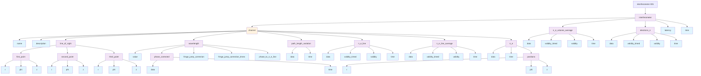

```mermaid
flowchart TD
    root["interferometer IDS"]

    n1[interferometer]
    root --> n1
    class n1 normalNode
    n2(channel)
    n1 --> n2
    class n2 complexNode
    n3[name]
    n2 --> n3
    class n3 leafNode
    n4[description]
    n2 --> n4
    class n4 leafNode
    n5[line_of_sight]
    n2 --> n5
    class n5 normalNode
    n6[first_point]
    n5 --> n6
    class n6 normalNode
    n7[r]
    n6 --> n7
    class n7 leafNode
    n8[phi]
    n6 --> n8
    class n8 leafNode
    n9[z]
    n6 --> n9
    class n9 leafNode
    n10[second_point]
    n5 --> n10
    class n10 normalNode
    n11[r]
    n10 --> n11
    class n11 leafNode
    n12[phi]
    n10 --> n12
    class n12 leafNode
    n13[z]
    n10 --> n13
    class n13 leafNode
    n14[third_point]
    n5 --> n14
    class n14 normalNode
    n15[r]
    n14 --> n15
    class n15 leafNode
    n16[phi]
    n14 --> n16
    class n16 leafNode
    n17[z]
    n14 --> n17
    class n17 leafNode
    n18[wavelength]
    n2 --> n18
    class n18 normalNode
    n19[value]
    n18 --> n19
    class n19 leafNode
    n20[phase_corrected]
    n18 --> n20
    class n20 normalNode
    n21[data]
    n20 --> n21
    class n21 leafNode
    n22[time]
    n20 --> n22
    class n22 leafNode
    n23[fringe_jump_correction]
    n18 --> n23
    class n23 leafNode
    n24[fringe_jump_correction_times]
    n18 --> n24
    class n24 leafNode
    n25[phase_to_n_e_line]
    n18 --> n25
    class n25 leafNode
    n26[path_length_variation]
    n2 --> n26
    class n26 normalNode
    n27[data]
    n26 --> n27
    class n27 leafNode
    n28[time]
    n26 --> n28
    class n28 leafNode
    n29[n_e_line]
    n2 --> n29
    class n29 normalNode
    n30[data]
    n29 --> n30
    class n30 leafNode
    n31[validity_timed]
    n29 --> n31
    class n31 leafNode
    n32[validity]
    n29 --> n32
    class n32 leafNode
    n33[time]
    n29 --> n33
    class n33 leafNode
    n34[n_e_line_average]
    n2 --> n34
    class n34 normalNode
    n35[data]
    n34 --> n35
    class n35 leafNode
    n36[validity_timed]
    n34 --> n36
    class n36 leafNode
    n37[validity]
    n34 --> n37
    class n37 leafNode
    n38[time]
    n34 --> n38
    class n38 leafNode
    n39[n_e]
    n2 --> n39
    class n39 normalNode
    n40[data]
    n39 --> n40
    class n40 leafNode
    n41[time]
    n39 --> n41
    class n41 leafNode
    n42[positions]
    n39 --> n42
    class n42 normalNode
    n43[r]
    n42 --> n43
    class n43 leafNode
    n44[phi]
    n42 --> n44
    class n44 leafNode
    n45[z]
    n42 --> n45
    class n45 leafNode
    n46[n_e_volume_average]
    n1 --> n46
    class n46 normalNode
    n47[data]
    n46 --> n47
    class n47 leafNode
    n48[validity_timed]
    n46 --> n48
    class n48 leafNode
    n49[validity]
    n46 --> n49
    class n49 leafNode
    n50[time]
    n46 --> n50
    class n50 leafNode
    n51[electrons_n]
    n1 --> n51
    class n51 normalNode
    n52[data]
    n51 --> n52
    class n52 leafNode
    n53[validity_timed]
    n51 --> n53
    class n53 leafNode
    n54[validity]
    n51 --> n54
    class n54 leafNode
    n55[time]
    n51 --> n55
    class n55 leafNode
    n56[latency]
    n1 --> n56
    class n56 leafNode
    n57[time]
    n1 --> n57
    class n57 leafNode

    classDef leafNode fill:#e1f5fe
    classDef complexNode fill:#fff3e0
    classDef normalNode fill:#f3e5f5
    classDef moreNode fill:#f5f5f5,stroke-dasharray: 5 5
```