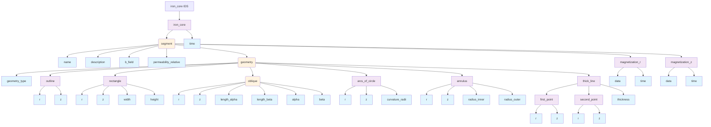

```mermaid
flowchart TD
    root["iron_core IDS"]

    n1[iron_core]
    root --> n1
    class n1 normalNode
    n2(segment)
    n1 --> n2
    class n2 complexNode
    n3[name]
    n2 --> n3
    class n3 leafNode
    n4[description]
    n2 --> n4
    class n4 leafNode
    n5[b_field]
    n2 --> n5
    class n5 leafNode
    n6[permeability_relative]
    n2 --> n6
    class n6 leafNode
    n7(geometry)
    n2 --> n7
    class n7 complexNode
    n8[geometry_type]
    n7 --> n8
    class n8 leafNode
    n9[outline]
    n7 --> n9
    class n9 normalNode
    n10[r]
    n9 --> n10
    class n10 leafNode
    n11[z]
    n9 --> n11
    class n11 leafNode
    n12[rectangle]
    n7 --> n12
    class n12 normalNode
    n13[r]
    n12 --> n13
    class n13 leafNode
    n14[z]
    n12 --> n14
    class n14 leafNode
    n15[width]
    n12 --> n15
    class n15 leafNode
    n16[height]
    n12 --> n16
    class n16 leafNode
    n17(oblique)
    n7 --> n17
    class n17 complexNode
    n18[r]
    n17 --> n18
    class n18 leafNode
    n19[z]
    n17 --> n19
    class n19 leafNode
    n20[length_alpha]
    n17 --> n20
    class n20 leafNode
    n21[length_beta]
    n17 --> n21
    class n21 leafNode
    n22[alpha]
    n17 --> n22
    class n22 leafNode
    n23[beta]
    n17 --> n23
    class n23 leafNode
    n24[arcs_of_circle]
    n7 --> n24
    class n24 normalNode
    n25[r]
    n24 --> n25
    class n25 leafNode
    n26[z]
    n24 --> n26
    class n26 leafNode
    n27[curvature_radii]
    n24 --> n27
    class n27 leafNode
    n28[annulus]
    n7 --> n28
    class n28 normalNode
    n29[r]
    n28 --> n29
    class n29 leafNode
    n30[z]
    n28 --> n30
    class n30 leafNode
    n31[radius_inner]
    n28 --> n31
    class n31 leafNode
    n32[radius_outer]
    n28 --> n32
    class n32 leafNode
    n33[thick_line]
    n7 --> n33
    class n33 normalNode
    n34[first_point]
    n33 --> n34
    class n34 normalNode
    n35[r]
    n34 --> n35
    class n35 leafNode
    n36[z]
    n34 --> n36
    class n36 leafNode
    n37[second_point]
    n33 --> n37
    class n37 normalNode
    n38[r]
    n37 --> n38
    class n38 leafNode
    n39[z]
    n37 --> n39
    class n39 leafNode
    n40[thickness]
    n33 --> n40
    class n40 leafNode
    n41[magnetization_r]
    n2 --> n41
    class n41 normalNode
    n42[data]
    n41 --> n42
    class n42 leafNode
    n43[time]
    n41 --> n43
    class n43 leafNode
    n44[magnetization_z]
    n2 --> n44
    class n44 normalNode
    n45[data]
    n44 --> n45
    class n45 leafNode
    n46[time]
    n44 --> n46
    class n46 leafNode
    n47[time]
    n1 --> n47
    class n47 leafNode

    classDef leafNode fill:#e1f5fe
    classDef complexNode fill:#fff3e0
    classDef normalNode fill:#f3e5f5
    classDef moreNode fill:#f5f5f5,stroke-dasharray: 5 5
```