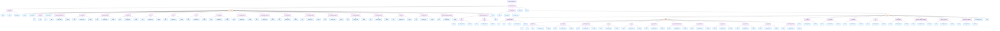

```mermaid
flowchart TD
    root["langmuir_probes IDS"]

    n1[langmuir_probes]
    root --> n1
    class n1 normalNode
    n2[midplane]
    n1 --> n2
    class n2 normalNode
    n3[name]
    n2 --> n3
    class n3 leafNode
    n4[index]
    n2 --> n4
    class n4 leafNode
    n5[description]
    n2 --> n5
    class n5 leafNode
    n6(embedded)
    n1 --> n6
    class n6 complexNode
    n7[name]
    n6 --> n7
    class n7 leafNode
    n8[description]
    n6 --> n8
    class n8 leafNode
    n9[position]
    n6 --> n9
    class n9 normalNode
    n10[r]
    n9 --> n10
    class n10 leafNode
    n11[phi]
    n9 --> n11
    class n11 leafNode
    n12[z]
    n9 --> n12
    class n12 leafNode
    n13[surface_area]
    n6 --> n13
    class n13 leafNode
    n14[surface_area_effective]
    n6 --> n14
    class n14 normalNode
    n15[data]
    n14 --> n15
    class n15 leafNode
    n16[validity_timed]
    n14 --> n16
    class n16 leafNode
    n17[validity]
    n14 --> n17
    class n17 leafNode
    n18[v_floating]
    n6 --> n18
    class n18 normalNode
    n19[data]
    n18 --> n19
    class n19 leafNode
    n20[validity_timed]
    n18 --> n20
    class n20 leafNode
    n21[validity]
    n18 --> n21
    class n21 leafNode
    n22[v_floating_sigma]
    n6 --> n22
    class n22 normalNode
    n23[data]
    n22 --> n23
    class n23 leafNode
    n24[validity_timed]
    n22 --> n24
    class n24 leafNode
    n25[validity]
    n22 --> n25
    class n25 leafNode
    n26[v_plasma]
    n6 --> n26
    class n26 normalNode
    n27[data]
    n26 --> n27
    class n27 leafNode
    n28[validity_timed]
    n26 --> n28
    class n28 leafNode
    n29[validity]
    n26 --> n29
    class n29 leafNode
    n30[t_e]
    n6 --> n30
    class n30 normalNode
    n31[data]
    n30 --> n31
    class n31 leafNode
    n32[validity_timed]
    n30 --> n32
    class n32 leafNode
    n33[validity]
    n30 --> n33
    class n33 leafNode
    n34[n_e]
    n6 --> n34
    class n34 normalNode
    n35[data]
    n34 --> n35
    class n35 leafNode
    n36[validity_timed]
    n34 --> n36
    class n36 leafNode
    n37[validity]
    n34 --> n37
    class n37 leafNode
    n38[t_i]
    n6 --> n38
    class n38 normalNode
    n39[data]
    n38 --> n39
    class n39 leafNode
    n40[validity_timed]
    n38 --> n40
    class n40 leafNode
    n41[validity]
    n38 --> n41
    class n41 leafNode
    n42[j_i_parallel]
    n6 --> n42
    class n42 normalNode
    n43[data]
    n42 --> n43
    class n43 leafNode
    n44[validity_timed]
    n42 --> n44
    class n44 leafNode
    n45[validity]
    n42 --> n45
    class n45 leafNode
    n46[j_i_parallel_sigma]
    n6 --> n46
    class n46 normalNode
    n47[data]
    n46 --> n47
    class n47 leafNode
    n48[validity_timed]
    n46 --> n48
    class n48 leafNode
    n49[validity]
    n46 --> n49
    class n49 leafNode
    n50[ion_saturation_current]
    n6 --> n50
    class n50 normalNode
    n51[data]
    n50 --> n51
    class n51 leafNode
    n52[validity_timed]
    n50 --> n52
    class n52 leafNode
    n53[validity]
    n50 --> n53
    class n53 leafNode
    n54[j_i_saturation]
    n6 --> n54
    class n54 normalNode
    n55[data]
    n54 --> n55
    class n55 leafNode
    n56[validity_timed]
    n54 --> n56
    class n56 leafNode
    n57[validity]
    n54 --> n57
    class n57 leafNode
    n58[j_i_saturation_skew]
    n6 --> n58
    class n58 normalNode
    n59[data]
    n58 --> n59
    class n59 leafNode
    n60[validity_timed]
    n58 --> n60
    class n60 leafNode
    n61[validity]
    n58 --> n61
    class n61 leafNode
    n62[j_i_saturation_kurtosis]
    n6 --> n62
    class n62 normalNode
    n63[data]
    n62 --> n63
    class n63 leafNode
    n64[validity_timed]
    n62 --> n64
    class n64 leafNode
    n65[validity]
    n62 --> n65
    class n65 leafNode
    n66[j_i_saturation_sigma]
    n6 --> n66
    class n66 normalNode
    n67[data]
    n66 --> n67
    class n67 leafNode
    n68[validity_timed]
    n66 --> n68
    class n68 leafNode
    n69[validity]
    n66 --> n69
    class n69 leafNode
    n70[heat_flux_parallel]
    n6 --> n70
    class n70 normalNode
    n71[data]
    n70 --> n71
    class n71 leafNode
    n72[validity_timed]
    n70 --> n72
    class n72 leafNode
    n73[validity]
    n70 --> n73
    class n73 leafNode
    n74[fluence]
    n6 --> n74
    class n74 normalNode
    n75[data]
    n74 --> n75
    class n75 leafNode
    n76[validity_timed]
    n74 --> n76
    class n76 leafNode
    n77[validity]
    n74 --> n77
    class n77 leafNode
    n78[b_field_angle]
    n6 --> n78
    class n78 normalNode
    n79[data]
    n78 --> n79
    class n79 leafNode
    n80[validity_timed]
    n78 --> n80
    class n80 leafNode
    n81[validity]
    n78 --> n81
    class n81 leafNode
    n82[distance_separatrix_midplane]
    n6 --> n82
    class n82 normalNode
    n83[data]
    n82 --> n83
    class n83 leafNode
    n84[validity_timed]
    n82 --> n84
    class n84 leafNode
    n85[validity]
    n82 --> n85
    class n85 leafNode
    n86[multi_temperature_fits]
    n6 --> n86
    class n86 normalNode
    n87[t_e]
    n86 --> n87
    class n87 normalNode
    n88[data]
    n87 --> n88
    class n88 leafNode
    n89[validity_timed]
    n87 --> n89
    class n89 leafNode
    n90[validity]
    n87 --> n90
    class n90 leafNode
    n91[t_i]
    n86 --> n91
    class n91 normalNode
    n92[data]
    n91 --> n92
    class n92 leafNode
    n93[validity_timed]
    n91 --> n93
    class n93 leafNode
    n94[validity]
    n91 --> n94
    class n94 leafNode
    n95[time]
    n86 --> n95
    class n95 leafNode
    n96[time]
    n6 --> n96
    class n96 leafNode
    n97[reciprocating]
    n1 --> n97
    class n97 normalNode
    n98[name]
    n97 --> n98
    class n98 leafNode
    n99[description]
    n97 --> n99
    class n99 leafNode
    n100[surface_area]
    n97 --> n100
    class n100 leafNode
    n101(plunge)
    n97 --> n101
    class n101 complexNode
    n102[position_average]
    n101 --> n102
    class n102 normalNode
    n103[r]
    n102 --> n103
    class n103 leafNode
    n104[z]
    n102 --> n104
    class n104 leafNode
    n105[phi]
    n102 --> n105
    class n105 leafNode
    n106[validity_timed]
    n102 --> n106
    class n106 leafNode
    n107[validity]
    n102 --> n107
    class n107 leafNode
    n108(collector)
    n101 --> n108
    class n108 complexNode
    n109[position]
    n108 --> n109
    class n109 normalNode
    n110[r]
    n109 --> n110
    class n110 leafNode
    n111[z]
    n109 --> n111
    class n111 leafNode
    n112[phi]
    n109 --> n112
    class n112 leafNode
    n113[validity_timed]
    n109 --> n113
    class n113 leafNode
    n114[validity]
    n109 --> n114
    class n114 leafNode
    n115[v_floating]
    n108 --> n115
    class n115 normalNode
    n116[data]
    n115 --> n116
    class n116 leafNode
    n117[validity_timed]
    n115 --> n117
    class n117 leafNode
    n118[validity]
    n115 --> n118
    class n118 leafNode
    n119[v_floating_sigma]
    n108 --> n119
    class n119 normalNode
    n120[data]
    n119 --> n120
    class n120 leafNode
    n121[validity_timed]
    n119 --> n121
    class n121 leafNode
    n122[validity]
    n119 --> n122
    class n122 leafNode
    n123[t_e]
    n108 --> n123
    class n123 normalNode
    n124[data]
    n123 --> n124
    class n124 leafNode
    n125[validity_timed]
    n123 --> n125
    class n125 leafNode
    n126[validity]
    n123 --> n126
    class n126 leafNode
    n127[t_i]
    n108 --> n127
    class n127 normalNode
    n128[data]
    n127 --> n128
    class n128 leafNode
    n129[validity_timed]
    n127 --> n129
    class n129 leafNode
    n130[validity]
    n127 --> n130
    class n130 leafNode
    n131[j_i_parallel]
    n108 --> n131
    class n131 normalNode
    n132[data]
    n131 --> n132
    class n132 leafNode
    n133[validity_timed]
    n131 --> n133
    class n133 leafNode
    n134[validity]
    n131 --> n134
    class n134 leafNode
    n135[ion_saturation_current]
    n108 --> n135
    class n135 normalNode
    n136[data]
    n135 --> n136
    class n136 leafNode
    n137[validity_timed]
    n135 --> n137
    class n137 leafNode
    n138[validity]
    n135 --> n138
    class n138 leafNode
    n139[j_i_saturation]
    n108 --> n139
    class n139 normalNode
    n140[data]
    n139 --> n140
    class n140 leafNode
    n141[validity_timed]
    n139 --> n141
    class n141 leafNode
    n142[validity]
    n139 --> n142
    class n142 leafNode
    n143[j_i_skew]
    n108 --> n143
    class n143 normalNode
    n144[data]
    n143 --> n144
    class n144 leafNode
    n145[validity_timed]
    n143 --> n145
    class n145 leafNode
    n146[validity]
    n143 --> n146
    class n146 leafNode
    n147[j_i_kurtosis]
    n108 --> n147
    class n147 normalNode
    n148[data]
    n147 --> n148
    class n148 leafNode
    n149[validity_timed]
    n147 --> n149
    class n149 leafNode
    n150[validity]
    n147 --> n150
    class n150 leafNode
    n151[j_i_sigma]
    n108 --> n151
    class n151 normalNode
    n152[data]
    n151 --> n152
    class n152 leafNode
    n153[validity_timed]
    n151 --> n153
    class n153 leafNode
    n154[validity]
    n151 --> n154
    class n154 leafNode
    n155[heat_flux_parallel]
    n108 --> n155
    class n155 normalNode
    n156[data]
    n155 --> n156
    class n156 leafNode
    n157[validity_timed]
    n155 --> n157
    class n157 leafNode
    n158[validity]
    n155 --> n158
    class n158 leafNode
    n159[v_plasma]
    n101 --> n159
    class n159 normalNode
    n160[data]
    n159 --> n160
    class n160 leafNode
    n161[validity_timed]
    n159 --> n161
    class n161 leafNode
    n162[validity]
    n159 --> n162
    class n162 leafNode
    n163[t_e_average]
    n101 --> n163
    class n163 normalNode
    n164[data]
    n163 --> n164
    class n164 leafNode
    n165[validity_timed]
    n163 --> n165
    class n165 leafNode
    n166[validity]
    n163 --> n166
    class n166 leafNode
    n167[t_i_average]
    n101 --> n167
    class n167 normalNode
    n168[data]
    n167 --> n168
    class n168 leafNode
    n169[validity_timed]
    n167 --> n169
    class n169 leafNode
    n170[validity]
    n167 --> n170
    class n170 leafNode
    n171[n_e]
    n101 --> n171
    class n171 normalNode
    n172[data]
    n171 --> n172
    class n172 leafNode
    n173[validity_timed]
    n171 --> n173
    class n173 leafNode
    n174[validity]
    n171 --> n174
    class n174 leafNode
    n175[b_field_angle]
    n101 --> n175
    class n175 normalNode
    n176[data]
    n175 --> n176
    class n176 leafNode
    n177[validity_timed]
    n175 --> n177
    class n177 leafNode
    n178[validity]
    n175 --> n178
    class n178 leafNode
    n179[distance_separatrix_midplane]
    n101 --> n179
    class n179 normalNode
    n180[data]
    n179 --> n180
    class n180 leafNode
    n181[validity_timed]
    n179 --> n181
    class n181 leafNode
    n182[validity]
    n179 --> n182
    class n182 leafNode
    n183[distance_x_point_z]
    n101 --> n183
    class n183 normalNode
    n184[data]
    n183 --> n184
    class n184 leafNode
    n185[validity_timed]
    n183 --> n185
    class n185 leafNode
    n186[validity]
    n183 --> n186
    class n186 leafNode
    n187[mach_number_parallel]
    n101 --> n187
    class n187 normalNode
    n188[data]
    n187 --> n188
    class n188 leafNode
    n189[validity_timed]
    n187 --> n189
    class n189 leafNode
    n190[validity]
    n187 --> n190
    class n190 leafNode
    n191[time_within_plunge]
    n101 --> n191
    class n191 leafNode
    n192[time]
    n101 --> n192
    class n192 leafNode
    n193[latency]
    n1 --> n193
    class n193 leafNode
    n194[time]
    n1 --> n194
    class n194 leafNode

    classDef leafNode fill:#e1f5fe
    classDef complexNode fill:#fff3e0
    classDef normalNode fill:#f3e5f5
    classDef moreNode fill:#f5f5f5,stroke-dasharray: 5 5
```