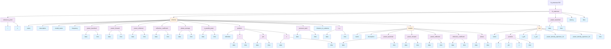

```mermaid
flowchart TD
    root["lh_antennas IDS"]

    n1[lh_antennas]
    root --> n1
    class n1 normalNode
    n2[reference_point]
    n1 --> n2
    class n2 normalNode
    n3[r]
    n2 --> n3
    class n3 leafNode
    n4[z]
    n2 --> n4
    class n4 leafNode
    n5(antenna)
    n1 --> n5
    class n5 complexNode
    n6[name]
    n5 --> n6
    class n6 leafNode
    n7[description]
    n5 --> n7
    class n7 leafNode
    n8[model_name]
    n5 --> n8
    class n8 leafNode
    n9[frequency]
    n5 --> n9
    class n9 leafNode
    n10[power_launched]
    n5 --> n10
    class n10 normalNode
    n11[data]
    n10 --> n11
    class n11 leafNode
    n12[time]
    n10 --> n12
    class n12 leafNode
    n13[power_forward]
    n5 --> n13
    class n13 normalNode
    n14[data]
    n13 --> n14
    class n14 leafNode
    n15[time]
    n13 --> n15
    class n15 leafNode
    n16[power_reflected]
    n5 --> n16
    class n16 normalNode
    n17[data]
    n16 --> n17
    class n17 leafNode
    n18[time]
    n16 --> n18
    class n18 leafNode
    n19[reflection_coefficient]
    n5 --> n19
    class n19 normalNode
    n20[data]
    n19 --> n20
    class n20 leafNode
    n21[time]
    n19 --> n21
    class n21 leafNode
    n22[phase_average]
    n5 --> n22
    class n22 normalNode
    n23[data]
    n22 --> n23
    class n23 leafNode
    n24[time]
    n22 --> n24
    class n24 leafNode
    n25[n_parallel_peak]
    n5 --> n25
    class n25 normalNode
    n26[data]
    n25 --> n26
    class n26 leafNode
    n27[time]
    n25 --> n27
    class n27 leafNode
    n28[position]
    n5 --> n28
    class n28 normalNode
    n29[definition]
    n28 --> n29
    class n29 leafNode
    n30[r]
    n28 --> n30
    class n30 normalNode
    n31[data]
    n30 --> n31
    class n31 leafNode
    n32[time]
    n30 --> n32
    class n32 leafNode
    n33[phi]
    n28 --> n33
    class n33 normalNode
    n34[data]
    n33 --> n34
    class n34 leafNode
    n35[time]
    n33 --> n35
    class n35 leafNode
    n36[z]
    n28 --> n36
    class n36 normalNode
    n37[data]
    n36 --> n37
    class n37 leafNode
    n38[time]
    n36 --> n38
    class n38 leafNode
    n39[pressure_tank]
    n5 --> n39
    class n39 normalNode
    n40[data]
    n39 --> n40
    class n40 leafNode
    n41[time]
    n39 --> n41
    class n41 leafNode
    n42[distance_to_antenna]
    n5 --> n42
    class n42 leafNode
    n43[n_e]
    n5 --> n43
    class n43 normalNode
    n44[data]
    n43 --> n44
    class n44 leafNode
    n45[time]
    n43 --> n45
    class n45 leafNode
    n46(module)
    n5 --> n46
    class n46 complexNode
    n47[name]
    n46 --> n47
    class n47 leafNode
    n48[description]
    n46 --> n48
    class n48 leafNode
    n49[power_launched]
    n46 --> n49
    class n49 normalNode
    n50[data]
    n49 --> n50
    class n50 leafNode
    n51[time]
    n49 --> n51
    class n51 leafNode
    n52[power_forward]
    n46 --> n52
    class n52 normalNode
    n53[data]
    n52 --> n53
    class n53 leafNode
    n54[time]
    n52 --> n54
    class n54 leafNode
    n55[power_reflected]
    n46 --> n55
    class n55 normalNode
    n56[data]
    n55 --> n56
    class n56 leafNode
    n57[time]
    n55 --> n57
    class n57 leafNode
    n58[reflection_coefficient]
    n46 --> n58
    class n58 normalNode
    n59[data]
    n58 --> n59
    class n59 leafNode
    n60[time]
    n58 --> n60
    class n60 leafNode
    n61[phase]
    n46 --> n61
    class n61 normalNode
    n62[data]
    n61 --> n62
    class n62 leafNode
    n63[time]
    n61 --> n63
    class n63 leafNode
    n64(row)
    n5 --> n64
    class n64 complexNode
    n65[name]
    n64 --> n65
    class n65 leafNode
    n66[position]
    n64 --> n66
    class n66 normalNode
    n67[r]
    n66 --> n67
    class n67 leafNode
    n68[phi]
    n66 --> n68
    class n68 leafNode
    n69[z]
    n66 --> n69
    class n69 leafNode
    n70[time]
    n66 --> n70
    class n70 leafNode
    n71[n_phi]
    n64 --> n71
    class n71 leafNode
    n72[n_pol]
    n64 --> n72
    class n72 leafNode
    n73[power_density_spectrum_1d]
    n64 --> n73
    class n73 leafNode
    n74[power_density_spectrum_2d]
    n64 --> n74
    class n74 leafNode
    n75[time]
    n64 --> n75
    class n75 leafNode
    n76[power_launched]
    n1 --> n76
    class n76 normalNode
    n77[data]
    n76 --> n77
    class n77 leafNode
    n78[time]
    n76 --> n78
    class n78 leafNode
    n79[latency]
    n1 --> n79
    class n79 leafNode
    n80[time]
    n1 --> n80
    class n80 leafNode

    classDef leafNode fill:#e1f5fe
    classDef complexNode fill:#fff3e0
    classDef normalNode fill:#f3e5f5
    classDef moreNode fill:#f5f5f5,stroke-dasharray: 5 5
```