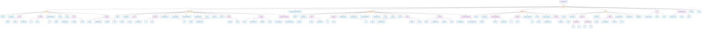

```mermaid
flowchart TD
    root["magnetics IDS"]

    n1(magnetics)
    root --> n1
    class n1 complexNode
    n2(flux_loop)
    n1 --> n2
    class n2 complexNode
    n3[name]
    n2 --> n3
    class n3 leafNode
    n4[description]
    n2 --> n4
    class n4 leafNode
    n5[type]
    n2 --> n5
    class n5 normalNode
    n6[name]
    n5 --> n6
    class n6 leafNode
    n7[index]
    n5 --> n7
    class n7 leafNode
    n8[description]
    n5 --> n8
    class n8 leafNode
    n9[position]
    n2 --> n9
    class n9 normalNode
    n10[r]
    n9 --> n10
    class n10 leafNode
    n11[phi]
    n9 --> n11
    class n11 leafNode
    n12[z]
    n9 --> n12
    class n12 leafNode
    n13[indices_differential]
    n2 --> n13
    class n13 leafNode
    n14[area]
    n2 --> n14
    class n14 leafNode
    n15[gm9]
    n2 --> n15
    class n15 leafNode
    n16[flux]
    n2 --> n16
    class n16 normalNode
    n17[data]
    n16 --> n17
    class n17 leafNode
    n18[validity_timed]
    n16 --> n18
    class n18 leafNode
    n19[validity]
    n16 --> n19
    class n19 leafNode
    n20[time]
    n16 --> n20
    class n20 leafNode
    n21[voltage]
    n2 --> n21
    class n21 normalNode
    n22[data]
    n21 --> n22
    class n22 leafNode
    n23[validity_timed]
    n21 --> n23
    class n23 leafNode
    n24[validity]
    n21 --> n24
    class n24 leafNode
    n25[time]
    n21 --> n25
    class n25 leafNode
    n26(b_field_pol_probe)
    n1 --> n26
    class n26 complexNode
    n27[name]
    n26 --> n27
    class n27 leafNode
    n28[description]
    n26 --> n28
    class n28 leafNode
    n29[type]
    n26 --> n29
    class n29 normalNode
    n30[name]
    n29 --> n30
    class n30 leafNode
    n31[index]
    n29 --> n31
    class n31 leafNode
    n32[description]
    n29 --> n32
    class n32 leafNode
    n33[position]
    n26 --> n33
    class n33 normalNode
    n34[r]
    n33 --> n34
    class n34 leafNode
    n35[phi]
    n33 --> n35
    class n35 leafNode
    n36[z]
    n33 --> n36
    class n36 leafNode
    n37[poloidal_angle]
    n26 --> n37
    class n37 leafNode
    n38[toroidal_angle]
    n26 --> n38
    class n38 leafNode
    n39[indices_differential]
    n26 --> n39
    class n39 leafNode
    n40[bandwidth_3db]
    n26 --> n40
    class n40 leafNode
    n41[area]
    n26 --> n41
    class n41 leafNode
    n42[length]
    n26 --> n42
    class n42 leafNode
    n43[turns]
    n26 --> n43
    class n43 leafNode
    n44[field]
    n26 --> n44
    class n44 normalNode
    n45[data]
    n44 --> n45
    class n45 leafNode
    n46[validity_timed]
    n44 --> n46
    class n46 leafNode
    n47[validity]
    n44 --> n47
    class n47 leafNode
    n48[time]
    n44 --> n48
    class n48 leafNode
    n49[voltage]
    n26 --> n49
    class n49 normalNode
    n50[data]
    n49 --> n50
    class n50 leafNode
    n51[validity_timed]
    n49 --> n51
    class n51 leafNode
    n52[validity]
    n49 --> n52
    class n52 leafNode
    n53[time]
    n49 --> n53
    class n53 leafNode
    n54[non_linear_response]
    n26 --> n54
    class n54 normalNode
    n55[b_field_linear]
    n54 --> n55
    class n55 leafNode
    n56[b_field_non_linear]
    n54 --> n56
    class n56 leafNode
    n57[b_field_pol_probe_equivalent]
    n1 --> n57
    class n57 leafNode
    n58(b_field_phi_probe)
    n1 --> n58
    class n58 complexNode
    n59[name]
    n58 --> n59
    class n59 leafNode
    n60[description]
    n58 --> n60
    class n60 leafNode
    n61[type]
    n58 --> n61
    class n61 normalNode
    n62[name]
    n61 --> n62
    class n62 leafNode
    n63[index]
    n61 --> n63
    class n63 leafNode
    n64[description]
    n61 --> n64
    class n64 leafNode
    n65[position]
    n58 --> n65
    class n65 normalNode
    n66[r]
    n65 --> n66
    class n66 leafNode
    n67[phi]
    n65 --> n67
    class n67 leafNode
    n68[z]
    n65 --> n68
    class n68 leafNode
    n69[poloidal_angle]
    n58 --> n69
    class n69 leafNode
    n70[toroidal_angle]
    n58 --> n70
    class n70 leafNode
    n71[indices_differential]
    n58 --> n71
    class n71 leafNode
    n72[bandwidth_3db]
    n58 --> n72
    class n72 leafNode
    n73[area]
    n58 --> n73
    class n73 leafNode
    n74[length]
    n58 --> n74
    class n74 leafNode
    n75[turns]
    n58 --> n75
    class n75 leafNode
    n76[field]
    n58 --> n76
    class n76 normalNode
    n77[data]
    n76 --> n77
    class n77 leafNode
    n78[validity_timed]
    n76 --> n78
    class n78 leafNode
    n79[validity]
    n76 --> n79
    class n79 leafNode
    n80[time]
    n76 --> n80
    class n80 leafNode
    n81[voltage]
    n58 --> n81
    class n81 normalNode
    n82[data]
    n81 --> n82
    class n82 leafNode
    n83[validity_timed]
    n81 --> n83
    class n83 leafNode
    n84[validity]
    n81 --> n84
    class n84 leafNode
    n85[time]
    n81 --> n85
    class n85 leafNode
    n86[non_linear_response]
    n58 --> n86
    class n86 normalNode
    n87[b_field_linear]
    n86 --> n87
    class n87 leafNode
    n88[b_field_non_linear]
    n86 --> n88
    class n88 leafNode
    n89(rogowski_coil)
    n1 --> n89
    class n89 complexNode
    n90[name]
    n89 --> n90
    class n90 leafNode
    n91[description]
    n89 --> n91
    class n91 leafNode
    n92[measured_quantity]
    n89 --> n92
    class n92 normalNode
    n93[name]
    n92 --> n93
    class n93 leafNode
    n94[index]
    n92 --> n94
    class n94 leafNode
    n95[description]
    n92 --> n95
    class n95 leafNode
    n96[position]
    n89 --> n96
    class n96 normalNode
    n97[r]
    n96 --> n97
    class n97 leafNode
    n98[phi]
    n96 --> n98
    class n98 leafNode
    n99[z]
    n96 --> n99
    class n99 leafNode
    n100[indices_compound]
    n89 --> n100
    class n100 leafNode
    n101[area]
    n89 --> n101
    class n101 leafNode
    n102[turns_per_metre]
    n89 --> n102
    class n102 leafNode
    n103[current]
    n89 --> n103
    class n103 normalNode
    n104[data]
    n103 --> n104
    class n104 leafNode
    n105[validity_timed]
    n103 --> n105
    class n105 leafNode
    n106[validity]
    n103 --> n106
    class n106 leafNode
    n107[time]
    n103 --> n107
    class n107 leafNode
    n108(shunt)
    n1 --> n108
    class n108 complexNode
    n109[name]
    n108 --> n109
    class n109 leafNode
    n110[description]
    n108 --> n110
    class n110 leafNode
    n111[position]
    n108 --> n111
    class n111 normalNode
    n112[first_point]
    n111 --> n112
    class n112 normalNode
    n113[r]
    n112 --> n113
    class n113 leafNode
    n114[z]
    n112 --> n114
    class n114 leafNode
    n115[second_point]
    n111 --> n115
    class n115 normalNode
    n116[r]
    n115 --> n116
    class n116 leafNode
    n117[z]
    n115 --> n117
    class n117 leafNode
    n118[resistance]
    n108 --> n118
    class n118 leafNode
    n119[voltage]
    n108 --> n119
    class n119 normalNode
    n120[data]
    n119 --> n120
    class n120 leafNode
    n121[validity_timed]
    n119 --> n121
    class n121 leafNode
    n122[validity]
    n119 --> n122
    class n122 leafNode
    n123[time]
    n119 --> n123
    class n123 leafNode
    n124[divertor_index]
    n108 --> n124
    class n124 leafNode
    n125[target_index]
    n108 --> n125
    class n125 leafNode
    n126[tile_index]
    n108 --> n126
    class n126 leafNode
    n127[ip]
    n1 --> n127
    class n127 normalNode
    n128[method_name]
    n127 --> n128
    class n128 leafNode
    n129[data]
    n127 --> n129
    class n129 leafNode
    n130[time]
    n127 --> n130
    class n130 leafNode
    n131[diamagnetic_flux]
    n1 --> n131
    class n131 normalNode
    n132[method_name]
    n131 --> n132
    class n132 leafNode
    n133[data]
    n131 --> n133
    class n133 leafNode
    n134[time]
    n131 --> n134
    class n134 leafNode
    n135[latency]
    n1 --> n135
    class n135 leafNode
    n136[time]
    n1 --> n136
    class n136 leafNode

    classDef leafNode fill:#e1f5fe
    classDef complexNode fill:#fff3e0
    classDef normalNode fill:#f3e5f5
    classDef moreNode fill:#f5f5f5,stroke-dasharray: 5 5
```