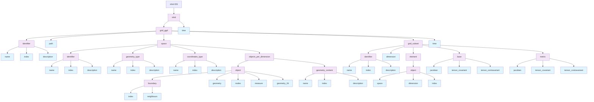

```mermaid
flowchart TD
    root["mhd IDS"]

    n1[mhd]
    root --> n1
    class n1 normalNode
    n2[grid_ggd]
    n1 --> n2
    class n2 normalNode
    n3[identifier]
    n2 --> n3
    class n3 normalNode
    n4[name]
    n3 --> n4
    class n4 leafNode
    n5[index]
    n3 --> n5
    class n5 leafNode
    n6[description]
    n3 --> n6
    class n6 leafNode
    n7[path]
    n2 --> n7
    class n7 leafNode
    n8[space]
    n2 --> n8
    class n8 normalNode
    n9[identifier]
    n8 --> n9
    class n9 normalNode
    n10[name]
    n9 --> n10
    class n10 leafNode
    n11[index]
    n9 --> n11
    class n11 leafNode
    n12[description]
    n9 --> n12
    class n12 leafNode
    n13[geometry_type]
    n8 --> n13
    class n13 normalNode
    n14[name]
    n13 --> n14
    class n14 leafNode
    n15[index]
    n13 --> n15
    class n15 leafNode
    n16[description]
    n13 --> n16
    class n16 leafNode
    n17[coordinates_type]
    n8 --> n17
    class n17 normalNode
    n18[name]
    n17 --> n18
    class n18 leafNode
    n19[index]
    n17 --> n19
    class n19 leafNode
    n20[description]
    n17 --> n20
    class n20 leafNode
    n21[objects_per_dimension]
    n8 --> n21
    class n21 normalNode
    n22[object]
    n21 --> n22
    class n22 normalNode
    n23[boundary]
    n22 --> n23
    class n23 normalNode
    n24[index]
    n23 --> n24
    class n24 leafNode
    n25[neighbours]
    n23 --> n25
    class n25 leafNode
    n26[geometry]
    n22 --> n26
    class n26 leafNode
    n27[nodes]
    n22 --> n27
    class n27 leafNode
    n28[measure]
    n22 --> n28
    class n28 leafNode
    n29[geometry_2d]
    n22 --> n29
    class n29 leafNode
    n30[geometry_content]
    n21 --> n30
    class n30 normalNode
    n31[name]
    n30 --> n31
    class n31 leafNode
    n32[index]
    n30 --> n32
    class n32 leafNode
    n33[description]
    n30 --> n33
    class n33 leafNode
    n34[grid_subset]
    n2 --> n34
    class n34 normalNode
    n35[identifier]
    n34 --> n35
    class n35 normalNode
    n36[name]
    n35 --> n36
    class n36 leafNode
    n37[index]
    n35 --> n37
    class n37 leafNode
    n38[description]
    n35 --> n38
    class n38 leafNode
    n39[dimension]
    n34 --> n39
    class n39 leafNode
    n40[element]
    n34 --> n40
    class n40 normalNode
    n41[object]
    n40 --> n41
    class n41 normalNode
    n42[space]
    n41 --> n42
    class n42 leafNode
    n43[dimension]
    n41 --> n43
    class n43 leafNode
    n44[index]
    n41 --> n44
    class n44 leafNode
    n45[base]
    n34 --> n45
    class n45 normalNode
    n46[jacobian]
    n45 --> n46
    class n46 leafNode
    n47[tensor_covariant]
    n45 --> n47
    class n47 leafNode
    n48[tensor_contravariant]
    n45 --> n48
    class n48 leafNode
    n49[metric]
    n34 --> n49
    class n49 normalNode
    n50[jacobian]
    n49 --> n50
    class n50 leafNode
    n51[tensor_covariant]
    n49 --> n51
    class n51 leafNode
    n52[tensor_contravariant]
    n49 --> n52
    class n52 leafNode
    n53[time]
    n2 --> n53
    class n53 leafNode
    n54[time]
    n1 --> n54
    class n54 leafNode

    classDef leafNode fill:#e1f5fe
    classDef complexNode fill:#fff3e0
    classDef normalNode fill:#f3e5f5
    classDef moreNode fill:#f5f5f5,stroke-dasharray: 5 5
```