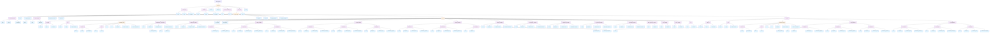

```mermaid
flowchart TD
    root["mhd_linear IDS"]

    n1(mhd_linear)
    root --> n1
    class n1 complexNode
    n2[model_type]
    n1 --> n2
    class n2 normalNode
    n3[name]
    n2 --> n3
    class n3 leafNode
    n4[index]
    n2 --> n4
    class n4 leafNode
    n5[description]
    n2 --> n5
    class n5 leafNode
    n6[equations]
    n1 --> n6
    class n6 normalNode
    n7[name]
    n6 --> n7
    class n7 leafNode
    n8[index]
    n6 --> n8
    class n8 leafNode
    n9[description]
    n6 --> n9
    class n9 leafNode
    n10[fluids_n]
    n1 --> n10
    class n10 leafNode
    n11[ideal_flag]
    n1 --> n11
    class n11 leafNode
    n12[vacuum_toroidal_field]
    n1 --> n12
    class n12 normalNode
    n13[r0]
    n12 --> n13
    class n13 leafNode
    n14[b0]
    n12 --> n14
    class n14 leafNode
    n15[time_slice]
    n1 --> n15
    class n15 normalNode
    n16(toroidal_mode)
    n15 --> n16
    class n16 complexNode
    n17[perturbation_type]
    n16 --> n17
    class n17 normalNode
    n18[name]
    n17 --> n18
    class n18 leafNode
    n19[index]
    n17 --> n19
    class n19 leafNode
    n20[description]
    n17 --> n20
    class n20 leafNode
    n21[n_phi]
    n16 --> n21
    class n21 leafNode
    n22[m_pol_dominant]
    n16 --> n22
    class n22 leafNode
    n23[ballooning_type]
    n16 --> n23
    class n23 normalNode
    n24[name]
    n23 --> n24
    class n24 leafNode
    n25[index]
    n23 --> n25
    class n25 leafNode
    n26[description]
    n23 --> n26
    class n26 leafNode
    n27[radial_mode_number]
    n16 --> n27
    class n27 leafNode
    n28[growthrate]
    n16 --> n28
    class n28 leafNode
    n29[frequency]
    n16 --> n29
    class n29 leafNode
    n30[phase]
    n16 --> n30
    class n30 leafNode
    n31[energy_perturbed]
    n16 --> n31
    class n31 leafNode
    n32[amplitude_multiplier]
    n16 --> n32
    class n32 leafNode
    n33(plasma)
    n16 --> n33
    class n33 complexNode
    n34[grid_type]
    n33 --> n34
    class n34 normalNode
    n35[name]
    n34 --> n35
    class n35 leafNode
    n36[index]
    n34 --> n36
    class n36 leafNode
    n37[description]
    n34 --> n37
    class n37 leafNode
    n38[grid]
    n33 --> n38
    class n38 normalNode
    n39[dim1]
    n38 --> n39
    class n39 leafNode
    n40[dim2]
    n38 --> n40
    class n40 leafNode
    n41[volume_element]
    n38 --> n41
    class n41 leafNode
    n42(coordinate_system)
    n33 --> n42
    class n42 complexNode
    n43[grid_type]
    n42 --> n43
    class n43 normalNode
    n44[name]
    n43 --> n44
    class n44 leafNode
    n45[index]
    n43 --> n45
    class n45 leafNode
    n46[description]
    n43 --> n46
    class n46 leafNode
    n47[grid]
    n42 --> n47
    class n47 normalNode
    n48[dim1]
    n47 --> n48
    class n48 leafNode
    n49[dim2]
    n47 --> n49
    class n49 leafNode
    n50[volume_element]
    n47 --> n50
    class n50 leafNode
    n51[r]
    n42 --> n51
    class n51 leafNode
    n52[z]
    n42 --> n52
    class n52 leafNode
    n53[jacobian]
    n42 --> n53
    class n53 leafNode
    n54[tensor_covariant]
    n42 --> n54
    class n54 leafNode
    n55[tensor_contravariant]
    n42 --> n55
    class n55 leafNode
    n56[displacement_perpendicular]
    n33 --> n56
    class n56 normalNode
    n57[real]
    n56 --> n57
    class n57 leafNode
    n58[imaginary]
    n56 --> n58
    class n58 leafNode
    n59[coefficients_real]
    n56 --> n59
    class n59 leafNode
    n60[coefficients_imaginary]
    n56 --> n60
    class n60 leafNode
    n61[displacement_parallel]
    n33 --> n61
    class n61 normalNode
    n62[real]
    n61 --> n62
    class n62 leafNode
    n63[imaginary]
    n61 --> n63
    class n63 leafNode
    n64[coefficients_real]
    n61 --> n64
    class n64 leafNode
    n65[coefficients_imaginary]
    n61 --> n65
    class n65 leafNode
    n66[tau_alfven]
    n33 --> n66
    class n66 leafNode
    n67[tau_resistive]
    n33 --> n67
    class n67 leafNode
    n68[a_field_perturbed]
    n33 --> n68
    class n68 normalNode
    n69[coordinate1]
    n68 --> n69
    class n69 normalNode
    n70[real]
    n69 --> n70
    class n70 leafNode
    n71[imaginary]
    n69 --> n71
    class n71 leafNode
    n72[coefficients_real]
    n69 --> n72
    class n72 leafNode
    n73[coefficients_imaginary]
    n69 --> n73
    class n73 leafNode
    n74[coordinate2]
    n68 --> n74
    class n74 normalNode
    n75[real]
    n74 --> n75
    class n75 leafNode
    n76[imaginary]
    n74 --> n76
    class n76 leafNode
    n77[coefficients_real]
    n74 --> n77
    class n77 leafNode
    n78[coefficients_imaginary]
    n74 --> n78
    class n78 leafNode
    n79[coordinate3]
    n68 --> n79
    class n79 normalNode
    n80[real]
    n79 --> n80
    class n80 leafNode
    n81[imaginary]
    n79 --> n81
    class n81 leafNode
    n82[coefficients_real]
    n79 --> n82
    class n82 leafNode
    n83[coefficients_imaginary]
    n79 --> n83
    class n83 leafNode
    n84[b_field_perturbed]
    n33 --> n84
    class n84 normalNode
    n85[coordinate1]
    n84 --> n85
    class n85 normalNode
    n86[real]
    n85 --> n86
    class n86 leafNode
    n87[imaginary]
    n85 --> n87
    class n87 leafNode
    n88[coefficients_real]
    n85 --> n88
    class n88 leafNode
    n89[coefficients_imaginary]
    n85 --> n89
    class n89 leafNode
    n90[coordinate2]
    n84 --> n90
    class n90 normalNode
    n91[real]
    n90 --> n91
    class n91 leafNode
    n92[imaginary]
    n90 --> n92
    class n92 leafNode
    n93[coefficients_real]
    n90 --> n93
    class n93 leafNode
    n94[coefficients_imaginary]
    n90 --> n94
    class n94 leafNode
    n95[coordinate3]
    n84 --> n95
    class n95 normalNode
    n96[real]
    n95 --> n96
    class n96 leafNode
    n97[imaginary]
    n95 --> n97
    class n97 leafNode
    n98[coefficients_real]
    n95 --> n98
    class n98 leafNode
    n99[coefficients_imaginary]
    n95 --> n99
    class n99 leafNode
    n100[velocity_perturbed]
    n33 --> n100
    class n100 normalNode
    n101[coordinate1]
    n100 --> n101
    class n101 normalNode
    n102[real]
    n101 --> n102
    class n102 leafNode
    n103[imaginary]
    n101 --> n103
    class n103 leafNode
    n104[coefficients_real]
    n101 --> n104
    class n104 leafNode
    n105[coefficients_imaginary]
    n101 --> n105
    class n105 leafNode
    n106[coordinate2]
    n100 --> n106
    class n106 normalNode
    n107[real]
    n106 --> n107
    class n107 leafNode
    n108[imaginary]
    n106 --> n108
    class n108 leafNode
    n109[coefficients_real]
    n106 --> n109
    class n109 leafNode
    n110[coefficients_imaginary]
    n106 --> n110
    class n110 leafNode
    n111[coordinate3]
    n100 --> n111
    class n111 normalNode
    n112[real]
    n111 --> n112
    class n112 leafNode
    n113[imaginary]
    n111 --> n113
    class n113 leafNode
    n114[coefficients_real]
    n111 --> n114
    class n114 leafNode
    n115[coefficients_imaginary]
    n111 --> n115
    class n115 leafNode
    n116[pressure_perturbed]
    n33 --> n116
    class n116 normalNode
    n117[real]
    n116 --> n117
    class n117 leafNode
    n118[imaginary]
    n116 --> n118
    class n118 leafNode
    n119[coefficients_real]
    n116 --> n119
    class n119 leafNode
    n120[coefficients_imaginary]
    n116 --> n120
    class n120 leafNode
    n121[mass_density_perturbed]
    n33 --> n121
    class n121 normalNode
    n122[real]
    n121 --> n122
    class n122 leafNode
    n123[imaginary]
    n121 --> n123
    class n123 leafNode
    n124[coefficients_real]
    n121 --> n124
    class n124 leafNode
    n125[coefficients_imaginary]
    n121 --> n125
    class n125 leafNode
    n126[temperature_perturbed]
    n33 --> n126
    class n126 normalNode
    n127[real]
    n126 --> n127
    class n127 leafNode
    n128[imaginary]
    n126 --> n128
    class n128 leafNode
    n129[coefficients_real]
    n126 --> n129
    class n129 leafNode
    n130[coefficients_imaginary]
    n126 --> n130
    class n130 leafNode
    n131[phi_potential_perturbed]
    n33 --> n131
    class n131 normalNode
    n132[real]
    n131 --> n132
    class n132 leafNode
    n133[imaginary]
    n131 --> n133
    class n133 leafNode
    n134[coefficients_real]
    n131 --> n134
    class n134 leafNode
    n135[coefficients_imaginary]
    n131 --> n135
    class n135 leafNode
    n136[psi_potential_perturbed]
    n33 --> n136
    class n136 normalNode
    n137[real]
    n136 --> n137
    class n137 leafNode
    n138[imaginary]
    n136 --> n138
    class n138 leafNode
    n139[coefficients_real]
    n136 --> n139
    class n139 leafNode
    n140[coefficients_imaginary]
    n136 --> n140
    class n140 leafNode
    n141[alfven_frequency_spectrum]
    n33 --> n141
    class n141 normalNode
    n142[real]
    n141 --> n142
    class n142 leafNode
    n143[imaginary]
    n141 --> n143
    class n143 leafNode
    n144[stress_maxwell]
    n33 --> n144
    class n144 normalNode
    n145[real]
    n144 --> n145
    class n145 leafNode
    n146[imaginary]
    n144 --> n146
    class n146 leafNode
    n147[stress_reynolds]
    n33 --> n147
    class n147 normalNode
    n148[real]
    n147 --> n148
    class n148 leafNode
    n149[imaginary]
    n147 --> n149
    class n149 leafNode
    n150[ntv]
    n33 --> n150
    class n150 normalNode
    n151[real]
    n150 --> n151
    class n151 leafNode
    n152[imaginary]
    n150 --> n152
    class n152 leafNode
    n153[vacuum]
    n16 --> n153
    class n153 normalNode
    n154[grid_type]
    n153 --> n154
    class n154 normalNode
    n155[name]
    n154 --> n155
    class n155 leafNode
    n156[index]
    n154 --> n156
    class n156 leafNode
    n157[description]
    n154 --> n157
    class n157 leafNode
    n158[grid]
    n153 --> n158
    class n158 normalNode
    n159[dim1]
    n158 --> n159
    class n159 leafNode
    n160[dim2]
    n158 --> n160
    class n160 leafNode
    n161[volume_element]
    n158 --> n161
    class n161 leafNode
    n162(coordinate_system)
    n153 --> n162
    class n162 complexNode
    n163[grid_type]
    n162 --> n163
    class n163 normalNode
    n164[name]
    n163 --> n164
    class n164 leafNode
    n165[index]
    n163 --> n165
    class n165 leafNode
    n166[description]
    n163 --> n166
    class n166 leafNode
    n167[grid]
    n162 --> n167
    class n167 normalNode
    n168[dim1]
    n167 --> n168
    class n168 leafNode
    n169[dim2]
    n167 --> n169
    class n169 leafNode
    n170[volume_element]
    n167 --> n170
    class n170 leafNode
    n171[r]
    n162 --> n171
    class n171 leafNode
    n172[z]
    n162 --> n172
    class n172 leafNode
    n173[jacobian]
    n162 --> n173
    class n173 leafNode
    n174[tensor_covariant]
    n162 --> n174
    class n174 leafNode
    n175[tensor_contravariant]
    n162 --> n175
    class n175 leafNode
    n176[a_field_perturbed]
    n153 --> n176
    class n176 normalNode
    n177[coordinate1]
    n176 --> n177
    class n177 normalNode
    n178[real]
    n177 --> n178
    class n178 leafNode
    n179[imaginary]
    n177 --> n179
    class n179 leafNode
    n180[coefficients_real]
    n177 --> n180
    class n180 leafNode
    n181[coefficients_imaginary]
    n177 --> n181
    class n181 leafNode
    n182[coordinate2]
    n176 --> n182
    class n182 normalNode
    n183[real]
    n182 --> n183
    class n183 leafNode
    n184[imaginary]
    n182 --> n184
    class n184 leafNode
    n185[coefficients_real]
    n182 --> n185
    class n185 leafNode
    n186[coefficients_imaginary]
    n182 --> n186
    class n186 leafNode
    n187[coordinate3]
    n176 --> n187
    class n187 normalNode
    n188[real]
    n187 --> n188
    class n188 leafNode
    n189[imaginary]
    n187 --> n189
    class n189 leafNode
    n190[coefficients_real]
    n187 --> n190
    class n190 leafNode
    n191[coefficients_imaginary]
    n187 --> n191
    class n191 leafNode
    n192[b_field_perturbed]
    n153 --> n192
    class n192 normalNode
    n193[coordinate1]
    n192 --> n193
    class n193 normalNode
    n194[real]
    n193 --> n194
    class n194 leafNode
    n195[imaginary]
    n193 --> n195
    class n195 leafNode
    n196[coefficients_real]
    n193 --> n196
    class n196 leafNode
    n197[coefficients_imaginary]
    n193 --> n197
    class n197 leafNode
    n198[coordinate2]
    n192 --> n198
    class n198 normalNode
    n199[real]
    n198 --> n199
    class n199 leafNode
    n200[imaginary]
    n198 --> n200
    class n200 leafNode
    n201[coefficients_real]
    n198 --> n201
    class n201 leafNode
    n202[coefficients_imaginary]
    n198 --> n202
    class n202 leafNode
    n203[coordinate3]
    n192 --> n203
    class n203 normalNode
    n204[real]
    n203 --> n204
    class n204 leafNode
    n205[imaginary]
    n203 --> n205
    class n205 leafNode
    n206[coefficients_real]
    n203 --> n206
    class n206 leafNode
    n207[coefficients_imaginary]
    n203 --> n207
    class n207 leafNode
    n208[time]
    n15 --> n208
    class n208 leafNode
    n209[time]
    n1 --> n209
    class n209 leafNode

    classDef leafNode fill:#e1f5fe
    classDef complexNode fill:#fff3e0
    classDef normalNode fill:#f3e5f5
    classDef moreNode fill:#f5f5f5,stroke-dasharray: 5 5
```