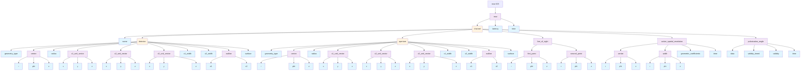

```mermaid
flowchart TD
    root["mse IDS"]

    n1[mse]
    root --> n1
    class n1 normalNode
    n2(channel)
    n1 --> n2
    class n2 complexNode
    n3[name]
    n2 --> n3
    class n3 leafNode
    n4(detector)
    n2 --> n4
    class n4 complexNode
    n5[geometry_type]
    n4 --> n5
    class n5 leafNode
    n6[centre]
    n4 --> n6
    class n6 normalNode
    n7[r]
    n6 --> n7
    class n7 leafNode
    n8[phi]
    n6 --> n8
    class n8 leafNode
    n9[z]
    n6 --> n9
    class n9 leafNode
    n10[radius]
    n4 --> n10
    class n10 leafNode
    n11[x1_unit_vector]
    n4 --> n11
    class n11 normalNode
    n12[x]
    n11 --> n12
    class n12 leafNode
    n13[y]
    n11 --> n13
    class n13 leafNode
    n14[z]
    n11 --> n14
    class n14 leafNode
    n15[x2_unit_vector]
    n4 --> n15
    class n15 normalNode
    n16[x]
    n15 --> n16
    class n16 leafNode
    n17[y]
    n15 --> n17
    class n17 leafNode
    n18[z]
    n15 --> n18
    class n18 leafNode
    n19[x3_unit_vector]
    n4 --> n19
    class n19 normalNode
    n20[x]
    n19 --> n20
    class n20 leafNode
    n21[y]
    n19 --> n21
    class n21 leafNode
    n22[z]
    n19 --> n22
    class n22 leafNode
    n23[x1_width]
    n4 --> n23
    class n23 leafNode
    n24[x2_width]
    n4 --> n24
    class n24 leafNode
    n25[outline]
    n4 --> n25
    class n25 normalNode
    n26[x1]
    n25 --> n26
    class n26 leafNode
    n27[x2]
    n25 --> n27
    class n27 leafNode
    n28[surface]
    n4 --> n28
    class n28 leafNode
    n29(aperture)
    n2 --> n29
    class n29 complexNode
    n30[geometry_type]
    n29 --> n30
    class n30 leafNode
    n31[centre]
    n29 --> n31
    class n31 normalNode
    n32[r]
    n31 --> n32
    class n32 leafNode
    n33[phi]
    n31 --> n33
    class n33 leafNode
    n34[z]
    n31 --> n34
    class n34 leafNode
    n35[radius]
    n29 --> n35
    class n35 leafNode
    n36[x1_unit_vector]
    n29 --> n36
    class n36 normalNode
    n37[x]
    n36 --> n37
    class n37 leafNode
    n38[y]
    n36 --> n38
    class n38 leafNode
    n39[z]
    n36 --> n39
    class n39 leafNode
    n40[x2_unit_vector]
    n29 --> n40
    class n40 normalNode
    n41[x]
    n40 --> n41
    class n41 leafNode
    n42[y]
    n40 --> n42
    class n42 leafNode
    n43[z]
    n40 --> n43
    class n43 leafNode
    n44[x3_unit_vector]
    n29 --> n44
    class n44 normalNode
    n45[x]
    n44 --> n45
    class n45 leafNode
    n46[y]
    n44 --> n46
    class n46 leafNode
    n47[z]
    n44 --> n47
    class n47 leafNode
    n48[x1_width]
    n29 --> n48
    class n48 leafNode
    n49[x2_width]
    n29 --> n49
    class n49 leafNode
    n50[outline]
    n29 --> n50
    class n50 normalNode
    n51[x1]
    n50 --> n51
    class n51 leafNode
    n52[x2]
    n50 --> n52
    class n52 leafNode
    n53[surface]
    n29 --> n53
    class n53 leafNode
    n54[line_of_sight]
    n2 --> n54
    class n54 normalNode
    n55[first_point]
    n54 --> n55
    class n55 normalNode
    n56[r]
    n55 --> n56
    class n56 leafNode
    n57[phi]
    n55 --> n57
    class n57 leafNode
    n58[z]
    n55 --> n58
    class n58 leafNode
    n59[second_point]
    n54 --> n59
    class n59 normalNode
    n60[r]
    n59 --> n60
    class n60 leafNode
    n61[phi]
    n59 --> n61
    class n61 leafNode
    n62[z]
    n59 --> n62
    class n62 leafNode
    n63[active_spatial_resolution]
    n2 --> n63
    class n63 normalNode
    n64[centre]
    n63 --> n64
    class n64 normalNode
    n65[r]
    n64 --> n65
    class n65 leafNode
    n66[phi]
    n64 --> n66
    class n66 leafNode
    n67[z]
    n64 --> n67
    class n67 leafNode
    n68[width]
    n63 --> n68
    class n68 normalNode
    n69[r]
    n68 --> n69
    class n69 leafNode
    n70[phi]
    n68 --> n70
    class n70 leafNode
    n71[z]
    n68 --> n71
    class n71 leafNode
    n72[geometric_coefficients]
    n63 --> n72
    class n72 leafNode
    n73[time]
    n63 --> n73
    class n73 leafNode
    n74[polarization_angle]
    n2 --> n74
    class n74 normalNode
    n75[data]
    n74 --> n75
    class n75 leafNode
    n76[validity_timed]
    n74 --> n76
    class n76 leafNode
    n77[validity]
    n74 --> n77
    class n77 leafNode
    n78[time]
    n74 --> n78
    class n78 leafNode
    n79[latency]
    n1 --> n79
    class n79 leafNode
    n80[time]
    n1 --> n80
    class n80 leafNode

    classDef leafNode fill:#e1f5fe
    classDef complexNode fill:#fff3e0
    classDef normalNode fill:#f3e5f5
    classDef moreNode fill:#f5f5f5,stroke-dasharray: 5 5
```