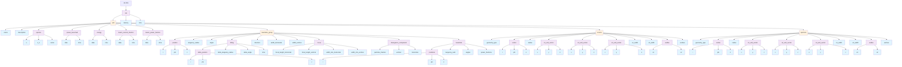

```mermaid
flowchart TD
    root["nbi IDS"]

    n1[nbi]
    root --> n1
    class n1 normalNode
    n2(unit)
    n1 --> n2
    class n2 complexNode
    n3[name]
    n2 --> n3
    class n3 leafNode
    n4[description]
    n2 --> n4
    class n4 leafNode
    n5[species]
    n2 --> n5
    class n5 normalNode
    n6[a]
    n5 --> n6
    class n6 leafNode
    n7[z_n]
    n5 --> n7
    class n7 leafNode
    n8[name]
    n5 --> n8
    class n8 leafNode
    n9[power_launched]
    n2 --> n9
    class n9 normalNode
    n10[data]
    n9 --> n10
    class n10 leafNode
    n11[time]
    n9 --> n11
    class n11 leafNode
    n12[energy]
    n2 --> n12
    class n12 normalNode
    n13[data]
    n12 --> n13
    class n13 leafNode
    n14[time]
    n12 --> n14
    class n14 leafNode
    n15[beam_current_fraction]
    n2 --> n15
    class n15 normalNode
    n16[data]
    n15 --> n16
    class n16 leafNode
    n17[time]
    n15 --> n17
    class n17 leafNode
    n18[beam_power_fraction]
    n2 --> n18
    class n18 normalNode
    n19[data]
    n18 --> n19
    class n19 leafNode
    n20[time]
    n18 --> n20
    class n20 leafNode
    n21(beamlets_group)
    n2 --> n21
    class n21 complexNode
    n22[position]
    n21 --> n22
    class n22 normalNode
    n23[r]
    n22 --> n23
    class n23 leafNode
    n24[phi]
    n22 --> n24
    class n24 leafNode
    n25[z]
    n22 --> n25
    class n25 leafNode
    n26[tangency_radius]
    n21 --> n26
    class n26 leafNode
    n27[angle]
    n21 --> n27
    class n27 leafNode
    n28[tilting]
    n21 --> n28
    class n28 normalNode
    n29[delta_position]
    n28 --> n29
    class n29 normalNode
    n30[r]
    n29 --> n30
    class n30 leafNode
    n31[phi]
    n29 --> n31
    class n31 leafNode
    n32[z]
    n29 --> n32
    class n32 leafNode
    n33[delta_tangency_radius]
    n28 --> n33
    class n33 leafNode
    n34[delta_angle]
    n28 --> n34
    class n34 leafNode
    n35[time]
    n28 --> n35
    class n35 leafNode
    n36[direction]
    n21 --> n36
    class n36 leafNode
    n37[width_horizontal]
    n21 --> n37
    class n37 leafNode
    n38[width_vertical]
    n21 --> n38
    class n38 leafNode
    n39[focus]
    n21 --> n39
    class n39 normalNode
    n40[focal_length_horizontal]
    n39 --> n40
    class n40 leafNode
    n41[focal_length_vertical]
    n39 --> n41
    class n41 leafNode
    n42[width_min_horizontal]
    n39 --> n42
    class n42 leafNode
    n43[width_min_vertical]
    n39 --> n43
    class n43 leafNode
    n44[divergence_component]
    n21 --> n44
    class n44 normalNode
    n45[particles_fraction]
    n44 --> n45
    class n45 leafNode
    n46[vertical]
    n44 --> n46
    class n46 leafNode
    n47[horizontal]
    n44 --> n47
    class n47 leafNode
    n48[beamlets]
    n21 --> n48
    class n48 normalNode
    n49[positions]
    n48 --> n49
    class n49 normalNode
    n50[r]
    n49 --> n50
    class n50 leafNode
    n51[phi]
    n49 --> n51
    class n51 leafNode
    n52[z]
    n49 --> n52
    class n52 leafNode
    n53[tangency_radii]
    n48 --> n53
    class n53 leafNode
    n54[angles]
    n48 --> n54
    class n54 leafNode
    n55[power_fractions]
    n48 --> n55
    class n55 leafNode
    n56(source)
    n2 --> n56
    class n56 complexNode
    n57[geometry_type]
    n56 --> n57
    class n57 leafNode
    n58[centre]
    n56 --> n58
    class n58 normalNode
    n59[r]
    n58 --> n59
    class n59 leafNode
    n60[phi]
    n58 --> n60
    class n60 leafNode
    n61[z]
    n58 --> n61
    class n61 leafNode
    n62[radius]
    n56 --> n62
    class n62 leafNode
    n63[x1_unit_vector]
    n56 --> n63
    class n63 normalNode
    n64[x]
    n63 --> n64
    class n64 leafNode
    n65[y]
    n63 --> n65
    class n65 leafNode
    n66[z]
    n63 --> n66
    class n66 leafNode
    n67[x2_unit_vector]
    n56 --> n67
    class n67 normalNode
    n68[x]
    n67 --> n68
    class n68 leafNode
    n69[y]
    n67 --> n69
    class n69 leafNode
    n70[z]
    n67 --> n70
    class n70 leafNode
    n71[x3_unit_vector]
    n56 --> n71
    class n71 normalNode
    n72[x]
    n71 --> n72
    class n72 leafNode
    n73[y]
    n71 --> n73
    class n73 leafNode
    n74[z]
    n71 --> n74
    class n74 leafNode
    n75[x1_width]
    n56 --> n75
    class n75 leafNode
    n76[x2_width]
    n56 --> n76
    class n76 leafNode
    n77[outline]
    n56 --> n77
    class n77 normalNode
    n78[x1]
    n77 --> n78
    class n78 leafNode
    n79[x2]
    n77 --> n79
    class n79 leafNode
    n80[surface]
    n56 --> n80
    class n80 leafNode
    n81(aperture)
    n2 --> n81
    class n81 complexNode
    n82[geometry_type]
    n81 --> n82
    class n82 leafNode
    n83[centre]
    n81 --> n83
    class n83 normalNode
    n84[r]
    n83 --> n84
    class n84 leafNode
    n85[phi]
    n83 --> n85
    class n85 leafNode
    n86[z]
    n83 --> n86
    class n86 leafNode
    n87[radius]
    n81 --> n87
    class n87 leafNode
    n88[x1_unit_vector]
    n81 --> n88
    class n88 normalNode
    n89[x]
    n88 --> n89
    class n89 leafNode
    n90[y]
    n88 --> n90
    class n90 leafNode
    n91[z]
    n88 --> n91
    class n91 leafNode
    n92[x2_unit_vector]
    n81 --> n92
    class n92 normalNode
    n93[x]
    n92 --> n93
    class n93 leafNode
    n94[y]
    n92 --> n94
    class n94 leafNode
    n95[z]
    n92 --> n95
    class n95 leafNode
    n96[x3_unit_vector]
    n81 --> n96
    class n96 normalNode
    n97[x]
    n96 --> n97
    class n97 leafNode
    n98[y]
    n96 --> n98
    class n98 leafNode
    n99[z]
    n96 --> n99
    class n99 leafNode
    n100[x1_width]
    n81 --> n100
    class n100 leafNode
    n101[x2_width]
    n81 --> n101
    class n101 leafNode
    n102[outline]
    n81 --> n102
    class n102 normalNode
    n103[x1]
    n102 --> n103
    class n103 leafNode
    n104[x2]
    n102 --> n104
    class n104 leafNode
    n105[surface]
    n81 --> n105
    class n105 leafNode
    n106[latency]
    n1 --> n106
    class n106 leafNode
    n107[time]
    n1 --> n107
    class n107 leafNode

    classDef leafNode fill:#e1f5fe
    classDef complexNode fill:#fff3e0
    classDef normalNode fill:#f3e5f5
    classDef moreNode fill:#f5f5f5,stroke-dasharray: 5 5
```