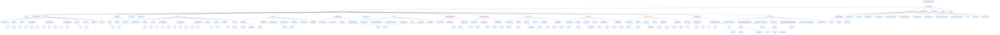

```mermaid
flowchart TD
    root["neutron_diagnostic IDS"]

    n1(neutron_diagnostic)
    root --> n1
    class n1 complexNode
    n2(detector)
    n1 --> n2
    class n2 complexNode
    n3[name]
    n2 --> n3
    class n3 leafNode
    n4[line_of_sight_index]
    n2 --> n4
    class n4 leafNode
    n5(geometry)
    n2 --> n5
    class n5 complexNode
    n6[geometry_type]
    n5 --> n6
    class n6 leafNode
    n7[centre]
    n5 --> n7
    class n7 normalNode
    n8[r]
    n7 --> n8
    class n8 leafNode
    n9[phi]
    n7 --> n9
    class n9 leafNode
    n10[z]
    n7 --> n10
    class n10 leafNode
    n11[radius]
    n5 --> n11
    class n11 leafNode
    n12[x1_unit_vector]
    n5 --> n12
    class n12 normalNode
    n13[x]
    n12 --> n13
    class n13 leafNode
    n14[y]
    n12 --> n14
    class n14 leafNode
    n15[z]
    n12 --> n15
    class n15 leafNode
    n16[x2_unit_vector]
    n5 --> n16
    class n16 normalNode
    n17[x]
    n16 --> n17
    class n17 leafNode
    n18[y]
    n16 --> n18
    class n18 leafNode
    n19[z]
    n16 --> n19
    class n19 leafNode
    n20[x3_unit_vector]
    n5 --> n20
    class n20 normalNode
    n21[x]
    n20 --> n21
    class n21 leafNode
    n22[y]
    n20 --> n22
    class n22 leafNode
    n23[z]
    n20 --> n23
    class n23 leafNode
    n24[x1_width]
    n5 --> n24
    class n24 leafNode
    n25[x2_width]
    n5 --> n25
    class n25 leafNode
    n26[outline]
    n5 --> n26
    class n26 normalNode
    n27[x1]
    n26 --> n27
    class n27 leafNode
    n28[x2]
    n26 --> n28
    class n28 leafNode
    n29[surface]
    n5 --> n29
    class n29 leafNode
    n30[material]
    n2 --> n30
    class n30 normalNode
    n31[name]
    n30 --> n31
    class n31 leafNode
    n32[index]
    n30 --> n32
    class n32 leafNode
    n33[description]
    n30 --> n33
    class n33 leafNode
    n34[nuclei_n]
    n2 --> n34
    class n34 leafNode
    n35[temperature]
    n2 --> n35
    class n35 leafNode
    n36(aperture)
    n2 --> n36
    class n36 complexNode
    n37[geometry_type]
    n36 --> n37
    class n37 leafNode
    n38[centre]
    n36 --> n38
    class n38 normalNode
    n39[r]
    n38 --> n39
    class n39 leafNode
    n40[phi]
    n38 --> n40
    class n40 leafNode
    n41[z]
    n38 --> n41
    class n41 leafNode
    n42[radius]
    n36 --> n42
    class n42 leafNode
    n43[x1_unit_vector]
    n36 --> n43
    class n43 normalNode
    n44[x]
    n43 --> n44
    class n44 leafNode
    n45[y]
    n43 --> n45
    class n45 leafNode
    n46[z]
    n43 --> n46
    class n46 leafNode
    n47[x2_unit_vector]
    n36 --> n47
    class n47 normalNode
    n48[x]
    n47 --> n48
    class n48 leafNode
    n49[y]
    n47 --> n49
    class n49 leafNode
    n50[z]
    n47 --> n50
    class n50 leafNode
    n51[x3_unit_vector]
    n36 --> n51
    class n51 normalNode
    n52[x]
    n51 --> n52
    class n52 leafNode
    n53[y]
    n51 --> n53
    class n53 leafNode
    n54[z]
    n51 --> n54
    class n54 leafNode
    n55[x1_width]
    n36 --> n55
    class n55 leafNode
    n56[x2_width]
    n36 --> n56
    class n56 leafNode
    n57[outline]
    n36 --> n57
    class n57 normalNode
    n58[x1]
    n57 --> n58
    class n58 leafNode
    n59[x2]
    n57 --> n59
    class n59 leafNode
    n60[surface]
    n36 --> n60
    class n60 leafNode
    n61(mode)
    n2 --> n61
    class n61 complexNode
    n62[identifier]
    n61 --> n62
    class n62 normalNode
    n63[name]
    n62 --> n63
    class n63 leafNode
    n64[index]
    n62 --> n64
    class n64 leafNode
    n65[description]
    n62 --> n65
    class n65 leafNode
    n66[counting]
    n61 --> n66
    class n66 normalNode
    n67[data]
    n66 --> n67
    class n67 leafNode
    n68[time]
    n66 --> n68
    class n68 leafNode
    n69[count_limit_max]
    n61 --> n69
    class n69 leafNode
    n70[count_limit_min]
    n61 --> n70
    class n70 leafNode
    n71[brightness]
    n61 --> n71
    class n71 leafNode
    n72[neutron_flux]
    n61 --> n72
    class n72 leafNode
    n73[spectrum]
    n61 --> n73
    class n73 normalNode
    n74[data]
    n73 --> n74
    class n74 leafNode
    n75[time]
    n73 --> n75
    class n75 leafNode
    n76[energy_band]
    n2 --> n76
    class n76 normalNode
    n77[lower_bound]
    n76 --> n77
    class n77 leafNode
    n78[upper_bound]
    n76 --> n78
    class n78 leafNode
    n79[energies]
    n76 --> n79
    class n79 leafNode
    n80[detection_efficiency]
    n76 --> n80
    class n80 leafNode
    n81[exposure_time]
    n2 --> n81
    class n81 leafNode
    n82(adc)
    n2 --> n82
    class n82 complexNode
    n83[power_switch]
    n82 --> n83
    class n83 leafNode
    n84[discriminator_level_lower]
    n82 --> n84
    class n84 leafNode
    n85[discriminator_level_upper]
    n82 --> n85
    class n85 leafNode
    n86[sampling_rate]
    n82 --> n86
    class n86 leafNode
    n87[bias]
    n82 --> n87
    class n87 leafNode
    n88[input_range]
    n82 --> n88
    class n88 leafNode
    n89[impedance]
    n82 --> n89
    class n89 leafNode
    n90[supply_high_voltage]
    n2 --> n90
    class n90 normalNode
    n91[power_switch]
    n90 --> n91
    class n91 leafNode
    n92[voltage_set]
    n90 --> n92
    class n92 normalNode
    n93[data]
    n92 --> n93
    class n93 leafNode
    n94[time]
    n92 --> n94
    class n94 leafNode
    n95[voltage_out]
    n90 --> n95
    class n95 normalNode
    n96[data]
    n95 --> n96
    class n96 leafNode
    n97[time]
    n95 --> n97
    class n97 leafNode
    n98[supply_low_voltage]
    n2 --> n98
    class n98 normalNode
    n99[power_switch]
    n98 --> n99
    class n99 leafNode
    n100[voltage_set]
    n98 --> n100
    class n100 normalNode
    n101[data]
    n100 --> n101
    class n101 leafNode
    n102[time]
    n100 --> n102
    class n102 leafNode
    n103[voltage_out]
    n98 --> n103
    class n103 normalNode
    n104[data]
    n103 --> n104
    class n104 leafNode
    n105[time]
    n103 --> n105
    class n105 leafNode
    n106(test_generator)
    n2 --> n106
    class n106 complexNode
    n107[power_switch]
    n106 --> n107
    class n107 leafNode
    n108[shape]
    n106 --> n108
    class n108 normalNode
    n109[name]
    n108 --> n109
    class n109 leafNode
    n110[index]
    n108 --> n110
    class n110 leafNode
    n111[description]
    n108 --> n111
    class n111 leafNode
    n112[rise_time]
    n106 --> n112
    class n112 leafNode
    n113[fall_time]
    n106 --> n113
    class n113 leafNode
    n114[frequency]
    n106 --> n114
    class n114 normalNode
    n115[data]
    n114 --> n115
    class n115 leafNode
    n116[time]
    n114 --> n116
    class n116 leafNode
    n117[amplitude]
    n106 --> n117
    class n117 normalNode
    n118[data]
    n117 --> n118
    class n118 leafNode
    n119[time]
    n117 --> n119
    class n119 leafNode
    n120(b_field_sensor)
    n2 --> n120
    class n120 complexNode
    n121[power_switch]
    n120 --> n121
    class n121 leafNode
    n122[shape]
    n120 --> n122
    class n122 normalNode
    n123[name]
    n122 --> n123
    class n123 leafNode
    n124[index]
    n122 --> n124
    class n124 leafNode
    n125[description]
    n122 --> n125
    class n125 leafNode
    n126[rise_time]
    n120 --> n126
    class n126 leafNode
    n127[fall_time]
    n120 --> n127
    class n127 leafNode
    n128[frequency]
    n120 --> n128
    class n128 normalNode
    n129[data]
    n128 --> n129
    class n129 leafNode
    n130[time]
    n128 --> n130
    class n130 leafNode
    n131[amplitude]
    n120 --> n131
    class n131 normalNode
    n132[data]
    n131 --> n132
    class n132 leafNode
    n133[time]
    n131 --> n133
    class n133 leafNode
    n134(temperature_sensor)
    n2 --> n134
    class n134 complexNode
    n135[power_switch]
    n134 --> n135
    class n135 leafNode
    n136[shape]
    n134 --> n136
    class n136 normalNode
    n137[name]
    n136 --> n137
    class n137 leafNode
    n138[index]
    n136 --> n138
    class n138 leafNode
    n139[description]
    n136 --> n139
    class n139 leafNode
    n140[rise_time]
    n134 --> n140
    class n140 leafNode
    n141[fall_time]
    n134 --> n141
    class n141 leafNode
    n142[frequency]
    n134 --> n142
    class n142 normalNode
    n143[data]
    n142 --> n143
    class n143 leafNode
    n144[time]
    n142 --> n144
    class n144 leafNode
    n145[amplitude]
    n134 --> n145
    class n145 normalNode
    n146[data]
    n145 --> n146
    class n146 leafNode
    n147[time]
    n145 --> n147
    class n147 leafNode
    n148[field_of_view]
    n2 --> n148
    class n148 normalNode
    n149[solid_angle]
    n148 --> n149
    class n149 leafNode
    n150[emission_grid]
    n148 --> n150
    class n150 normalNode
    n151[r]
    n150 --> n151
    class n151 leafNode
    n152[phi]
    n150 --> n152
    class n152 leafNode
    n153[z]
    n150 --> n153
    class n153 leafNode
    n154[direction_to_detector]
    n148 --> n154
    class n154 normalNode
    n155[x]
    n154 --> n155
    class n155 leafNode
    n156[y]
    n154 --> n156
    class n156 leafNode
    n157[z]
    n154 --> n157
    class n157 leafNode
    n158(green_functions)
    n2 --> n158
    class n158 complexNode
    n159[source_neutron_energies]
    n158 --> n159
    class n159 leafNode
    n160[event_in_detector_neutron_flux]
    n158 --> n160
    class n160 normalNode
    n161[type]
    n160 --> n161
    class n161 normalNode
    n162[name]
    n161 --> n162
    class n162 leafNode
    n163[index]
    n161 --> n163
    class n163 leafNode
    n164[description]
    n161 --> n164
    class n164 leafNode
    n165[values]
    n160 --> n165
    class n165 leafNode
    n166[neutron_flux_integrated_flags]
    n158 --> n166
    class n166 leafNode
    n167[neutron_flux]
    n158 --> n167
    class n167 leafNode
    n168[event_in_detector_response_function]
    n158 --> n168
    class n168 normalNode
    n169[type]
    n168 --> n169
    class n169 normalNode
    n170[name]
    n169 --> n170
    class n170 leafNode
    n171[index]
    n169 --> n171
    class n171 leafNode
    n172[description]
    n169 --> n172
    class n172 leafNode
    n173[values]
    n168 --> n173
    class n173 leafNode
    n174[response_function_integrated_flags]
    n158 --> n174
    class n174 leafNode
    n175[response_function]
    n158 --> n175
    class n175 leafNode
    n176(reconstructed_emissivity)
    n1 --> n176
    class n176 complexNode
    n177[algorithm_type]
    n176 --> n177
    class n177 normalNode
    n178[name]
    n177 --> n178
    class n178 leafNode
    n179[index]
    n177 --> n179
    class n179 leafNode
    n180[description]
    n177 --> n180
    class n180 leafNode
    n181[rho_tor_norm]
    n176 --> n181
    class n181 leafNode
    n182[psi_norm]
    n176 --> n182
    class n182 leafNode
    n183[emissivity_dd]
    n176 --> n183
    class n183 leafNode
    n184[emissivity_dt]
    n176 --> n184
    class n184 leafNode
    n185[emissivity_dd_accuracy]
    n176 --> n185
    class n185 leafNode
    n186[emissivity_dt_accuracy]
    n176 --> n186
    class n186 leafNode
    n187[fusion_power_dd]
    n176 --> n187
    class n187 leafNode
    n188[fusion_power_dt]
    n176 --> n188
    class n188 leafNode
    n189[fusion_power_dd_accuracy]
    n176 --> n189
    class n189 leafNode
    n190[fusion_power_dt_accuracy]
    n176 --> n190
    class n190 leafNode
    n191[t_i]
    n176 --> n191
    class n191 leafNode
    n192[fuel_ratio]
    n176 --> n192
    class n192 leafNode
    n193[detectors_used]
    n176 --> n193
    class n193 leafNode
    n194[neutron_flux_total]
    n1 --> n194
    class n194 leafNode
    n195[fusion_power]
    n1 --> n195
    class n195 leafNode
    n196[latency]
    n1 --> n196
    class n196 leafNode
    n197[time]
    n1 --> n197
    class n197 leafNode

    classDef leafNode fill:#e1f5fe
    classDef complexNode fill:#fff3e0
    classDef normalNode fill:#f3e5f5
    classDef moreNode fill:#f5f5f5,stroke-dasharray: 5 5
```