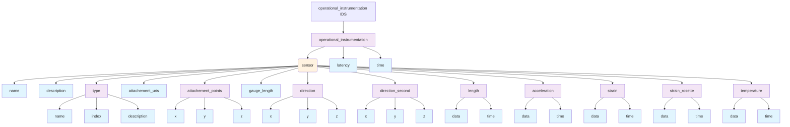

```mermaid
flowchart TD
    root["operational_instrumentation IDS"]

    n1[operational_instrumentation]
    root --> n1
    class n1 normalNode
    n2(sensor)
    n1 --> n2
    class n2 complexNode
    n3[name]
    n2 --> n3
    class n3 leafNode
    n4[description]
    n2 --> n4
    class n4 leafNode
    n5[type]
    n2 --> n5
    class n5 normalNode
    n6[name]
    n5 --> n6
    class n6 leafNode
    n7[index]
    n5 --> n7
    class n7 leafNode
    n8[description]
    n5 --> n8
    class n8 leafNode
    n9[attachement_uris]
    n2 --> n9
    class n9 leafNode
    n10[attachement_points]
    n2 --> n10
    class n10 normalNode
    n11[x]
    n10 --> n11
    class n11 leafNode
    n12[y]
    n10 --> n12
    class n12 leafNode
    n13[z]
    n10 --> n13
    class n13 leafNode
    n14[gauge_length]
    n2 --> n14
    class n14 leafNode
    n15[direction]
    n2 --> n15
    class n15 normalNode
    n16[x]
    n15 --> n16
    class n16 leafNode
    n17[y]
    n15 --> n17
    class n17 leafNode
    n18[z]
    n15 --> n18
    class n18 leafNode
    n19[direction_second]
    n2 --> n19
    class n19 normalNode
    n20[x]
    n19 --> n20
    class n20 leafNode
    n21[y]
    n19 --> n21
    class n21 leafNode
    n22[z]
    n19 --> n22
    class n22 leafNode
    n23[length]
    n2 --> n23
    class n23 normalNode
    n24[data]
    n23 --> n24
    class n24 leafNode
    n25[time]
    n23 --> n25
    class n25 leafNode
    n26[acceleration]
    n2 --> n26
    class n26 normalNode
    n27[data]
    n26 --> n27
    class n27 leafNode
    n28[time]
    n26 --> n28
    class n28 leafNode
    n29[strain]
    n2 --> n29
    class n29 normalNode
    n30[data]
    n29 --> n30
    class n30 leafNode
    n31[time]
    n29 --> n31
    class n31 leafNode
    n32[strain_rosette]
    n2 --> n32
    class n32 normalNode
    n33[data]
    n32 --> n33
    class n33 leafNode
    n34[time]
    n32 --> n34
    class n34 leafNode
    n35[temperature]
    n2 --> n35
    class n35 normalNode
    n36[data]
    n35 --> n36
    class n36 leafNode
    n37[time]
    n35 --> n37
    class n37 leafNode
    n38[latency]
    n1 --> n38
    class n38 leafNode
    n39[time]
    n1 --> n39
    class n39 leafNode

    classDef leafNode fill:#e1f5fe
    classDef complexNode fill:#fff3e0
    classDef normalNode fill:#f3e5f5
    classDef moreNode fill:#f5f5f5,stroke-dasharray: 5 5
```