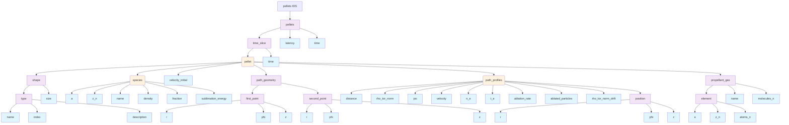

```mermaid
flowchart TD
    root["pellets IDS"]

    n1[pellets]
    root --> n1
    class n1 normalNode
    n2[time_slice]
    n1 --> n2
    class n2 normalNode
    n3(pellet)
    n2 --> n3
    class n3 complexNode
    n4[shape]
    n3 --> n4
    class n4 normalNode
    n5[type]
    n4 --> n5
    class n5 normalNode
    n6[name]
    n5 --> n6
    class n6 leafNode
    n7[index]
    n5 --> n7
    class n7 leafNode
    n8[description]
    n5 --> n8
    class n8 leafNode
    n9[size]
    n4 --> n9
    class n9 leafNode
    n10(species)
    n3 --> n10
    class n10 complexNode
    n11[a]
    n10 --> n11
    class n11 leafNode
    n12[z_n]
    n10 --> n12
    class n12 leafNode
    n13[name]
    n10 --> n13
    class n13 leafNode
    n14[density]
    n10 --> n14
    class n14 leafNode
    n15[fraction]
    n10 --> n15
    class n15 leafNode
    n16[sublimation_energy]
    n10 --> n16
    class n16 leafNode
    n17[velocity_initial]
    n3 --> n17
    class n17 leafNode
    n18[path_geometry]
    n3 --> n18
    class n18 normalNode
    n19[first_point]
    n18 --> n19
    class n19 normalNode
    n20[r]
    n19 --> n20
    class n20 leafNode
    n21[phi]
    n19 --> n21
    class n21 leafNode
    n22[z]
    n19 --> n22
    class n22 leafNode
    n23[second_point]
    n18 --> n23
    class n23 normalNode
    n24[r]
    n23 --> n24
    class n24 leafNode
    n25[phi]
    n23 --> n25
    class n25 leafNode
    n26[z]
    n23 --> n26
    class n26 leafNode
    n27(path_profiles)
    n3 --> n27
    class n27 complexNode
    n28[distance]
    n27 --> n28
    class n28 leafNode
    n29[rho_tor_norm]
    n27 --> n29
    class n29 leafNode
    n30[psi]
    n27 --> n30
    class n30 leafNode
    n31[velocity]
    n27 --> n31
    class n31 leafNode
    n32[n_e]
    n27 --> n32
    class n32 leafNode
    n33[t_e]
    n27 --> n33
    class n33 leafNode
    n34[ablation_rate]
    n27 --> n34
    class n34 leafNode
    n35[ablated_particles]
    n27 --> n35
    class n35 leafNode
    n36[rho_tor_norm_drift]
    n27 --> n36
    class n36 leafNode
    n37[position]
    n27 --> n37
    class n37 normalNode
    n38[r]
    n37 --> n38
    class n38 leafNode
    n39[phi]
    n37 --> n39
    class n39 leafNode
    n40[z]
    n37 --> n40
    class n40 leafNode
    n41[propellant_gas]
    n3 --> n41
    class n41 normalNode
    n42[element]
    n41 --> n42
    class n42 normalNode
    n43[a]
    n42 --> n43
    class n43 leafNode
    n44[z_n]
    n42 --> n44
    class n44 leafNode
    n45[atoms_n]
    n42 --> n45
    class n45 leafNode
    n46[name]
    n41 --> n46
    class n46 leafNode
    n47[molecules_n]
    n41 --> n47
    class n47 leafNode
    n48[time]
    n2 --> n48
    class n48 leafNode
    n49[latency]
    n1 --> n49
    class n49 leafNode
    n50[time]
    n1 --> n50
    class n50 leafNode

    classDef leafNode fill:#e1f5fe
    classDef complexNode fill:#fff3e0
    classDef normalNode fill:#f3e5f5
    classDef moreNode fill:#f5f5f5,stroke-dasharray: 5 5
```