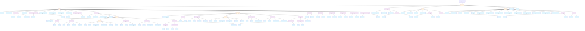

```mermaid
flowchart TD
    root["pf_active IDS"]

    n1(pf_active)
    root --> n1
    class n1 complexNode
    n2(coil)
    n1 --> n2
    class n2 complexNode
    n3[name]
    n2 --> n3
    class n3 leafNode
    n4[description]
    n2 --> n4
    class n4 leafNode
    n5[function]
    n2 --> n5
    class n5 normalNode
    n6[name]
    n5 --> n6
    class n6 leafNode
    n7[index]
    n5 --> n7
    class n7 leafNode
    n8[description]
    n5 --> n8
    class n8 leafNode
    n9[resistance]
    n2 --> n9
    class n9 leafNode
    n10[resistance_additional]
    n2 --> n10
    class n10 normalNode
    n11[data]
    n10 --> n11
    class n11 leafNode
    n12[time]
    n10 --> n12
    class n12 leafNode
    n13[energy_limit_max]
    n2 --> n13
    class n13 leafNode
    n14[current_limit_max]
    n2 --> n14
    class n14 leafNode
    n15[b_field_max]
    n2 --> n15
    class n15 leafNode
    n16[temperature]
    n2 --> n16
    class n16 leafNode
    n17[b_field_max_timed]
    n2 --> n17
    class n17 normalNode
    n18[data]
    n17 --> n18
    class n18 leafNode
    n19[time]
    n17 --> n19
    class n19 leafNode
    n20[element]
    n2 --> n20
    class n20 normalNode
    n21[name]
    n20 --> n21
    class n21 leafNode
    n22[description]
    n20 --> n22
    class n22 leafNode
    n23[turns_with_sign]
    n20 --> n23
    class n23 leafNode
    n24[area]
    n20 --> n24
    class n24 leafNode
    n25(geometry)
    n20 --> n25
    class n25 complexNode
    n26[geometry_type]
    n25 --> n26
    class n26 leafNode
    n27[outline]
    n25 --> n27
    class n27 normalNode
    n28[r]
    n27 --> n28
    class n28 leafNode
    n29[z]
    n27 --> n29
    class n29 leafNode
    n30[rectangle]
    n25 --> n30
    class n30 normalNode
    n31[r]
    n30 --> n31
    class n31 leafNode
    n32[z]
    n30 --> n32
    class n32 leafNode
    n33[width]
    n30 --> n33
    class n33 leafNode
    n34[height]
    n30 --> n34
    class n34 leafNode
    n35(oblique)
    n25 --> n35
    class n35 complexNode
    n36[r]
    n35 --> n36
    class n36 leafNode
    n37[z]
    n35 --> n37
    class n37 leafNode
    n38[length_alpha]
    n35 --> n38
    class n38 leafNode
    n39[length_beta]
    n35 --> n39
    class n39 leafNode
    n40[alpha]
    n35 --> n40
    class n40 leafNode
    n41[beta]
    n35 --> n41
    class n41 leafNode
    n42[arcs_of_circle]
    n25 --> n42
    class n42 normalNode
    n43[r]
    n42 --> n43
    class n43 leafNode
    n44[z]
    n42 --> n44
    class n44 leafNode
    n45[curvature_radii]
    n42 --> n45
    class n45 leafNode
    n46[annulus]
    n25 --> n46
    class n46 normalNode
    n47[r]
    n46 --> n47
    class n47 leafNode
    n48[z]
    n46 --> n48
    class n48 leafNode
    n49[radius_inner]
    n46 --> n49
    class n49 leafNode
    n50[radius_outer]
    n46 --> n50
    class n50 leafNode
    n51[thick_line]
    n25 --> n51
    class n51 normalNode
    n52[first_point]
    n51 --> n52
    class n52 normalNode
    n53[r]
    n52 --> n53
    class n53 leafNode
    n54[z]
    n52 --> n54
    class n54 leafNode
    n55[second_point]
    n51 --> n55
    class n55 normalNode
    n56[r]
    n55 --> n56
    class n56 leafNode
    n57[z]
    n55 --> n57
    class n57 leafNode
    n58[thickness]
    n51 --> n58
    class n58 leafNode
    n59(geometry)
    n2 --> n59
    class n59 complexNode
    n60[geometry_type]
    n59 --> n60
    class n60 leafNode
    n61[outline]
    n59 --> n61
    class n61 normalNode
    n62[r]
    n61 --> n62
    class n62 leafNode
    n63[z]
    n61 --> n63
    class n63 leafNode
    n64[rectangle]
    n59 --> n64
    class n64 normalNode
    n65[r]
    n64 --> n65
    class n65 leafNode
    n66[z]
    n64 --> n66
    class n66 leafNode
    n67[width]
    n64 --> n67
    class n67 leafNode
    n68[height]
    n64 --> n68
    class n68 leafNode
    n69(oblique)
    n59 --> n69
    class n69 complexNode
    n70[r]
    n69 --> n70
    class n70 leafNode
    n71[z]
    n69 --> n71
    class n71 leafNode
    n72[length_alpha]
    n69 --> n72
    class n72 leafNode
    n73[length_beta]
    n69 --> n73
    class n73 leafNode
    n74[alpha]
    n69 --> n74
    class n74 leafNode
    n75[beta]
    n69 --> n75
    class n75 leafNode
    n76[arcs_of_circle]
    n59 --> n76
    class n76 normalNode
    n77[r]
    n76 --> n77
    class n77 leafNode
    n78[z]
    n76 --> n78
    class n78 leafNode
    n79[curvature_radii]
    n76 --> n79
    class n79 leafNode
    n80[annulus]
    n59 --> n80
    class n80 normalNode
    n81[r]
    n80 --> n81
    class n81 leafNode
    n82[z]
    n80 --> n82
    class n82 leafNode
    n83[radius_inner]
    n80 --> n83
    class n83 leafNode
    n84[radius_outer]
    n80 --> n84
    class n84 leafNode
    n85[thick_line]
    n59 --> n85
    class n85 normalNode
    n86[first_point]
    n85 --> n86
    class n86 normalNode
    n87[r]
    n86 --> n87
    class n87 leafNode
    n88[z]
    n86 --> n88
    class n88 leafNode
    n89[second_point]
    n85 --> n89
    class n89 normalNode
    n90[r]
    n89 --> n90
    class n90 leafNode
    n91[z]
    n89 --> n91
    class n91 leafNode
    n92[thickness]
    n85 --> n92
    class n92 leafNode
    n93[current]
    n2 --> n93
    class n93 normalNode
    n94[data]
    n93 --> n94
    class n94 leafNode
    n95[time]
    n93 --> n95
    class n95 leafNode
    n96[voltage]
    n2 --> n96
    class n96 normalNode
    n97[data]
    n96 --> n97
    class n97 leafNode
    n98[time]
    n96 --> n98
    class n98 leafNode
    n99[force_radial]
    n2 --> n99
    class n99 normalNode
    n100[data]
    n99 --> n100
    class n100 leafNode
    n101[time]
    n99 --> n101
    class n101 leafNode
    n102[force_vertical]
    n2 --> n102
    class n102 normalNode
    n103[data]
    n102 --> n103
    class n103 leafNode
    n104[time]
    n102 --> n104
    class n104 leafNode
    n105[force_radial_crushing]
    n2 --> n105
    class n105 normalNode
    n106[data]
    n105 --> n106
    class n106 leafNode
    n107[time]
    n105 --> n107
    class n107 leafNode
    n108[force_vertical_crushing]
    n2 --> n108
    class n108 normalNode
    n109[data]
    n108 --> n109
    class n109 leafNode
    n110[time]
    n108 --> n110
    class n110 leafNode
    n111[force_limits]
    n1 --> n111
    class n111 normalNode
    n112[combination_matrix]
    n111 --> n112
    class n112 leafNode
    n113[limit_max]
    n111 --> n113
    class n113 leafNode
    n114[limit_min]
    n111 --> n114
    class n114 leafNode
    n115[force]
    n111 --> n115
    class n115 normalNode
    n116[data]
    n115 --> n116
    class n116 leafNode
    n117[time]
    n115 --> n117
    class n117 leafNode
    n118(circuit)
    n1 --> n118
    class n118 complexNode
    n119[name]
    n118 --> n119
    class n119 leafNode
    n120[description]
    n118 --> n120
    class n120 leafNode
    n121[type]
    n118 --> n121
    class n121 leafNode
    n122[connections]
    n118 --> n122
    class n122 leafNode
    n123[voltage]
    n118 --> n123
    class n123 normalNode
    n124[data]
    n123 --> n124
    class n124 leafNode
    n125[time]
    n123 --> n125
    class n125 leafNode
    n126[current]
    n118 --> n126
    class n126 normalNode
    n127[data]
    n126 --> n127
    class n127 leafNode
    n128[time]
    n126 --> n128
    class n128 leafNode
    n129(supply)
    n1 --> n129
    class n129 complexNode
    n130[name]
    n129 --> n130
    class n130 leafNode
    n131[description]
    n129 --> n131
    class n131 leafNode
    n132[type]
    n129 --> n132
    class n132 leafNode
    n133[resistance]
    n129 --> n133
    class n133 leafNode
    n134[delay]
    n129 --> n134
    class n134 leafNode
    n135[filter_numerator]
    n129 --> n135
    class n135 leafNode
    n136[filter_denominator]
    n129 --> n136
    class n136 leafNode
    n137[current_limit_max]
    n129 --> n137
    class n137 leafNode
    n138[current_limit_min]
    n129 --> n138
    class n138 leafNode
    n139[voltage_limit_max]
    n129 --> n139
    class n139 leafNode
    n140[voltage_limit_min]
    n129 --> n140
    class n140 leafNode
    n141[current_limiter_gain]
    n129 --> n141
    class n141 leafNode
    n142[energy_limit_max]
    n129 --> n142
    class n142 leafNode
    n143[nonlinear_model]
    n129 --> n143
    class n143 leafNode
    n144[voltage]
    n129 --> n144
    class n144 normalNode
    n145[data]
    n144 --> n145
    class n145 leafNode
    n146[time]
    n144 --> n146
    class n146 leafNode
    n147[current]
    n129 --> n147
    class n147 normalNode
    n148[data]
    n147 --> n148
    class n148 leafNode
    n149[time]
    n147 --> n149
    class n149 leafNode
    n150[latency]
    n1 --> n150
    class n150 leafNode
    n151[time]
    n1 --> n151
    class n151 leafNode

    classDef leafNode fill:#e1f5fe
    classDef complexNode fill:#fff3e0
    classDef normalNode fill:#f3e5f5
    classDef moreNode fill:#f5f5f5,stroke-dasharray: 5 5
```