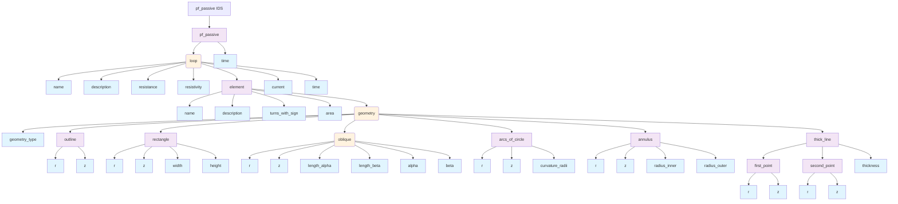

```mermaid
flowchart TD
    root["pf_passive IDS"]

    n1[pf_passive]
    root --> n1
    class n1 normalNode
    n2(loop)
    n1 --> n2
    class n2 complexNode
    n3[name]
    n2 --> n3
    class n3 leafNode
    n4[description]
    n2 --> n4
    class n4 leafNode
    n5[resistance]
    n2 --> n5
    class n5 leafNode
    n6[resistivity]
    n2 --> n6
    class n6 leafNode
    n7[element]
    n2 --> n7
    class n7 normalNode
    n8[name]
    n7 --> n8
    class n8 leafNode
    n9[description]
    n7 --> n9
    class n9 leafNode
    n10[turns_with_sign]
    n7 --> n10
    class n10 leafNode
    n11[area]
    n7 --> n11
    class n11 leafNode
    n12(geometry)
    n7 --> n12
    class n12 complexNode
    n13[geometry_type]
    n12 --> n13
    class n13 leafNode
    n14[outline]
    n12 --> n14
    class n14 normalNode
    n15[r]
    n14 --> n15
    class n15 leafNode
    n16[z]
    n14 --> n16
    class n16 leafNode
    n17[rectangle]
    n12 --> n17
    class n17 normalNode
    n18[r]
    n17 --> n18
    class n18 leafNode
    n19[z]
    n17 --> n19
    class n19 leafNode
    n20[width]
    n17 --> n20
    class n20 leafNode
    n21[height]
    n17 --> n21
    class n21 leafNode
    n22(oblique)
    n12 --> n22
    class n22 complexNode
    n23[r]
    n22 --> n23
    class n23 leafNode
    n24[z]
    n22 --> n24
    class n24 leafNode
    n25[length_alpha]
    n22 --> n25
    class n25 leafNode
    n26[length_beta]
    n22 --> n26
    class n26 leafNode
    n27[alpha]
    n22 --> n27
    class n27 leafNode
    n28[beta]
    n22 --> n28
    class n28 leafNode
    n29[arcs_of_circle]
    n12 --> n29
    class n29 normalNode
    n30[r]
    n29 --> n30
    class n30 leafNode
    n31[z]
    n29 --> n31
    class n31 leafNode
    n32[curvature_radii]
    n29 --> n32
    class n32 leafNode
    n33[annulus]
    n12 --> n33
    class n33 normalNode
    n34[r]
    n33 --> n34
    class n34 leafNode
    n35[z]
    n33 --> n35
    class n35 leafNode
    n36[radius_inner]
    n33 --> n36
    class n36 leafNode
    n37[radius_outer]
    n33 --> n37
    class n37 leafNode
    n38[thick_line]
    n12 --> n38
    class n38 normalNode
    n39[first_point]
    n38 --> n39
    class n39 normalNode
    n40[r]
    n39 --> n40
    class n40 leafNode
    n41[z]
    n39 --> n41
    class n41 leafNode
    n42[second_point]
    n38 --> n42
    class n42 normalNode
    n43[r]
    n42 --> n43
    class n43 leafNode
    n44[z]
    n42 --> n44
    class n44 leafNode
    n45[thickness]
    n38 --> n45
    class n45 leafNode
    n46[current]
    n2 --> n46
    class n46 leafNode
    n47[time]
    n2 --> n47
    class n47 leafNode
    n48[time]
    n1 --> n48
    class n48 leafNode

    classDef leafNode fill:#e1f5fe
    classDef complexNode fill:#fff3e0
    classDef normalNode fill:#f3e5f5
    classDef moreNode fill:#f5f5f5,stroke-dasharray: 5 5
```