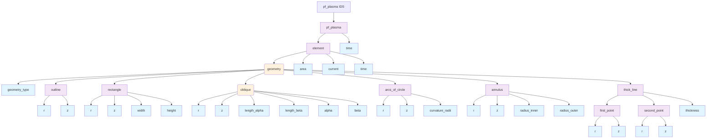

```mermaid
flowchart TD
    root["pf_plasma IDS"]

    n1[pf_plasma]
    root --> n1
    class n1 normalNode
    n2[element]
    n1 --> n2
    class n2 normalNode
    n3(geometry)
    n2 --> n3
    class n3 complexNode
    n4[geometry_type]
    n3 --> n4
    class n4 leafNode
    n5[outline]
    n3 --> n5
    class n5 normalNode
    n6[r]
    n5 --> n6
    class n6 leafNode
    n7[z]
    n5 --> n7
    class n7 leafNode
    n8[rectangle]
    n3 --> n8
    class n8 normalNode
    n9[r]
    n8 --> n9
    class n9 leafNode
    n10[z]
    n8 --> n10
    class n10 leafNode
    n11[width]
    n8 --> n11
    class n11 leafNode
    n12[height]
    n8 --> n12
    class n12 leafNode
    n13(oblique)
    n3 --> n13
    class n13 complexNode
    n14[r]
    n13 --> n14
    class n14 leafNode
    n15[z]
    n13 --> n15
    class n15 leafNode
    n16[length_alpha]
    n13 --> n16
    class n16 leafNode
    n17[length_beta]
    n13 --> n17
    class n17 leafNode
    n18[alpha]
    n13 --> n18
    class n18 leafNode
    n19[beta]
    n13 --> n19
    class n19 leafNode
    n20[arcs_of_circle]
    n3 --> n20
    class n20 normalNode
    n21[r]
    n20 --> n21
    class n21 leafNode
    n22[z]
    n20 --> n22
    class n22 leafNode
    n23[curvature_radii]
    n20 --> n23
    class n23 leafNode
    n24[annulus]
    n3 --> n24
    class n24 normalNode
    n25[r]
    n24 --> n25
    class n25 leafNode
    n26[z]
    n24 --> n26
    class n26 leafNode
    n27[radius_inner]
    n24 --> n27
    class n27 leafNode
    n28[radius_outer]
    n24 --> n28
    class n28 leafNode
    n29[thick_line]
    n3 --> n29
    class n29 normalNode
    n30[first_point]
    n29 --> n30
    class n30 normalNode
    n31[r]
    n30 --> n31
    class n31 leafNode
    n32[z]
    n30 --> n32
    class n32 leafNode
    n33[second_point]
    n29 --> n33
    class n33 normalNode
    n34[r]
    n33 --> n34
    class n34 leafNode
    n35[z]
    n33 --> n35
    class n35 leafNode
    n36[thickness]
    n29 --> n36
    class n36 leafNode
    n37[area]
    n2 --> n37
    class n37 leafNode
    n38[current]
    n2 --> n38
    class n38 leafNode
    n39[time]
    n2 --> n39
    class n39 leafNode
    n40[time]
    n1 --> n40
    class n40 leafNode

    classDef leafNode fill:#e1f5fe
    classDef complexNode fill:#fff3e0
    classDef normalNode fill:#f3e5f5
    classDef moreNode fill:#f5f5f5,stroke-dasharray: 5 5
```