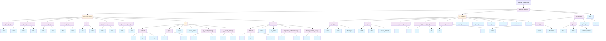

```mermaid
flowchart TD
    root["plasma_initiation IDS"]

    n1[plasma_initiation]
    root --> n1
    class n1 normalNode
    n2(global_quantities)
    n1 --> n2
    class n2 complexNode
    n3[b_field_stray]
    n2 --> n3
    class n3 normalNode
    n4[data]
    n3 --> n4
    class n4 leafNode
    n5[time]
    n3 --> n5
    class n5 leafNode
    n6[b_field_perpendicular]
    n2 --> n6
    class n6 normalNode
    n7[data]
    n6 --> n7
    class n7 leafNode
    n8[time]
    n6 --> n8
    class n8 leafNode
    n9[connection_length]
    n2 --> n9
    class n9 normalNode
    n10[data]
    n9 --> n10
    class n10 leafNode
    n11[time]
    n9 --> n11
    class n11 leafNode
    n12[coulomb_logarithm]
    n2 --> n12
    class n12 normalNode
    n13[data]
    n12 --> n13
    class n13 leafNode
    n14[time]
    n12 --> n14
    class n14 leafNode
    n15[ip]
    n2 --> n15
    class n15 normalNode
    n16[data]
    n15 --> n16
    class n16 leafNode
    n17[time]
    n15 --> n17
    class n17 leafNode
    n18[t_e_volume_average]
    n2 --> n18
    class n18 normalNode
    n19[data]
    n18 --> n19
    class n19 leafNode
    n20[time]
    n18 --> n20
    class n20 leafNode
    n21[n_e_volume_average]
    n2 --> n21
    class n21 normalNode
    n22[data]
    n21 --> n22
    class n22 leafNode
    n23[time]
    n21 --> n23
    class n23 leafNode
    n24(ion)
    n2 --> n24
    class n24 complexNode
    n25[element]
    n24 --> n25
    class n25 normalNode
    n26[a]
    n25 --> n26
    class n26 leafNode
    n27[z_n]
    n25 --> n27
    class n27 leafNode
    n28[atoms_n]
    n25 --> n28
    class n28 leafNode
    n29[z_ion]
    n24 --> n29
    class n29 normalNode
    n30[data]
    n29 --> n30
    class n30 leafNode
    n31[time]
    n29 --> n31
    class n31 leafNode
    n32[name]
    n24 --> n32
    class n32 leafNode
    n33[neutral_index]
    n24 --> n33
    class n33 leafNode
    n34[t_i_volume_average]
    n24 --> n34
    class n34 normalNode
    n35[data]
    n34 --> n35
    class n35 leafNode
    n36[time]
    n34 --> n36
    class n36 leafNode
    n37[n_i_volume_average]
    n24 --> n37
    class n37 normalNode
    n38[data]
    n37 --> n38
    class n38 leafNode
    n39[time]
    n37 --> n39
    class n39 leafNode
    n40[neutral]
    n2 --> n40
    class n40 normalNode
    n41[element]
    n40 --> n41
    class n41 normalNode
    n42[a]
    n41 --> n42
    class n42 leafNode
    n43[z_n]
    n41 --> n43
    class n43 leafNode
    n44[atoms_n]
    n41 --> n44
    class n44 leafNode
    n45[name]
    n40 --> n45
    class n45 leafNode
    n46[ion_index]
    n40 --> n46
    class n46 leafNode
    n47[temperature_volume_average]
    n40 --> n47
    class n47 normalNode
    n48[data]
    n47 --> n48
    class n48 leafNode
    n49[time]
    n47 --> n49
    class n49 leafNode
    n50[density_volume_average]
    n40 --> n50
    class n50 normalNode
    n51[data]
    n50 --> n51
    class n51 leafNode
    n52[time]
    n50 --> n52
    class n52 leafNode
    n53(b_field_lines)
    n1 --> n53
    class n53 complexNode
    n54[grid_type]
    n53 --> n54
    class n54 normalNode
    n55[name]
    n54 --> n55
    class n55 leafNode
    n56[index]
    n54 --> n56
    class n56 leafNode
    n57[description]
    n54 --> n57
    class n57 leafNode
    n58[grid]
    n53 --> n58
    class n58 normalNode
    n59[dim1]
    n58 --> n59
    class n59 leafNode
    n60[dim2]
    n58 --> n60
    class n60 leafNode
    n61[volume_element]
    n58 --> n61
    class n61 leafNode
    n62[townsend_or_closed_positions]
    n53 --> n62
    class n62 normalNode
    n63[r]
    n62 --> n63
    class n63 leafNode
    n64[z]
    n62 --> n64
    class n64 leafNode
    n65[townsend_or_closed_grid_positions]
    n53 --> n65
    class n65 normalNode
    n66[r]
    n65 --> n66
    class n66 leafNode
    n67[z]
    n65 --> n67
    class n67 leafNode
    n68[starting_positions]
    n53 --> n68
    class n68 normalNode
    n69[r]
    n68 --> n69
    class n69 leafNode
    n70[z]
    n68 --> n70
    class n70 leafNode
    n71[e_field_townsend]
    n53 --> n71
    class n71 leafNode
    n72[e_field_parallel]
    n53 --> n72
    class n72 leafNode
    n73[lengths]
    n53 --> n73
    class n73 leafNode
    n74[pressure]
    n53 --> n74
    class n74 leafNode
    n75[open_fraction]
    n53 --> n75
    class n75 leafNode
    n76[time]
    n53 --> n76
    class n76 leafNode
    n77[profiles_2d]
    n1 --> n77
    class n77 normalNode
    n78[grid_type]
    n77 --> n78
    class n78 normalNode
    n79[name]
    n78 --> n79
    class n79 leafNode
    n80[index]
    n78 --> n80
    class n80 leafNode
    n81[description]
    n78 --> n81
    class n81 leafNode
    n82[grid]
    n77 --> n82
    class n82 normalNode
    n83[dim1]
    n82 --> n83
    class n83 leafNode
    n84[dim2]
    n82 --> n84
    class n84 leafNode
    n85[volume_element]
    n82 --> n85
    class n85 leafNode
    n86[e_field_phi]
    n77 --> n86
    class n86 leafNode
    n87[time]
    n77 --> n87
    class n87 leafNode
    n88[time]
    n1 --> n88
    class n88 leafNode

    classDef leafNode fill:#e1f5fe
    classDef complexNode fill:#fff3e0
    classDef normalNode fill:#f3e5f5
    classDef moreNode fill:#f5f5f5,stroke-dasharray: 5 5
```