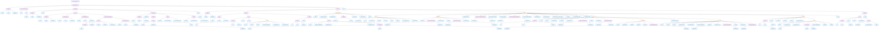

```mermaid
flowchart TD
    root["plasma_sources IDS"]

    n1[plasma_sources]
    root --> n1
    class n1 normalNode
    n2[midplane]
    n1 --> n2
    class n2 normalNode
    n3[name]
    n2 --> n3
    class n3 leafNode
    n4[index]
    n2 --> n4
    class n4 leafNode
    n5[description]
    n2 --> n5
    class n5 leafNode
    n6[vacuum_toroidal_field]
    n1 --> n6
    class n6 normalNode
    n7[r0]
    n6 --> n7
    class n7 leafNode
    n8[b0]
    n6 --> n8
    class n8 leafNode
    n9[grid_ggd]
    n1 --> n9
    class n9 normalNode
    n10[identifier]
    n9 --> n10
    class n10 normalNode
    n11[name]
    n10 --> n11
    class n11 leafNode
    n12[index]
    n10 --> n12
    class n12 leafNode
    n13[description]
    n10 --> n13
    class n13 leafNode
    n14[path]
    n9 --> n14
    class n14 leafNode
    n15[space]
    n9 --> n15
    class n15 normalNode
    n16[identifier]
    n15 --> n16
    class n16 normalNode
    n17[name]
    n16 --> n17
    class n17 leafNode
    n18[index]
    n16 --> n18
    class n18 leafNode
    n19[description]
    n16 --> n19
    class n19 leafNode
    n20[geometry_type]
    n15 --> n20
    class n20 normalNode
    n21[name]
    n20 --> n21
    class n21 leafNode
    n22[index]
    n20 --> n22
    class n22 leafNode
    n23[description]
    n20 --> n23
    class n23 leafNode
    n24[coordinates_type]
    n15 --> n24
    class n24 normalNode
    n25[name]
    n24 --> n25
    class n25 leafNode
    n26[index]
    n24 --> n26
    class n26 leafNode
    n27[description]
    n24 --> n27
    class n27 leafNode
    n28[objects_per_dimension]
    n15 --> n28
    class n28 normalNode
    n29[object]
    n28 --> n29
    class n29 normalNode
    n30[boundary]
    n29 --> n30
    class n30 normalNode
    n31[index]
    n30 --> n31
    class n31 leafNode
    n32[neighbours]
    n30 --> n32
    class n32 leafNode
    n33[geometry]
    n29 --> n33
    class n33 leafNode
    n34[nodes]
    n29 --> n34
    class n34 leafNode
    n35[measure]
    n29 --> n35
    class n35 leafNode
    n36[geometry_2d]
    n29 --> n36
    class n36 leafNode
    n37[geometry_content]
    n28 --> n37
    class n37 normalNode
    n38[name]
    n37 --> n38
    class n38 leafNode
    n39[index]
    n37 --> n39
    class n39 leafNode
    n40[description]
    n37 --> n40
    class n40 leafNode
    n41[grid_subset]
    n9 --> n41
    class n41 normalNode
    n42[identifier]
    n41 --> n42
    class n42 normalNode
    n43[name]
    n42 --> n43
    class n43 leafNode
    n44[index]
    n42 --> n44
    class n44 leafNode
    n45[description]
    n42 --> n45
    class n45 leafNode
    n46[dimension]
    n41 --> n46
    class n46 leafNode
    n47[element]
    n41 --> n47
    class n47 normalNode
    n48[object]
    n47 --> n48
    class n48 normalNode
    n49[space]
    n48 --> n49
    class n49 leafNode
    n50[dimension]
    n48 --> n50
    class n50 leafNode
    n51[index]
    n48 --> n51
    class n51 leafNode
    n52[base]
    n41 --> n52
    class n52 normalNode
    n53[jacobian]
    n52 --> n53
    class n53 leafNode
    n54[tensor_covariant]
    n52 --> n54
    class n54 leafNode
    n55[tensor_contravariant]
    n52 --> n55
    class n55 leafNode
    n56[metric]
    n41 --> n56
    class n56 normalNode
    n57[jacobian]
    n56 --> n57
    class n57 leafNode
    n58[tensor_covariant]
    n56 --> n58
    class n58 leafNode
    n59[tensor_contravariant]
    n56 --> n59
    class n59 leafNode
    n60[time]
    n9 --> n60
    class n60 leafNode
    n61[source]
    n1 --> n61
    class n61 normalNode
    n62[identifier]
    n61 --> n62
    class n62 normalNode
    n63[name]
    n62 --> n63
    class n63 leafNode
    n64[index]
    n62 --> n64
    class n64 leafNode
    n65[description]
    n62 --> n65
    class n65 leafNode
    n66[species]
    n61 --> n66
    class n66 normalNode
    n67[type]
    n66 --> n67
    class n67 normalNode
    n68[name]
    n67 --> n68
    class n68 leafNode
    n69[index]
    n67 --> n69
    class n69 leafNode
    n70[description]
    n67 --> n70
    class n70 leafNode
    n71[ion]
    n66 --> n71
    class n71 normalNode
    n72[element]
    n71 --> n72
    class n72 normalNode
    n73[a]
    n72 --> n73
    class n73 leafNode
    n74[z_n]
    n72 --> n74
    class n74 leafNode
    n75[atoms_n]
    n72 --> n75
    class n75 leafNode
    n76[z_ion]
    n71 --> n76
    class n76 leafNode
    n77[name]
    n71 --> n77
    class n77 leafNode
    n78(state)
    n71 --> n78
    class n78 complexNode
    n79[z_min]
    n78 --> n79
    class n79 leafNode
    n80[z_max]
    n78 --> n80
    class n80 leafNode
    n81[name]
    n78 --> n81
    class n81 leafNode
    n82[electron_configuration]
    n78 --> n82
    class n82 leafNode
    n83[vibrational_level]
    n78 --> n83
    class n83 leafNode
    n84[vibrational_mode]
    n78 --> n84
    class n84 leafNode
    n85[neutral]
    n66 --> n85
    class n85 normalNode
    n86[element]
    n85 --> n86
    class n86 normalNode
    n87[a]
    n86 --> n87
    class n87 leafNode
    n88[z_n]
    n86 --> n88
    class n88 leafNode
    n89[atoms_n]
    n86 --> n89
    class n89 leafNode
    n90[name]
    n85 --> n90
    class n90 leafNode
    n91[state]
    n85 --> n91
    class n91 normalNode
    n92[name]
    n91 --> n92
    class n92 leafNode
    n93[electron_configuration]
    n91 --> n93
    class n93 leafNode
    n94[vibrational_level]
    n91 --> n94
    class n94 leafNode
    n95[vibrational_mode]
    n91 --> n95
    class n95 leafNode
    n96[neutral_type]
    n91 --> n96
    class n96 normalNode
    n97[name]
    n96 --> n97
    class n97 leafNode
    n98[index]
    n96 --> n98
    class n98 leafNode
    n99[description]
    n96 --> n99
    class n99 leafNode
    n100(global_quantities)
    n61 --> n100
    class n100 complexNode
    n101[power]
    n100 --> n101
    class n101 leafNode
    n102[total_ion_particles]
    n100 --> n102
    class n102 leafNode
    n103[total_ion_power]
    n100 --> n103
    class n103 leafNode
    n104[electrons]
    n100 --> n104
    class n104 normalNode
    n105[particles]
    n104 --> n105
    class n105 leafNode
    n106[power]
    n104 --> n106
    class n106 leafNode
    n107[torque_phi]
    n100 --> n107
    class n107 leafNode
    n108[current_parallel]
    n100 --> n108
    class n108 leafNode
    n109[time]
    n100 --> n109
    class n109 leafNode
    n110(profiles_1d)
    n61 --> n110
    class n110 complexNode
    n111(grid)
    n110 --> n111
    class n111 complexNode
    n112[rho_pol_norm]
    n111 --> n112
    class n112 leafNode
    n113[psi]
    n111 --> n113
    class n113 leafNode
    n114[rho_tor_norm]
    n111 --> n114
    class n114 leafNode
    n115[rho_tor]
    n111 --> n115
    class n115 leafNode
    n116[volume]
    n111 --> n116
    class n116 leafNode
    n117[area]
    n111 --> n117
    class n117 leafNode
    n118[surface]
    n111 --> n118
    class n118 leafNode
    n119[psi_magnetic_axis]
    n111 --> n119
    class n119 leafNode
    n120[psi_boundary]
    n111 --> n120
    class n120 leafNode
    n121(electrons)
    n110 --> n121
    class n121 complexNode
    n122[particles]
    n121 --> n122
    class n122 leafNode
    n123[particles_decomposed]
    n121 --> n123
    class n123 normalNode
    n124[implicit_part]
    n123 --> n124
    class n124 leafNode
    n125[explicit_part]
    n123 --> n125
    class n125 leafNode
    n126[particles_inside]
    n121 --> n126
    class n126 leafNode
    n127[energy]
    n121 --> n127
    class n127 leafNode
    n128[energy_decomposed]
    n121 --> n128
    class n128 normalNode
    n129[implicit_part]
    n128 --> n129
    class n129 leafNode
    n130[explicit_part]
    n128 --> n130
    class n130 leafNode
    n131[power_inside]
    n121 --> n131
    class n131 leafNode
    n132[total_ion_energy]
    n110 --> n132
    class n132 leafNode
    n133[total_ion_energy_decomposed]
    n110 --> n133
    class n133 normalNode
    n134[implicit_part]
    n133 --> n134
    class n134 leafNode
    n135[explicit_part]
    n133 --> n135
    class n135 leafNode
    n136[total_ion_power_inside]
    n110 --> n136
    class n136 leafNode
    n137[total_ion_particles]
    n110 --> n137
    class n137 leafNode
    n138[total_ion_particles_decomposed]
    n110 --> n138
    class n138 normalNode
    n139[implicit_part]
    n138 --> n139
    class n139 leafNode
    n140[explicit_part]
    n138 --> n140
    class n140 leafNode
    n141[total_ion_particles_inside]
    n110 --> n141
    class n141 leafNode
    n142[momentum_phi]
    n110 --> n142
    class n142 leafNode
    n143[torque_phi_inside]
    n110 --> n143
    class n143 leafNode
    n144[momentum_phi_j_cross_b_field]
    n110 --> n144
    class n144 leafNode
    n145[j_parallel]
    n110 --> n145
    class n145 leafNode
    n146[current_parallel_inside]
    n110 --> n146
    class n146 leafNode
    n147[conductivity_parallel]
    n110 --> n147
    class n147 leafNode
    n148(ion)
    n110 --> n148
    class n148 complexNode
    n149[element]
    n148 --> n149
    class n149 normalNode
    n150[a]
    n149 --> n150
    class n150 leafNode
    n151[z_n]
    n149 --> n151
    class n151 leafNode
    n152[atoms_n]
    n149 --> n152
    class n152 leafNode
    n153[z_ion]
    n148 --> n153
    class n153 leafNode
    n154[name]
    n148 --> n154
    class n154 leafNode
    n155[neutral_index]
    n148 --> n155
    class n155 leafNode
    n156[particles]
    n148 --> n156
    class n156 leafNode
    n157[particles_inside]
    n148 --> n157
    class n157 leafNode
    n158[particles_decomposed]
    n148 --> n158
    class n158 normalNode
    n159[implicit_part]
    n158 --> n159
    class n159 leafNode
    n160[explicit_part]
    n158 --> n160
    class n160 leafNode
    n161[energy]
    n148 --> n161
    class n161 leafNode
    n162[power_inside]
    n148 --> n162
    class n162 leafNode
    n163[energy_decomposed]
    n148 --> n163
    class n163 normalNode
    n164[implicit_part]
    n163 --> n164
    class n164 leafNode
    n165[explicit_part]
    n163 --> n165
    class n165 leafNode
    n166(momentum)
    n148 --> n166
    class n166 complexNode
    n167[radial]
    n166 --> n167
    class n167 leafNode
    n168[diamagnetic]
    n166 --> n168
    class n168 leafNode
    n169[parallel]
    n166 --> n169
    class n169 leafNode
    n170[poloidal]
    n166 --> n170
    class n170 leafNode
    n171[toroidal]
    n166 --> n171
    class n171 leafNode
    n172[toroidal_decomposed]
    n166 --> n172
    class n172 normalNode
    n173[implicit_part]
    n172 --> n173
    class n173 leafNode
    n174[explicit_part]
    n172 --> n174
    class n174 leafNode
    n175[multiple_states_flag]
    n148 --> n175
    class n175 leafNode
    n176(state)
    n148 --> n176
    class n176 complexNode
    n177[z_min]
    n176 --> n177
    class n177 leafNode
    n178[z_max]
    n176 --> n178
    class n178 leafNode
    n179[name]
    n176 --> n179
    class n179 leafNode
    n180[vibrational_level]
    n176 --> n180
    class n180 leafNode
    n181[vibrational_mode]
    n176 --> n181
    class n181 leafNode
    n182[electron_configuration]
    n176 --> n182
    class n182 leafNode
    n183[particles]
    n176 --> n183
    class n183 leafNode
    n184[particles_inside]
    n176 --> n184
    class n184 leafNode
    n185[particles_decomposed]
    n176 --> n185
    class n185 normalNode
    n186[implicit_part]
    n185 --> n186
    class n186 leafNode
    n187[explicit_part]
    n185 --> n187
    class n187 leafNode
    n188[energy]
    n176 --> n188
    class n188 leafNode
    n189[power_inside]
    n176 --> n189
    class n189 leafNode
    n190[energy_decomposed]
    n176 --> n190
    class n190 normalNode
    n191[implicit_part]
    n190 --> n191
    class n191 leafNode
    n192[explicit_part]
    n190 --> n192
    class n192 leafNode
    n193(neutral)
    n110 --> n193
    class n193 complexNode
    n194[element]
    n193 --> n194
    class n194 normalNode
    n195[a]
    n194 --> n195
    class n195 leafNode
    n196[z_n]
    n194 --> n196
    class n196 leafNode
    n197[atoms_n]
    n194 --> n197
    class n197 leafNode
    n198[name]
    n193 --> n198
    class n198 leafNode
    n199[ion_index]
    n193 --> n199
    class n199 leafNode
    n200[particles]
    n193 --> n200
    class n200 leafNode
    n201[energy]
    n193 --> n201
    class n201 leafNode
    n202[multiple_states_flag]
    n193 --> n202
    class n202 leafNode
    n203(state)
    n193 --> n203
    class n203 complexNode
    n204[name]
    n203 --> n204
    class n204 leafNode
    n205[vibrational_level]
    n203 --> n205
    class n205 leafNode
    n206[vibrational_mode]
    n203 --> n206
    class n206 leafNode
    n207[neutral_type]
    n203 --> n207
    class n207 normalNode
    n208[name]
    n207 --> n208
    class n208 leafNode
    n209[index]
    n207 --> n209
    class n209 leafNode
    n210[description]
    n207 --> n210
    class n210 leafNode
    n211[electron_configuration]
    n203 --> n211
    class n211 leafNode
    n212[particles]
    n203 --> n212
    class n212 leafNode
    n213[energy]
    n203 --> n213
    class n213 leafNode
    n214[time]
    n110 --> n214
    class n214 leafNode
    n215[ggd_fast]
    n61 --> n215
    class n215 normalNode
    n216[ion]
    n215 --> n216
    class n216 normalNode
    n217[element]
    n216 --> n217
    class n217 normalNode
    n218[a]
    n217 --> n218
    class n218 leafNode
    n219[z_n]
    n217 --> n219
    class n219 leafNode
    n220[atoms_n]
    n217 --> n220
    class n220 leafNode
    n221[z_ion]
    n216 --> n221
    class n221 leafNode
    n222[name]
    n216 --> n222
    class n222 leafNode
    n223[neutral_index]
    n216 --> n223
    class n223 leafNode
    n224[power]
    n216 --> n224
    class n224 normalNode
    n225[grid_index]
    n224 --> n225
    class n225 leafNode
    n226[grid_subset_index]
    n224 --> n226
    class n226 leafNode
    n227[value]
    n224 --> n227
    class n227 leafNode
    n228[time]
    n215 --> n228
    class n228 leafNode
    n229[time]
    n1 --> n229
    class n229 leafNode

    classDef leafNode fill:#e1f5fe
    classDef complexNode fill:#fff3e0
    classDef normalNode fill:#f3e5f5
    classDef moreNode fill:#f5f5f5,stroke-dasharray: 5 5
```