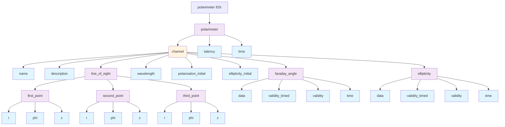

```mermaid
flowchart TD
    root["polarimeter IDS"]

    n1[polarimeter]
    root --> n1
    class n1 normalNode
    n2(channel)
    n1 --> n2
    class n2 complexNode
    n3[name]
    n2 --> n3
    class n3 leafNode
    n4[description]
    n2 --> n4
    class n4 leafNode
    n5[line_of_sight]
    n2 --> n5
    class n5 normalNode
    n6[first_point]
    n5 --> n6
    class n6 normalNode
    n7[r]
    n6 --> n7
    class n7 leafNode
    n8[phi]
    n6 --> n8
    class n8 leafNode
    n9[z]
    n6 --> n9
    class n9 leafNode
    n10[second_point]
    n5 --> n10
    class n10 normalNode
    n11[r]
    n10 --> n11
    class n11 leafNode
    n12[phi]
    n10 --> n12
    class n12 leafNode
    n13[z]
    n10 --> n13
    class n13 leafNode
    n14[third_point]
    n5 --> n14
    class n14 normalNode
    n15[r]
    n14 --> n15
    class n15 leafNode
    n16[phi]
    n14 --> n16
    class n16 leafNode
    n17[z]
    n14 --> n17
    class n17 leafNode
    n18[wavelength]
    n2 --> n18
    class n18 leafNode
    n19[polarization_initial]
    n2 --> n19
    class n19 leafNode
    n20[ellipticity_initial]
    n2 --> n20
    class n20 leafNode
    n21[faraday_angle]
    n2 --> n21
    class n21 normalNode
    n22[data]
    n21 --> n22
    class n22 leafNode
    n23[validity_timed]
    n21 --> n23
    class n23 leafNode
    n24[validity]
    n21 --> n24
    class n24 leafNode
    n25[time]
    n21 --> n25
    class n25 leafNode
    n26[ellipticity]
    n2 --> n26
    class n26 normalNode
    n27[data]
    n26 --> n27
    class n27 leafNode
    n28[validity_timed]
    n26 --> n28
    class n28 leafNode
    n29[validity]
    n26 --> n29
    class n29 leafNode
    n30[time]
    n26 --> n30
    class n30 leafNode
    n31[latency]
    n1 --> n31
    class n31 leafNode
    n32[time]
    n1 --> n32
    class n32 leafNode

    classDef leafNode fill:#e1f5fe
    classDef complexNode fill:#fff3e0
    classDef normalNode fill:#f3e5f5
    classDef moreNode fill:#f5f5f5,stroke-dasharray: 5 5
```