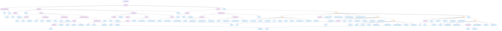

```mermaid
flowchart TD
    root["radiation IDS"]

    n1[radiation]
    root --> n1
    class n1 normalNode
    n2[vacuum_toroidal_field]
    n1 --> n2
    class n2 normalNode
    n3[r0]
    n2 --> n3
    class n3 leafNode
    n4[b0]
    n2 --> n4
    class n4 leafNode
    n5[grid_ggd]
    n1 --> n5
    class n5 normalNode
    n6[identifier]
    n5 --> n6
    class n6 normalNode
    n7[name]
    n6 --> n7
    class n7 leafNode
    n8[index]
    n6 --> n8
    class n8 leafNode
    n9[description]
    n6 --> n9
    class n9 leafNode
    n10[path]
    n5 --> n10
    class n10 leafNode
    n11[space]
    n5 --> n11
    class n11 normalNode
    n12[identifier]
    n11 --> n12
    class n12 normalNode
    n13[name]
    n12 --> n13
    class n13 leafNode
    n14[index]
    n12 --> n14
    class n14 leafNode
    n15[description]
    n12 --> n15
    class n15 leafNode
    n16[geometry_type]
    n11 --> n16
    class n16 normalNode
    n17[name]
    n16 --> n17
    class n17 leafNode
    n18[index]
    n16 --> n18
    class n18 leafNode
    n19[description]
    n16 --> n19
    class n19 leafNode
    n20[coordinates_type]
    n11 --> n20
    class n20 normalNode
    n21[name]
    n20 --> n21
    class n21 leafNode
    n22[index]
    n20 --> n22
    class n22 leafNode
    n23[description]
    n20 --> n23
    class n23 leafNode
    n24[objects_per_dimension]
    n11 --> n24
    class n24 normalNode
    n25[object]
    n24 --> n25
    class n25 normalNode
    n26[boundary]
    n25 --> n26
    class n26 normalNode
    n27[index]
    n26 --> n27
    class n27 leafNode
    n28[neighbours]
    n26 --> n28
    class n28 leafNode
    n29[geometry]
    n25 --> n29
    class n29 leafNode
    n30[nodes]
    n25 --> n30
    class n30 leafNode
    n31[measure]
    n25 --> n31
    class n31 leafNode
    n32[geometry_2d]
    n25 --> n32
    class n32 leafNode
    n33[geometry_content]
    n24 --> n33
    class n33 normalNode
    n34[name]
    n33 --> n34
    class n34 leafNode
    n35[index]
    n33 --> n35
    class n35 leafNode
    n36[description]
    n33 --> n36
    class n36 leafNode
    n37[grid_subset]
    n5 --> n37
    class n37 normalNode
    n38[identifier]
    n37 --> n38
    class n38 normalNode
    n39[name]
    n38 --> n39
    class n39 leafNode
    n40[index]
    n38 --> n40
    class n40 leafNode
    n41[description]
    n38 --> n41
    class n41 leafNode
    n42[dimension]
    n37 --> n42
    class n42 leafNode
    n43[element]
    n37 --> n43
    class n43 normalNode
    n44[object]
    n43 --> n44
    class n44 normalNode
    n45[space]
    n44 --> n45
    class n45 leafNode
    n46[dimension]
    n44 --> n46
    class n46 leafNode
    n47[index]
    n44 --> n47
    class n47 leafNode
    n48[base]
    n37 --> n48
    class n48 normalNode
    n49[jacobian]
    n48 --> n49
    class n49 leafNode
    n50[tensor_covariant]
    n48 --> n50
    class n50 leafNode
    n51[tensor_contravariant]
    n48 --> n51
    class n51 leafNode
    n52[metric]
    n37 --> n52
    class n52 normalNode
    n53[jacobian]
    n52 --> n53
    class n53 leafNode
    n54[tensor_covariant]
    n52 --> n54
    class n54 leafNode
    n55[tensor_contravariant]
    n52 --> n55
    class n55 leafNode
    n56[time]
    n5 --> n56
    class n56 leafNode
    n57[process]
    n1 --> n57
    class n57 normalNode
    n58[identifier]
    n57 --> n58
    class n58 normalNode
    n59[name]
    n58 --> n59
    class n59 leafNode
    n60[index]
    n58 --> n60
    class n60 leafNode
    n61[description]
    n58 --> n61
    class n61 leafNode
    n62[global_quantities]
    n57 --> n62
    class n62 normalNode
    n63[inside_lcfs]
    n62 --> n63
    class n63 normalNode
    n64[power]
    n63 --> n64
    class n64 leafNode
    n65[power_ion_total]
    n63 --> n65
    class n65 leafNode
    n66[power_neutral_total]
    n63 --> n66
    class n66 leafNode
    n67[power_electrons]
    n63 --> n67
    class n67 leafNode
    n68[inside_vessel]
    n62 --> n68
    class n68 normalNode
    n69[power]
    n68 --> n69
    class n69 leafNode
    n70[power_ion_total]
    n68 --> n70
    class n70 leafNode
    n71[power_neutral_total]
    n68 --> n71
    class n71 leafNode
    n72[power_electrons]
    n68 --> n72
    class n72 leafNode
    n73[time]
    n62 --> n73
    class n73 leafNode
    n74(profiles_1d)
    n57 --> n74
    class n74 complexNode
    n75(grid)
    n74 --> n75
    class n75 complexNode
    n76[rho_tor_norm]
    n75 --> n76
    class n76 leafNode
    n77[rho_tor]
    n75 --> n77
    class n77 leafNode
    n78[rho_pol_norm]
    n75 --> n78
    class n78 leafNode
    n79[psi]
    n75 --> n79
    class n79 leafNode
    n80[volume]
    n75 --> n80
    class n80 leafNode
    n81[area]
    n75 --> n81
    class n81 leafNode
    n82[surface]
    n75 --> n82
    class n82 leafNode
    n83[psi_magnetic_axis]
    n75 --> n83
    class n83 leafNode
    n84[psi_boundary]
    n75 --> n84
    class n84 leafNode
    n85[electrons]
    n74 --> n85
    class n85 normalNode
    n86[emissivity]
    n85 --> n86
    class n86 leafNode
    n87[power_inside]
    n85 --> n87
    class n87 leafNode
    n88[emissivity_ion_total]
    n74 --> n88
    class n88 leafNode
    n89[power_inside_ion_total]
    n74 --> n89
    class n89 leafNode
    n90[emissivity_neutral_total]
    n74 --> n90
    class n90 leafNode
    n91[power_inside_neutral_total]
    n74 --> n91
    class n91 leafNode
    n92(ion)
    n74 --> n92
    class n92 complexNode
    n93[element]
    n92 --> n93
    class n93 normalNode
    n94[a]
    n93 --> n94
    class n94 leafNode
    n95[z_n]
    n93 --> n95
    class n95 leafNode
    n96[atoms_n]
    n93 --> n96
    class n96 leafNode
    n97[z_ion]
    n92 --> n97
    class n97 leafNode
    n98[name]
    n92 --> n98
    class n98 leafNode
    n99[neutral_index]
    n92 --> n99
    class n99 leafNode
    n100[emissivity]
    n92 --> n100
    class n100 leafNode
    n101[power_inside]
    n92 --> n101
    class n101 leafNode
    n102[multiple_states_flag]
    n92 --> n102
    class n102 leafNode
    n103(state)
    n92 --> n103
    class n103 complexNode
    n104[z_min]
    n103 --> n104
    class n104 leafNode
    n105[z_max]
    n103 --> n105
    class n105 leafNode
    n106[name]
    n103 --> n106
    class n106 leafNode
    n107[vibrational_level]
    n103 --> n107
    class n107 leafNode
    n108[vibrational_mode]
    n103 --> n108
    class n108 leafNode
    n109[electron_configuration]
    n103 --> n109
    class n109 leafNode
    n110[emissivity]
    n103 --> n110
    class n110 leafNode
    n111[power_inside]
    n103 --> n111
    class n111 leafNode
    n112(neutral)
    n74 --> n112
    class n112 complexNode
    n113[element]
    n112 --> n113
    class n113 normalNode
    n114[a]
    n113 --> n114
    class n114 leafNode
    n115[z_n]
    n113 --> n115
    class n115 leafNode
    n116[atoms_n]
    n113 --> n116
    class n116 leafNode
    n117[name]
    n112 --> n117
    class n117 leafNode
    n118[ion_index]
    n112 --> n118
    class n118 leafNode
    n119[emissivity]
    n112 --> n119
    class n119 leafNode
    n120[power_inside]
    n112 --> n120
    class n120 leafNode
    n121[multiple_states_flag]
    n112 --> n121
    class n121 leafNode
    n122(state)
    n112 --> n122
    class n122 complexNode
    n123[name]
    n122 --> n123
    class n123 leafNode
    n124[vibrational_level]
    n122 --> n124
    class n124 leafNode
    n125[vibrational_mode]
    n122 --> n125
    class n125 leafNode
    n126[neutral_type]
    n122 --> n126
    class n126 normalNode
    n127[name]
    n126 --> n127
    class n127 leafNode
    n128[index]
    n126 --> n128
    class n128 leafNode
    n129[description]
    n126 --> n129
    class n129 leafNode
    n130[electron_configuration]
    n122 --> n130
    class n130 leafNode
    n131[emissivity]
    n122 --> n131
    class n131 leafNode
    n132[power_inside]
    n122 --> n132
    class n132 leafNode
    n133[time]
    n74 --> n133
    class n133 leafNode
    n134[time]
    n1 --> n134
    class n134 leafNode

    classDef leafNode fill:#e1f5fe
    classDef complexNode fill:#fff3e0
    classDef normalNode fill:#f3e5f5
    classDef moreNode fill:#f5f5f5,stroke-dasharray: 5 5
```