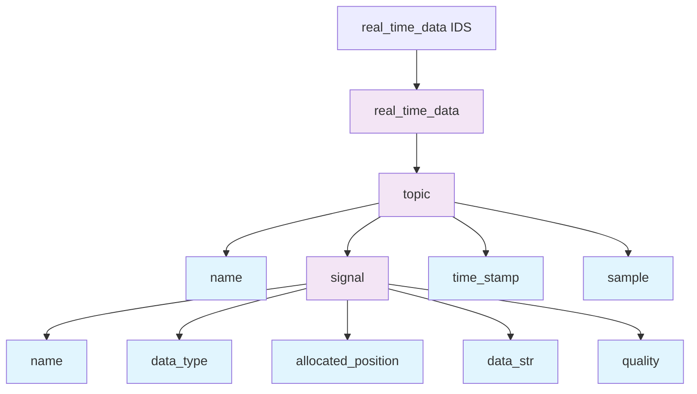

```mermaid
flowchart TD
    root["real_time_data IDS"]

    n1[real_time_data]
    root --> n1
    class n1 normalNode
    n2[topic]
    n1 --> n2
    class n2 normalNode
    n3[name]
    n2 --> n3
    class n3 leafNode
    n4[signal]
    n2 --> n4
    class n4 normalNode
    n5[name]
    n4 --> n5
    class n5 leafNode
    n6[data_type]
    n4 --> n6
    class n6 leafNode
    n7[allocated_position]
    n4 --> n7
    class n7 leafNode
    n8[data_str]
    n4 --> n8
    class n8 leafNode
    n9[quality]
    n4 --> n9
    class n9 leafNode
    n10[time_stamp]
    n2 --> n10
    class n10 leafNode
    n11[sample]
    n2 --> n11
    class n11 leafNode

    classDef leafNode fill:#e1f5fe
    classDef complexNode fill:#fff3e0
    classDef normalNode fill:#f3e5f5
    classDef moreNode fill:#f5f5f5,stroke-dasharray: 5 5
```