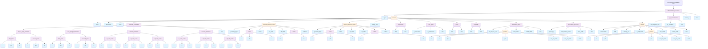

```mermaid
flowchart TD
    root["reflectometer_fluctuation IDS"]

    n1[reflectometer_fluctuation]
    root --> n1
    class n1 normalNode
    n2[type]
    n1 --> n2
    class n2 leafNode
    n3(channel)
    n1 --> n3
    class n3 complexNode
    n4[name]
    n3 --> n4
    class n4 leafNode
    n5[description]
    n3 --> n5
    class n5 leafNode
    n6[mode]
    n3 --> n6
    class n6 leafNode
    n7[antennas_orientation]
    n3 --> n7
    class n7 normalNode
    n8[line_of_sight_emission]
    n7 --> n8
    class n8 normalNode
    n9[first_point]
    n8 --> n9
    class n9 normalNode
    n10[r]
    n9 --> n10
    class n10 leafNode
    n11[phi]
    n9 --> n11
    class n11 leafNode
    n12[z]
    n9 --> n12
    class n12 leafNode
    n13[second_point]
    n8 --> n13
    class n13 normalNode
    n14[r]
    n13 --> n14
    class n14 leafNode
    n15[phi]
    n13 --> n15
    class n15 leafNode
    n16[z]
    n13 --> n16
    class n16 leafNode
    n17[line_of_sight_detection]
    n7 --> n17
    class n17 normalNode
    n18[first_point]
    n17 --> n18
    class n18 normalNode
    n19[r]
    n18 --> n19
    class n19 leafNode
    n20[phi]
    n18 --> n20
    class n20 leafNode
    n21[z]
    n18 --> n21
    class n21 leafNode
    n22[second_point]
    n17 --> n22
    class n22 normalNode
    n23[r]
    n22 --> n23
    class n23 leafNode
    n24[phi]
    n22 --> n24
    class n24 leafNode
    n25[z]
    n22 --> n25
    class n25 leafNode
    n26[antenna_emission]
    n7 --> n26
    class n26 normalNode
    n27[x1_unit_vector]
    n26 --> n27
    class n27 normalNode
    n28[x]
    n27 --> n28
    class n28 leafNode
    n29[y]
    n27 --> n29
    class n29 leafNode
    n30[z]
    n27 --> n30
    class n30 leafNode
    n31[x2_unit_vector]
    n26 --> n31
    class n31 normalNode
    n32[x]
    n31 --> n32
    class n32 leafNode
    n33[y]
    n31 --> n33
    class n33 leafNode
    n34[z]
    n31 --> n34
    class n34 leafNode
    n35[x3_unit_vector]
    n26 --> n35
    class n35 normalNode
    n36[x]
    n35 --> n36
    class n36 leafNode
    n37[y]
    n35 --> n37
    class n37 leafNode
    n38[z]
    n35 --> n38
    class n38 leafNode
    n39[antenna_detection]
    n7 --> n39
    class n39 normalNode
    n40[x1_unit_vector]
    n39 --> n40
    class n40 normalNode
    n41[x]
    n40 --> n41
    class n41 leafNode
    n42[y]
    n40 --> n42
    class n42 leafNode
    n43[z]
    n40 --> n43
    class n43 leafNode
    n44[x2_unit_vector]
    n39 --> n44
    class n44 normalNode
    n45[x]
    n44 --> n45
    class n45 leafNode
    n46[y]
    n44 --> n46
    class n46 leafNode
    n47[z]
    n44 --> n47
    class n47 leafNode
    n48[x3_unit_vector]
    n39 --> n48
    class n48 normalNode
    n49[x]
    n48 --> n49
    class n49 leafNode
    n50[y]
    n48 --> n50
    class n50 leafNode
    n51[z]
    n48 --> n51
    class n51 leafNode
    n52[time]
    n7 --> n52
    class n52 leafNode
    n53(antenna_emission_static)
    n3 --> n53
    class n53 complexNode
    n54[geometry_type]
    n53 --> n54
    class n54 leafNode
    n55[centre]
    n53 --> n55
    class n55 normalNode
    n56[r]
    n55 --> n56
    class n56 leafNode
    n57[phi]
    n55 --> n57
    class n57 leafNode
    n58[z]
    n55 --> n58
    class n58 leafNode
    n59[radius]
    n53 --> n59
    class n59 leafNode
    n60[x1_width]
    n53 --> n60
    class n60 leafNode
    n61[x2_width]
    n53 --> n61
    class n61 leafNode
    n62[outline]
    n53 --> n62
    class n62 normalNode
    n63[x1]
    n62 --> n63
    class n63 leafNode
    n64[x2]
    n62 --> n64
    class n64 leafNode
    n65[surface]
    n53 --> n65
    class n65 leafNode
    n66(antenna_detection_static)
    n3 --> n66
    class n66 complexNode
    n67[geometry_type]
    n66 --> n67
    class n67 leafNode
    n68[centre]
    n66 --> n68
    class n68 normalNode
    n69[r]
    n68 --> n69
    class n69 leafNode
    n70[phi]
    n68 --> n70
    class n70 leafNode
    n71[z]
    n68 --> n71
    class n71 leafNode
    n72[radius]
    n66 --> n72
    class n72 leafNode
    n73[x1_width]
    n66 --> n73
    class n73 leafNode
    n74[x2_width]
    n66 --> n74
    class n74 leafNode
    n75[outline]
    n66 --> n75
    class n75 normalNode
    n76[x1]
    n75 --> n76
    class n76 leafNode
    n77[x2]
    n75 --> n77
    class n77 leafNode
    n78[surface]
    n66 --> n78
    class n78 leafNode
    n79[sweep_time]
    n3 --> n79
    class n79 leafNode
    n80[frequencies]
    n3 --> n80
    class n80 normalNode
    n81[data]
    n80 --> n81
    class n81 leafNode
    n82[time]
    n80 --> n82
    class n82 leafNode
    n83[raw_signal]
    n3 --> n83
    class n83 normalNode
    n84[i_component]
    n83 --> n84
    class n84 leafNode
    n85[q_component]
    n83 --> n85
    class n85 leafNode
    n86[time]
    n83 --> n86
    class n86 leafNode
    n87[phase]
    n3 --> n87
    class n87 normalNode
    n88[data]
    n87 --> n88
    class n88 leafNode
    n89[time]
    n87 --> n89
    class n89 leafNode
    n90[amplitude]
    n3 --> n90
    class n90 normalNode
    n91[data]
    n90 --> n91
    class n91 leafNode
    n92[time]
    n90 --> n92
    class n92 leafNode
    n93[fluctuations_level]
    n3 --> n93
    class n93 normalNode
    n94[dn_e_over_n_e]
    n93 --> n94
    class n94 leafNode
    n95(position)
    n93 --> n95
    class n95 complexNode
    n96[r]
    n95 --> n96
    class n96 leafNode
    n97[z]
    n95 --> n97
    class n97 leafNode
    n98[phi]
    n95 --> n98
    class n98 leafNode
    n99[psi]
    n95 --> n99
    class n99 leafNode
    n100[rho_tor_norm]
    n95 --> n100
    class n100 leafNode
    n101[rho_pol_norm]
    n95 --> n101
    class n101 leafNode
    n102[theta]
    n95 --> n102
    class n102 leafNode
    n103[time_width]
    n93 --> n103
    class n103 leafNode
    n104[radial_width]
    n93 --> n104
    class n104 leafNode
    n105[time]
    n93 --> n105
    class n105 leafNode
    n106[fluctuations_spectrum]
    n3 --> n106
    class n106 normalNode
    n107[power_log]
    n106 --> n107
    class n107 leafNode
    n108[frequencies_fourier]
    n106 --> n108
    class n108 leafNode
    n109[time_width]
    n106 --> n109
    class n109 leafNode
    n110[time]
    n106 --> n110
    class n110 leafNode
    n111(doppler)
    n3 --> n111
    class n111 complexNode
    n112[wavenumber]
    n111 --> n112
    class n112 leafNode
    n113[shift]
    n111 --> n113
    class n113 leafNode
    n114[velocity_pol]
    n111 --> n114
    class n114 leafNode
    n115[e_field_radial]
    n111 --> n115
    class n115 leafNode
    n116(position)
    n111 --> n116
    class n116 complexNode
    n117[r]
    n116 --> n117
    class n117 leafNode
    n118[z]
    n116 --> n118
    class n118 leafNode
    n119[phi]
    n116 --> n119
    class n119 leafNode
    n120[psi]
    n116 --> n120
    class n120 leafNode
    n121[rho_tor_norm]
    n116 --> n121
    class n121 leafNode
    n122[rho_pol_norm]
    n116 --> n122
    class n122 leafNode
    n123[theta]
    n116 --> n123
    class n123 leafNode
    n124[time_width]
    n111 --> n124
    class n124 leafNode
    n125[radial_width]
    n111 --> n125
    class n125 leafNode
    n126[time]
    n111 --> n126
    class n126 leafNode
    n127[psi_normalization]
    n1 --> n127
    class n127 normalNode
    n128[psi_magnetic_axis]
    n127 --> n128
    class n128 leafNode
    n129[psi_boundary]
    n127 --> n129
    class n129 leafNode
    n130[time]
    n127 --> n130
    class n130 leafNode
    n131[latency]
    n1 --> n131
    class n131 leafNode
    n132[time]
    n1 --> n132
    class n132 leafNode

    classDef leafNode fill:#e1f5fe
    classDef complexNode fill:#fff3e0
    classDef normalNode fill:#f3e5f5
    classDef moreNode fill:#f5f5f5,stroke-dasharray: 5 5
```