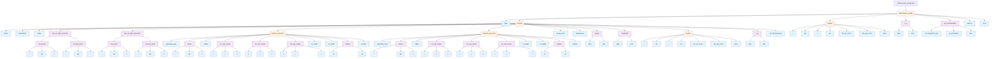

```mermaid
flowchart TD
    root["reflectometer_profile IDS"]

    n1(reflectometer_profile)
    root --> n1
    class n1 complexNode
    n2[type]
    n1 --> n2
    class n2 leafNode
    n3(channel)
    n1 --> n3
    class n3 complexNode
    n4[name]
    n3 --> n4
    class n4 leafNode
    n5[description]
    n3 --> n5
    class n5 leafNode
    n6[mode]
    n3 --> n6
    class n6 leafNode
    n7[line_of_sight_emission]
    n3 --> n7
    class n7 normalNode
    n8[first_point]
    n7 --> n8
    class n8 normalNode
    n9[r]
    n8 --> n9
    class n9 leafNode
    n10[phi]
    n8 --> n10
    class n10 leafNode
    n11[z]
    n8 --> n11
    class n11 leafNode
    n12[second_point]
    n7 --> n12
    class n12 normalNode
    n13[r]
    n12 --> n13
    class n13 leafNode
    n14[phi]
    n12 --> n14
    class n14 leafNode
    n15[z]
    n12 --> n15
    class n15 leafNode
    n16[line_of_sight_detection]
    n3 --> n16
    class n16 normalNode
    n17[first_point]
    n16 --> n17
    class n17 normalNode
    n18[r]
    n17 --> n18
    class n18 leafNode
    n19[phi]
    n17 --> n19
    class n19 leafNode
    n20[z]
    n17 --> n20
    class n20 leafNode
    n21[second_point]
    n16 --> n21
    class n21 normalNode
    n22[r]
    n21 --> n22
    class n22 leafNode
    n23[phi]
    n21 --> n23
    class n23 leafNode
    n24[z]
    n21 --> n24
    class n24 leafNode
    n25(antenna_emission)
    n3 --> n25
    class n25 complexNode
    n26[geometry_type]
    n25 --> n26
    class n26 leafNode
    n27[centre]
    n25 --> n27
    class n27 normalNode
    n28[r]
    n27 --> n28
    class n28 leafNode
    n29[phi]
    n27 --> n29
    class n29 leafNode
    n30[z]
    n27 --> n30
    class n30 leafNode
    n31[radius]
    n25 --> n31
    class n31 leafNode
    n32[x1_unit_vector]
    n25 --> n32
    class n32 normalNode
    n33[x]
    n32 --> n33
    class n33 leafNode
    n34[y]
    n32 --> n34
    class n34 leafNode
    n35[z]
    n32 --> n35
    class n35 leafNode
    n36[x2_unit_vector]
    n25 --> n36
    class n36 normalNode
    n37[x]
    n36 --> n37
    class n37 leafNode
    n38[y]
    n36 --> n38
    class n38 leafNode
    n39[z]
    n36 --> n39
    class n39 leafNode
    n40[x3_unit_vector]
    n25 --> n40
    class n40 normalNode
    n41[x]
    n40 --> n41
    class n41 leafNode
    n42[y]
    n40 --> n42
    class n42 leafNode
    n43[z]
    n40 --> n43
    class n43 leafNode
    n44[x1_width]
    n25 --> n44
    class n44 leafNode
    n45[x2_width]
    n25 --> n45
    class n45 leafNode
    n46[outline]
    n25 --> n46
    class n46 normalNode
    n47[x1]
    n46 --> n47
    class n47 leafNode
    n48[x2]
    n46 --> n48
    class n48 leafNode
    n49[surface]
    n25 --> n49
    class n49 leafNode
    n50(antenna_detection)
    n3 --> n50
    class n50 complexNode
    n51[geometry_type]
    n50 --> n51
    class n51 leafNode
    n52[centre]
    n50 --> n52
    class n52 normalNode
    n53[r]
    n52 --> n53
    class n53 leafNode
    n54[phi]
    n52 --> n54
    class n54 leafNode
    n55[z]
    n52 --> n55
    class n55 leafNode
    n56[radius]
    n50 --> n56
    class n56 leafNode
    n57[x1_unit_vector]
    n50 --> n57
    class n57 normalNode
    n58[x]
    n57 --> n58
    class n58 leafNode
    n59[y]
    n57 --> n59
    class n59 leafNode
    n60[z]
    n57 --> n60
    class n60 leafNode
    n61[x2_unit_vector]
    n50 --> n61
    class n61 normalNode
    n62[x]
    n61 --> n62
    class n62 leafNode
    n63[y]
    n61 --> n63
    class n63 leafNode
    n64[z]
    n61 --> n64
    class n64 leafNode
    n65[x3_unit_vector]
    n50 --> n65
    class n65 normalNode
    n66[x]
    n65 --> n66
    class n66 leafNode
    n67[y]
    n65 --> n67
    class n67 leafNode
    n68[z]
    n65 --> n68
    class n68 leafNode
    n69[x1_width]
    n50 --> n69
    class n69 leafNode
    n70[x2_width]
    n50 --> n70
    class n70 leafNode
    n71[outline]
    n50 --> n71
    class n71 normalNode
    n72[x1]
    n71 --> n72
    class n72 leafNode
    n73[x2]
    n71 --> n73
    class n73 leafNode
    n74[surface]
    n50 --> n74
    class n74 leafNode
    n75[sweep_time]
    n3 --> n75
    class n75 leafNode
    n76[frequencies]
    n3 --> n76
    class n76 leafNode
    n77[phase]
    n3 --> n77
    class n77 normalNode
    n78[data]
    n77 --> n78
    class n78 leafNode
    n79[time]
    n77 --> n79
    class n79 leafNode
    n80[amplitude]
    n3 --> n80
    class n80 normalNode
    n81[data]
    n80 --> n81
    class n81 leafNode
    n82[time]
    n80 --> n82
    class n82 leafNode
    n83(position)
    n3 --> n83
    class n83 complexNode
    n84[r]
    n83 --> n84
    class n84 leafNode
    n85[phi]
    n83 --> n85
    class n85 leafNode
    n86[z]
    n83 --> n86
    class n86 leafNode
    n87[psi]
    n83 --> n87
    class n87 leafNode
    n88[rho_tor_norm]
    n83 --> n88
    class n88 leafNode
    n89[rho_pol_norm]
    n83 --> n89
    class n89 leafNode
    n90[theta]
    n83 --> n90
    class n90 leafNode
    n91[n_e]
    n3 --> n91
    class n91 normalNode
    n92[data]
    n91 --> n92
    class n92 leafNode
    n93[time]
    n91 --> n93
    class n93 leafNode
    n94[cut_off_frequency]
    n3 --> n94
    class n94 leafNode
    n95(position)
    n1 --> n95
    class n95 complexNode
    n96[r]
    n95 --> n96
    class n96 leafNode
    n97[phi]
    n95 --> n97
    class n97 leafNode
    n98[z]
    n95 --> n98
    class n98 leafNode
    n99[psi]
    n95 --> n99
    class n99 leafNode
    n100[rho_tor_norm]
    n95 --> n100
    class n100 leafNode
    n101[rho_pol_norm]
    n95 --> n101
    class n101 leafNode
    n102[theta]
    n95 --> n102
    class n102 leafNode
    n103[n_e]
    n1 --> n103
    class n103 normalNode
    n104[data]
    n103 --> n104
    class n104 leafNode
    n105[time]
    n103 --> n105
    class n105 leafNode
    n106[psi_normalization]
    n1 --> n106
    class n106 normalNode
    n107[psi_magnetic_axis]
    n106 --> n107
    class n107 leafNode
    n108[psi_boundary]
    n106 --> n108
    class n108 leafNode
    n109[time]
    n106 --> n109
    class n109 leafNode
    n110[latency]
    n1 --> n110
    class n110 leafNode
    n111[time]
    n1 --> n111
    class n111 leafNode

    classDef leafNode fill:#e1f5fe
    classDef complexNode fill:#fff3e0
    classDef normalNode fill:#f3e5f5
    classDef moreNode fill:#f5f5f5,stroke-dasharray: 5 5
```