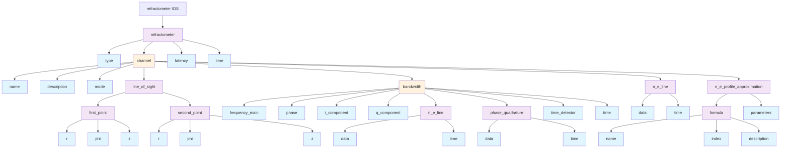

```mermaid
flowchart TD
    root["refractometer IDS"]

    n1[refractometer]
    root --> n1
    class n1 normalNode
    n2[type]
    n1 --> n2
    class n2 leafNode
    n3(channel)
    n1 --> n3
    class n3 complexNode
    n4[name]
    n3 --> n4
    class n4 leafNode
    n5[description]
    n3 --> n5
    class n5 leafNode
    n6[mode]
    n3 --> n6
    class n6 leafNode
    n7[line_of_sight]
    n3 --> n7
    class n7 normalNode
    n8[first_point]
    n7 --> n8
    class n8 normalNode
    n9[r]
    n8 --> n9
    class n9 leafNode
    n10[phi]
    n8 --> n10
    class n10 leafNode
    n11[z]
    n8 --> n11
    class n11 leafNode
    n12[second_point]
    n7 --> n12
    class n12 normalNode
    n13[r]
    n12 --> n13
    class n13 leafNode
    n14[phi]
    n12 --> n14
    class n14 leafNode
    n15[z]
    n12 --> n15
    class n15 leafNode
    n16(bandwidth)
    n3 --> n16
    class n16 complexNode
    n17[frequency_main]
    n16 --> n17
    class n17 leafNode
    n18[phase]
    n16 --> n18
    class n18 leafNode
    n19[i_component]
    n16 --> n19
    class n19 leafNode
    n20[q_component]
    n16 --> n20
    class n20 leafNode
    n21[n_e_line]
    n16 --> n21
    class n21 normalNode
    n22[data]
    n21 --> n22
    class n22 leafNode
    n23[time]
    n21 --> n23
    class n23 leafNode
    n24[phase_quadrature]
    n16 --> n24
    class n24 normalNode
    n25[data]
    n24 --> n25
    class n25 leafNode
    n26[time]
    n24 --> n26
    class n26 leafNode
    n27[time_detector]
    n16 --> n27
    class n27 leafNode
    n28[time]
    n16 --> n28
    class n28 leafNode
    n29[n_e_line]
    n3 --> n29
    class n29 normalNode
    n30[data]
    n29 --> n30
    class n30 leafNode
    n31[time]
    n29 --> n31
    class n31 leafNode
    n32[n_e_profile_approximation]
    n3 --> n32
    class n32 normalNode
    n33[formula]
    n32 --> n33
    class n33 normalNode
    n34[name]
    n33 --> n34
    class n34 leafNode
    n35[index]
    n33 --> n35
    class n35 leafNode
    n36[description]
    n33 --> n36
    class n36 leafNode
    n37[parameters]
    n32 --> n37
    class n37 leafNode
    n38[latency]
    n1 --> n38
    class n38 leafNode
    n39[time]
    n1 --> n39
    class n39 leafNode

    classDef leafNode fill:#e1f5fe
    classDef complexNode fill:#fff3e0
    classDef normalNode fill:#f3e5f5
    classDef moreNode fill:#f5f5f5,stroke-dasharray: 5 5
```