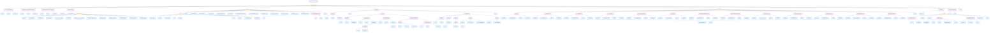

```mermaid
flowchart TD
    root["runaway_electrons IDS"]

    n1(runaway_electrons)
    root --> n1
    class n1 complexNode
    n2[e_field_critical_definition]
    n1 --> n2
    class n2 normalNode
    n3[name]
    n2 --> n3
    class n3 leafNode
    n4[index]
    n2 --> n4
    class n4 leafNode
    n5[description]
    n2 --> n5
    class n5 leafNode
    n6[momentum_critical_avalanche_definition]
    n1 --> n6
    class n6 normalNode
    n7[name]
    n6 --> n7
    class n7 leafNode
    n8[index]
    n6 --> n8
    class n8 leafNode
    n9[description]
    n6 --> n9
    class n9 leafNode
    n10[momentum_critical_hot_tail_definition]
    n1 --> n10
    class n10 normalNode
    n11[name]
    n10 --> n11
    class n11 leafNode
    n12[index]
    n10 --> n12
    class n12 leafNode
    n13[description]
    n10 --> n13
    class n13 leafNode
    n14[global_quantities]
    n1 --> n14
    class n14 normalNode
    n15[current_phi]
    n14 --> n15
    class n15 leafNode
    n16[energy_kinetic]
    n14 --> n16
    class n16 leafNode
    n17(volume_average)
    n14 --> n17
    class n17 complexNode
    n18[density]
    n17 --> n18
    class n18 leafNode
    n19[current_density]
    n17 --> n19
    class n19 leafNode
    n20[e_field_dreicer]
    n17 --> n20
    class n20 leafNode
    n21[e_field_critical]
    n17 --> n21
    class n21 leafNode
    n22[energy_density_kinetic]
    n17 --> n22
    class n22 leafNode
    n23[pitch_angle]
    n17 --> n23
    class n23 leafNode
    n24[momentum_critical_avalanche]
    n17 --> n24
    class n24 leafNode
    n25[momentum_critical_hot_tail]
    n17 --> n25
    class n25 leafNode
    n26[ddensity_dt_total]
    n17 --> n26
    class n26 leafNode
    n27[ddensity_dt_compton]
    n17 --> n27
    class n27 leafNode
    n28[ddensity_dt_tritium]
    n17 --> n28
    class n28 leafNode
    n29[ddensity_dt_hot_tail]
    n17 --> n29
    class n29 leafNode
    n30[ddensity_dt_dreicer]
    n17 --> n30
    class n30 leafNode
    n31(profiles_1d)
    n1 --> n31
    class n31 complexNode
    n32(grid)
    n31 --> n32
    class n32 complexNode
    n33[rho_tor_norm]
    n32 --> n33
    class n33 leafNode
    n34[rho_tor]
    n32 --> n34
    class n34 leafNode
    n35[rho_pol_norm]
    n32 --> n35
    class n35 leafNode
    n36[psi]
    n32 --> n36
    class n36 leafNode
    n37[volume]
    n32 --> n37
    class n37 leafNode
    n38[area]
    n32 --> n38
    class n38 leafNode
    n39[surface]
    n32 --> n39
    class n39 leafNode
    n40[psi_magnetic_axis]
    n32 --> n40
    class n40 leafNode
    n41[psi_boundary]
    n32 --> n41
    class n41 leafNode
    n42[density]
    n31 --> n42
    class n42 leafNode
    n43[current_density]
    n31 --> n43
    class n43 leafNode
    n44[e_field_dreicer]
    n31 --> n44
    class n44 leafNode
    n45[e_field_critical]
    n31 --> n45
    class n45 leafNode
    n46[energy_density_kinetic]
    n31 --> n46
    class n46 leafNode
    n47[pitch_angle]
    n31 --> n47
    class n47 leafNode
    n48[momentum_critical_avalanche]
    n31 --> n48
    class n48 leafNode
    n49[momentum_critical_hot_tail]
    n31 --> n49
    class n49 leafNode
    n50[ddensity_dt_total]
    n31 --> n50
    class n50 leafNode
    n51[ddensity_dt_compton]
    n31 --> n51
    class n51 leafNode
    n52[ddensity_dt_tritium]
    n31 --> n52
    class n52 leafNode
    n53[ddensity_dt_hot_tail]
    n31 --> n53
    class n53 leafNode
    n54[ddensity_dt_dreicer]
    n31 --> n54
    class n54 leafNode
    n55[transport_perpendicular]
    n31 --> n55
    class n55 normalNode
    n56[d]
    n55 --> n56
    class n56 leafNode
    n57[v]
    n55 --> n57
    class n57 leafNode
    n58[flux]
    n55 --> n58
    class n58 leafNode
    n59[time]
    n31 --> n59
    class n59 leafNode
    n60[grid_ggd]
    n1 --> n60
    class n60 normalNode
    n61[identifier]
    n60 --> n61
    class n61 normalNode
    n62[name]
    n61 --> n62
    class n62 leafNode
    n63[index]
    n61 --> n63
    class n63 leafNode
    n64[description]
    n61 --> n64
    class n64 leafNode
    n65[path]
    n60 --> n65
    class n65 leafNode
    n66[space]
    n60 --> n66
    class n66 normalNode
    n67[identifier]
    n66 --> n67
    class n67 normalNode
    n68[name]
    n67 --> n68
    class n68 leafNode
    n69[index]
    n67 --> n69
    class n69 leafNode
    n70[description]
    n67 --> n70
    class n70 leafNode
    n71[geometry_type]
    n66 --> n71
    class n71 normalNode
    n72[name]
    n71 --> n72
    class n72 leafNode
    n73[index]
    n71 --> n73
    class n73 leafNode
    n74[description]
    n71 --> n74
    class n74 leafNode
    n75[coordinates_type]
    n66 --> n75
    class n75 normalNode
    n76[name]
    n75 --> n76
    class n76 leafNode
    n77[index]
    n75 --> n77
    class n77 leafNode
    n78[description]
    n75 --> n78
    class n78 leafNode
    n79[objects_per_dimension]
    n66 --> n79
    class n79 normalNode
    n80[object]
    n79 --> n80
    class n80 normalNode
    n81[boundary]
    n80 --> n81
    class n81 normalNode
    n82[index]
    n81 --> n82
    class n82 leafNode
    n83[neighbours]
    n81 --> n83
    class n83 leafNode
    n84[geometry]
    n80 --> n84
    class n84 leafNode
    n85[nodes]
    n80 --> n85
    class n85 leafNode
    n86[measure]
    n80 --> n86
    class n86 leafNode
    n87[geometry_2d]
    n80 --> n87
    class n87 leafNode
    n88[geometry_content]
    n79 --> n88
    class n88 normalNode
    n89[name]
    n88 --> n89
    class n89 leafNode
    n90[index]
    n88 --> n90
    class n90 leafNode
    n91[description]
    n88 --> n91
    class n91 leafNode
    n92[grid_subset]
    n60 --> n92
    class n92 normalNode
    n93[identifier]
    n92 --> n93
    class n93 normalNode
    n94[name]
    n93 --> n94
    class n94 leafNode
    n95[index]
    n93 --> n95
    class n95 leafNode
    n96[description]
    n93 --> n96
    class n96 leafNode
    n97[dimension]
    n92 --> n97
    class n97 leafNode
    n98[element]
    n92 --> n98
    class n98 normalNode
    n99[object]
    n98 --> n99
    class n99 normalNode
    n100[space]
    n99 --> n100
    class n100 leafNode
    n101[dimension]
    n99 --> n101
    class n101 leafNode
    n102[index]
    n99 --> n102
    class n102 leafNode
    n103[base]
    n92 --> n103
    class n103 normalNode
    n104[jacobian]
    n103 --> n104
    class n104 leafNode
    n105[tensor_covariant]
    n103 --> n105
    class n105 leafNode
    n106[tensor_contravariant]
    n103 --> n106
    class n106 leafNode
    n107[metric]
    n92 --> n107
    class n107 normalNode
    n108[jacobian]
    n107 --> n108
    class n108 leafNode
    n109[tensor_covariant]
    n107 --> n109
    class n109 leafNode
    n110[tensor_contravariant]
    n107 --> n110
    class n110 leafNode
    n111[time]
    n60 --> n111
    class n111 leafNode
    n112(ggd_fluid)
    n1 --> n112
    class n112 complexNode
    n113[density]
    n112 --> n113
    class n113 normalNode
    n114[grid_index]
    n113 --> n114
    class n114 leafNode
    n115[grid_subset_index]
    n113 --> n115
    class n115 leafNode
    n116[values]
    n113 --> n116
    class n116 leafNode
    n117[coefficients]
    n113 --> n117
    class n117 leafNode
    n118[current_density]
    n112 --> n118
    class n118 normalNode
    n119[grid_index]
    n118 --> n119
    class n119 leafNode
    n120[grid_subset_index]
    n118 --> n120
    class n120 leafNode
    n121[values]
    n118 --> n121
    class n121 leafNode
    n122[coefficients]
    n118 --> n122
    class n122 leafNode
    n123[e_field_dreicer]
    n112 --> n123
    class n123 normalNode
    n124[grid_index]
    n123 --> n124
    class n124 leafNode
    n125[grid_subset_index]
    n123 --> n125
    class n125 leafNode
    n126[values]
    n123 --> n126
    class n126 leafNode
    n127[coefficients]
    n123 --> n127
    class n127 leafNode
    n128[e_field_critical]
    n112 --> n128
    class n128 normalNode
    n129[grid_index]
    n128 --> n129
    class n129 leafNode
    n130[grid_subset_index]
    n128 --> n130
    class n130 leafNode
    n131[values]
    n128 --> n131
    class n131 leafNode
    n132[coefficients]
    n128 --> n132
    class n132 leafNode
    n133[energy_density_kinetic]
    n112 --> n133
    class n133 normalNode
    n134[grid_index]
    n133 --> n134
    class n134 leafNode
    n135[grid_subset_index]
    n133 --> n135
    class n135 leafNode
    n136[values]
    n133 --> n136
    class n136 leafNode
    n137[coefficients]
    n133 --> n137
    class n137 leafNode
    n138[pitch_angle]
    n112 --> n138
    class n138 normalNode
    n139[grid_index]
    n138 --> n139
    class n139 leafNode
    n140[grid_subset_index]
    n138 --> n140
    class n140 leafNode
    n141[values]
    n138 --> n141
    class n141 leafNode
    n142[coefficients]
    n138 --> n142
    class n142 leafNode
    n143[momentum_critical_avalanche]
    n112 --> n143
    class n143 normalNode
    n144[grid_index]
    n143 --> n144
    class n144 leafNode
    n145[grid_subset_index]
    n143 --> n145
    class n145 leafNode
    n146[values]
    n143 --> n146
    class n146 leafNode
    n147[coefficients]
    n143 --> n147
    class n147 leafNode
    n148[momentum_critical_hot_tail]
    n112 --> n148
    class n148 normalNode
    n149[grid_index]
    n148 --> n149
    class n149 leafNode
    n150[grid_subset_index]
    n148 --> n150
    class n150 leafNode
    n151[values]
    n148 --> n151
    class n151 leafNode
    n152[coefficients]
    n148 --> n152
    class n152 leafNode
    n153[ddensity_dt_total]
    n112 --> n153
    class n153 normalNode
    n154[grid_index]
    n153 --> n154
    class n154 leafNode
    n155[grid_subset_index]
    n153 --> n155
    class n155 leafNode
    n156[values]
    n153 --> n156
    class n156 leafNode
    n157[coefficients]
    n153 --> n157
    class n157 leafNode
    n158[ddensity_dt_compton]
    n112 --> n158
    class n158 normalNode
    n159[grid_index]
    n158 --> n159
    class n159 leafNode
    n160[grid_subset_index]
    n158 --> n160
    class n160 leafNode
    n161[values]
    n158 --> n161
    class n161 leafNode
    n162[coefficients]
    n158 --> n162
    class n162 leafNode
    n163[ddensity_dt_tritium]
    n112 --> n163
    class n163 normalNode
    n164[grid_index]
    n163 --> n164
    class n164 leafNode
    n165[grid_subset_index]
    n163 --> n165
    class n165 leafNode
    n166[values]
    n163 --> n166
    class n166 leafNode
    n167[coefficients]
    n163 --> n167
    class n167 leafNode
    n168[ddensity_dt_hot_tail]
    n112 --> n168
    class n168 normalNode
    n169[grid_index]
    n168 --> n169
    class n169 leafNode
    n170[grid_subset_index]
    n168 --> n170
    class n170 leafNode
    n171[values]
    n168 --> n171
    class n171 leafNode
    n172[coefficients]
    n168 --> n172
    class n172 leafNode
    n173[ddensity_dt_dreicer]
    n112 --> n173
    class n173 normalNode
    n174[grid_index]
    n173 --> n174
    class n174 leafNode
    n175[grid_subset_index]
    n173 --> n175
    class n175 leafNode
    n176[values]
    n173 --> n176
    class n176 leafNode
    n177[coefficients]
    n173 --> n177
    class n177 leafNode
    n178[time]
    n112 --> n178
    class n178 leafNode
    n179[distribution]
    n1 --> n179
    class n179 normalNode
    n180[gyro_type]
    n179 --> n180
    class n180 leafNode
    n181(markers)
    n179 --> n181
    class n181 complexNode
    n182[coordinate_identifier]
    n181 --> n182
    class n182 normalNode
    n183[name]
    n182 --> n183
    class n183 leafNode
    n184[index]
    n182 --> n184
    class n184 leafNode
    n185[description]
    n182 --> n185
    class n185 leafNode
    n186[weights]
    n181 --> n186
    class n186 leafNode
    n187[positions]
    n181 --> n187
    class n187 leafNode
    n188[orbit_integrals]
    n181 --> n188
    class n188 normalNode
    n189[expressions]
    n188 --> n189
    class n189 leafNode
    n190[n_phi]
    n188 --> n190
    class n190 leafNode
    n191[m_pol]
    n188 --> n191
    class n191 leafNode
    n192[bounce_harmonics]
    n188 --> n192
    class n192 leafNode
    n193[values]
    n188 --> n193
    class n193 leafNode
    n194[orbit_integrals_instant]
    n181 --> n194
    class n194 normalNode
    n195[expressions]
    n194 --> n195
    class n195 leafNode
    n196[time_orbit]
    n194 --> n196
    class n196 leafNode
    n197[values]
    n194 --> n197
    class n197 leafNode
    n198[toroidal_mode]
    n181 --> n198
    class n198 leafNode
    n199[time]
    n181 --> n199
    class n199 leafNode
    n200[vacuum_toroidal_field]
    n1 --> n200
    class n200 normalNode
    n201[r0]
    n200 --> n201
    class n201 leafNode
    n202[b0]
    n200 --> n202
    class n202 leafNode
    n203[time]
    n1 --> n203
    class n203 leafNode

    classDef leafNode fill:#e1f5fe
    classDef complexNode fill:#fff3e0
    classDef normalNode fill:#f3e5f5
    classDef moreNode fill:#f5f5f5,stroke-dasharray: 5 5
```