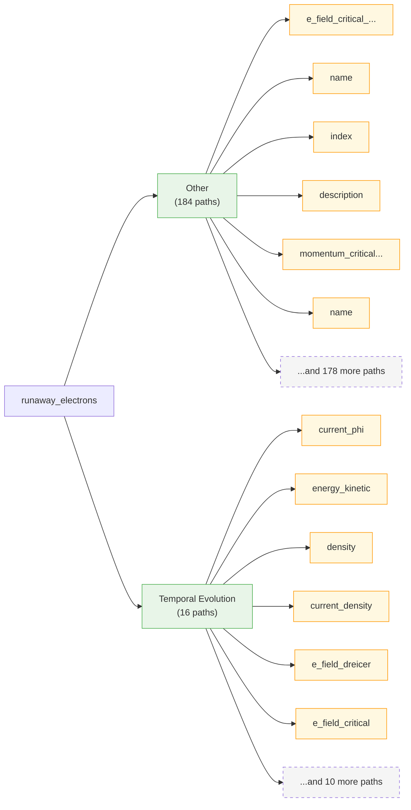

```mermaid
flowchart LR
    root["runaway_electrons"]

    d1["Other<br/>(184 paths)"]
    root --> d1
    p1_1["e_field_critical_..."]
    d1 --> p1_1
    class p1_1 pathNode
    p1_2["name"]
    d1 --> p1_2
    class p1_2 pathNode
    p1_3["index"]
    d1 --> p1_3
    class p1_3 pathNode
    p1_4["description"]
    d1 --> p1_4
    class p1_4 pathNode
    p1_5["momentum_critical..."]
    d1 --> p1_5
    class p1_5 pathNode
    p1_6["name"]
    d1 --> p1_6
    class p1_6 pathNode
    more1["...and 178 more paths"]
    d1 --> more1
    class more1 moreNode
    class d1 domainNode
    d2["Temporal Evolution<br/>(16 paths)"]
    root --> d2
    p2_1["current_phi"]
    d2 --> p2_1
    class p2_1 pathNode
    p2_2["energy_kinetic"]
    d2 --> p2_2
    class p2_2 pathNode
    p2_3["density"]
    d2 --> p2_3
    class p2_3 pathNode
    p2_4["current_density"]
    d2 --> p2_4
    class p2_4 pathNode
    p2_5["e_field_dreicer"]
    d2 --> p2_5
    class p2_5 pathNode
    p2_6["e_field_critical"]
    d2 --> p2_6
    class p2_6 pathNode
    more2["...and 10 more paths"]
    d2 --> more2
    class more2 moreNode
    class d2 domainNode

    classDef domainNode fill:#e8f5e8,stroke:#4caf50
    classDef pathNode fill:#fff8e1,stroke:#ff9800
    classDef moreNode fill:#f5f5f5,stroke-dasharray: 5 5
```