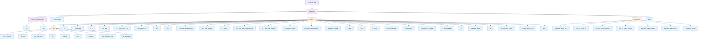

```mermaid
flowchart TD
    root["sawteeth IDS"]

    n1[sawteeth]
    root --> n1
    class n1 normalNode
    n2[vacuum_toroidal_field]
    n1 --> n2
    class n2 normalNode
    n3[r0]
    n2 --> n3
    class n3 leafNode
    n4[b0]
    n2 --> n4
    class n4 leafNode
    n5[crash_trigger]
    n1 --> n5
    class n5 leafNode
    n6(profiles_1d)
    n1 --> n6
    class n6 complexNode
    n7(grid)
    n6 --> n7
    class n7 complexNode
    n8[rho_tor_norm]
    n7 --> n8
    class n8 leafNode
    n9[rho_tor]
    n7 --> n9
    class n9 leafNode
    n10[rho_pol_norm]
    n7 --> n10
    class n10 leafNode
    n11[psi]
    n7 --> n11
    class n11 leafNode
    n12[volume]
    n7 --> n12
    class n12 leafNode
    n13[area]
    n7 --> n13
    class n13 leafNode
    n14[surface]
    n7 --> n14
    class n14 leafNode
    n15[psi_magnetic_axis]
    n7 --> n15
    class n15 leafNode
    n16[psi_boundary]
    n7 --> n16
    class n16 leafNode
    n17[t_e]
    n6 --> n17
    class n17 leafNode
    n18[t_i_average]
    n6 --> n18
    class n18 leafNode
    n19[n_e]
    n6 --> n19
    class n19 leafNode
    n20[n_e_fast]
    n6 --> n20
    class n20 leafNode
    n21[n_i_total_over_n_e]
    n6 --> n21
    class n21 leafNode
    n22[momentum_phi]
    n6 --> n22
    class n22 leafNode
    n23[zeff]
    n6 --> n23
    class n23 leafNode
    n24[p_e]
    n6 --> n24
    class n24 leafNode
    n25[p_e_fast_perpendicular]
    n6 --> n25
    class n25 leafNode
    n26[p_e_fast_parallel]
    n6 --> n26
    class n26 leafNode
    n27[p_i_total]
    n6 --> n27
    class n27 leafNode
    n28[p_i_total_fast_perpendicular]
    n6 --> n28
    class n28 leafNode
    n29[p_i_total_fast_parallel]
    n6 --> n29
    class n29 leafNode
    n30[pressure_thermal]
    n6 --> n30
    class n30 leafNode
    n31[pressure_perpendicular]
    n6 --> n31
    class n31 leafNode
    n32[pressure_parallel]
    n6 --> n32
    class n32 leafNode
    n33[j_total]
    n6 --> n33
    class n33 leafNode
    n34[j_phi]
    n6 --> n34
    class n34 leafNode
    n35[j_ohmic]
    n6 --> n35
    class n35 leafNode
    n36[j_non_inductive]
    n6 --> n36
    class n36 leafNode
    n37[j_bootstrap]
    n6 --> n37
    class n37 leafNode
    n38[conductivity_parallel]
    n6 --> n38
    class n38 leafNode
    n39[e_field_parallel]
    n6 --> n39
    class n39 leafNode
    n40[q]
    n6 --> n40
    class n40 leafNode
    n41[magnetic_shear]
    n6 --> n41
    class n41 leafNode
    n42[phi]
    n6 --> n42
    class n42 leafNode
    n43[psi_star_pre_crash]
    n6 --> n43
    class n43 leafNode
    n44[psi_star_post_crash]
    n6 --> n44
    class n44 leafNode
    n45[time]
    n6 --> n45
    class n45 leafNode
    n46(diagnostics)
    n1 --> n46
    class n46 complexNode
    n47[magnetic_shear_q1]
    n46 --> n47
    class n47 leafNode
    n48[rho_tor_norm_q1]
    n46 --> n48
    class n48 leafNode
    n49[rho_tor_norm_inversion]
    n46 --> n49
    class n49 leafNode
    n50[rho_tor_norm_mixing]
    n46 --> n50
    class n50 leafNode
    n51[previous_crash_trigger]
    n46 --> n51
    class n51 leafNode
    n52[previous_crash_time]
    n46 --> n52
    class n52 leafNode
    n53[previous_period]
    n46 --> n53
    class n53 leafNode
    n54[time]
    n1 --> n54
    class n54 leafNode

    classDef leafNode fill:#e1f5fe
    classDef complexNode fill:#fff3e0
    classDef normalNode fill:#f3e5f5
    classDef moreNode fill:#f5f5f5,stroke-dasharray: 5 5
```