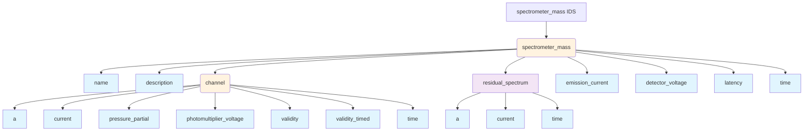

```mermaid
flowchart TD
    root["spectrometer_mass IDS"]

    n1(spectrometer_mass)
    root --> n1
    class n1 complexNode
    n2[name]
    n1 --> n2
    class n2 leafNode
    n3[description]
    n1 --> n3
    class n3 leafNode
    n4(channel)
    n1 --> n4
    class n4 complexNode
    n5[a]
    n4 --> n5
    class n5 leafNode
    n6[current]
    n4 --> n6
    class n6 leafNode
    n7[pressure_partial]
    n4 --> n7
    class n7 leafNode
    n8[photomultiplier_voltage]
    n4 --> n8
    class n8 leafNode
    n9[validity]
    n4 --> n9
    class n9 leafNode
    n10[validity_timed]
    n4 --> n10
    class n10 leafNode
    n11[time]
    n4 --> n11
    class n11 leafNode
    n12[residual_spectrum]
    n1 --> n12
    class n12 normalNode
    n13[a]
    n12 --> n13
    class n13 leafNode
    n14[current]
    n12 --> n14
    class n14 leafNode
    n15[time]
    n12 --> n15
    class n15 leafNode
    n16[emission_current]
    n1 --> n16
    class n16 leafNode
    n17[detector_voltage]
    n1 --> n17
    class n17 leafNode
    n18[latency]
    n1 --> n18
    class n18 leafNode
    n19[time]
    n1 --> n19
    class n19 leafNode

    classDef leafNode fill:#e1f5fe
    classDef complexNode fill:#fff3e0
    classDef normalNode fill:#f3e5f5
    classDef moreNode fill:#f5f5f5,stroke-dasharray: 5 5
```