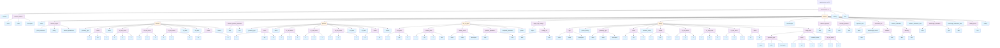

```mermaid
flowchart TD
    root["spectrometer_uv IDS"]

    n1[spectrometer_uv]
    root --> n1
    class n1 normalNode
    n2[etendue]
    n1 --> n2
    class n2 leafNode
    n3[etendue_method]
    n1 --> n3
    class n3 normalNode
    n4[name]
    n3 --> n4
    class n4 leafNode
    n5[index]
    n3 --> n5
    class n5 leafNode
    n6[description]
    n3 --> n6
    class n6 leafNode
    n7(channel)
    n1 --> n7
    class n7 complexNode
    n8[name]
    n7 --> n8
    class n8 leafNode
    n9[detector_layout]
    n7 --> n9
    class n9 normalNode
    n10[pixel_dimensions]
    n9 --> n10
    class n10 leafNode
    n11[pixel_n]
    n9 --> n11
    class n11 leafNode
    n12[detector_dimensions]
    n9 --> n12
    class n12 leafNode
    n13(detector)
    n7 --> n13
    class n13 complexNode
    n14[geometry_type]
    n13 --> n14
    class n14 leafNode
    n15[centre]
    n13 --> n15
    class n15 normalNode
    n16[r]
    n15 --> n16
    class n16 leafNode
    n17[phi]
    n15 --> n17
    class n17 leafNode
    n18[z]
    n15 --> n18
    class n18 leafNode
    n19[radius]
    n13 --> n19
    class n19 leafNode
    n20[x1_unit_vector]
    n13 --> n20
    class n20 normalNode
    n21[x]
    n20 --> n21
    class n21 leafNode
    n22[y]
    n20 --> n22
    class n22 leafNode
    n23[z]
    n20 --> n23
    class n23 leafNode
    n24[x2_unit_vector]
    n13 --> n24
    class n24 normalNode
    n25[x]
    n24 --> n25
    class n25 leafNode
    n26[y]
    n24 --> n26
    class n26 leafNode
    n27[z]
    n24 --> n27
    class n27 leafNode
    n28[x3_unit_vector]
    n13 --> n28
    class n28 normalNode
    n29[x]
    n28 --> n29
    class n29 leafNode
    n30[y]
    n28 --> n30
    class n30 leafNode
    n31[z]
    n28 --> n31
    class n31 leafNode
    n32[x1_width]
    n13 --> n32
    class n32 leafNode
    n33[x2_width]
    n13 --> n33
    class n33 leafNode
    n34[outline]
    n13 --> n34
    class n34 normalNode
    n35[x1]
    n34 --> n35
    class n35 leafNode
    n36[x2]
    n34 --> n36
    class n36 leafNode
    n37[surface]
    n13 --> n37
    class n37 leafNode
    n38[detector_position_parameter]
    n7 --> n38
    class n38 normalNode
    n39[data]
    n38 --> n39
    class n39 leafNode
    n40[time]
    n38 --> n40
    class n40 leafNode
    n41(aperture)
    n7 --> n41
    class n41 complexNode
    n42[geometry_type]
    n41 --> n42
    class n42 leafNode
    n43[centre]
    n41 --> n43
    class n43 normalNode
    n44[r]
    n43 --> n44
    class n44 leafNode
    n45[phi]
    n43 --> n45
    class n45 leafNode
    n46[z]
    n43 --> n46
    class n46 leafNode
    n47[radius]
    n41 --> n47
    class n47 leafNode
    n48[x1_unit_vector]
    n41 --> n48
    class n48 normalNode
    n49[x]
    n48 --> n49
    class n49 leafNode
    n50[y]
    n48 --> n50
    class n50 leafNode
    n51[z]
    n48 --> n51
    class n51 leafNode
    n52[x2_unit_vector]
    n41 --> n52
    class n52 normalNode
    n53[x]
    n52 --> n53
    class n53 leafNode
    n54[y]
    n52 --> n54
    class n54 leafNode
    n55[z]
    n52 --> n55
    class n55 leafNode
    n56[x3_unit_vector]
    n41 --> n56
    class n56 normalNode
    n57[x]
    n56 --> n57
    class n57 leafNode
    n58[y]
    n56 --> n58
    class n58 leafNode
    n59[z]
    n56 --> n59
    class n59 leafNode
    n60[x1_width]
    n41 --> n60
    class n60 leafNode
    n61[x2_width]
    n41 --> n61
    class n61 leafNode
    n62[outline]
    n41 --> n62
    class n62 normalNode
    n63[x1]
    n62 --> n63
    class n63 leafNode
    n64[x2]
    n62 --> n64
    class n64 leafNode
    n65[surface]
    n41 --> n65
    class n65 leafNode
    n66(line_of_sight)
    n7 --> n66
    class n66 complexNode
    n67[first_point]
    n66 --> n67
    class n67 normalNode
    n68[r]
    n67 --> n68
    class n68 leafNode
    n69[phi]
    n67 --> n69
    class n69 leafNode
    n70[z]
    n67 --> n70
    class n70 leafNode
    n71[second_point]
    n66 --> n71
    class n71 normalNode
    n72[r]
    n71 --> n72
    class n72 leafNode
    n73[phi]
    n71 --> n73
    class n73 leafNode
    n74[z]
    n71 --> n74
    class n74 leafNode
    n75[time]
    n71 --> n75
    class n75 leafNode
    n76[moving_mode]
    n66 --> n76
    class n76 normalNode
    n77[name]
    n76 --> n77
    class n77 leafNode
    n78[index]
    n76 --> n78
    class n78 leafNode
    n79[description]
    n76 --> n79
    class n79 leafNode
    n80[position_parameter]
    n66 --> n80
    class n80 normalNode
    n81[data]
    n80 --> n81
    class n81 leafNode
    n82[time]
    n80 --> n82
    class n82 leafNode
    n83[amplitude_parameter]
    n66 --> n83
    class n83 leafNode
    n84[period]
    n66 --> n84
    class n84 leafNode
    n85[supply_high_voltage]
    n7 --> n85
    class n85 normalNode
    n86[object]
    n85 --> n86
    class n86 leafNode
    n87[voltage_set]
    n85 --> n87
    class n87 normalNode
    n88[data]
    n87 --> n88
    class n88 leafNode
    n89[time]
    n87 --> n89
    class n89 leafNode
    n90(grating)
    n7 --> n90
    class n90 complexNode
    n91[type]
    n90 --> n91
    class n91 normalNode
    n92[name]
    n91 --> n92
    class n92 leafNode
    n93[index]
    n91 --> n93
    class n93 leafNode
    n94[description]
    n91 --> n94
    class n94 leafNode
    n95[groove_density]
    n90 --> n95
    class n95 leafNode
    n96[geometry_type]
    n90 --> n96
    class n96 normalNode
    n97[name]
    n96 --> n97
    class n97 leafNode
    n98[index]
    n96 --> n98
    class n98 leafNode
    n99[description]
    n96 --> n99
    class n99 leafNode
    n100[centre]
    n90 --> n100
    class n100 normalNode
    n101[r]
    n100 --> n101
    class n101 leafNode
    n102[phi]
    n100 --> n102
    class n102 leafNode
    n103[z]
    n100 --> n103
    class n103 leafNode
    n104[curvature_radius]
    n90 --> n104
    class n104 leafNode
    n105[summit]
    n90 --> n105
    class n105 normalNode
    n106[r]
    n105 --> n106
    class n106 leafNode
    n107[phi]
    n105 --> n107
    class n107 leafNode
    n108[z]
    n105 --> n108
    class n108 leafNode
    n109[x1_unit_vector]
    n90 --> n109
    class n109 normalNode
    n110[x]
    n109 --> n110
    class n110 leafNode
    n111[y]
    n109 --> n111
    class n111 leafNode
    n112[z]
    n109 --> n112
    class n112 leafNode
    n113[x2_unit_vector]
    n90 --> n113
    class n113 normalNode
    n114[x]
    n113 --> n114
    class n114 leafNode
    n115[y]
    n113 --> n115
    class n115 leafNode
    n116[z]
    n113 --> n116
    class n116 leafNode
    n117[x3_unit_vector]
    n90 --> n117
    class n117 normalNode
    n118[x]
    n117 --> n118
    class n118 leafNode
    n119[y]
    n117 --> n119
    class n119 leafNode
    n120[z]
    n117 --> n120
    class n120 leafNode
    n121[outline]
    n90 --> n121
    class n121 normalNode
    n122[x1]
    n121 --> n122
    class n122 leafNode
    n123[x2]
    n121 --> n123
    class n123 leafNode
    n124[image_field]
    n90 --> n124
    class n124 normalNode
    n125[geometry_type]
    n124 --> n125
    class n125 normalNode
    n126[name]
    n125 --> n126
    class n126 leafNode
    n127[index]
    n125 --> n127
    class n127 leafNode
    n128[description]
    n125 --> n128
    class n128 leafNode
    n129[centre]
    n124 --> n129
    class n129 normalNode
    n130[r]
    n129 --> n130
    class n130 leafNode
    n131[phi]
    n129 --> n131
    class n131 leafNode
    n132[z]
    n129 --> n132
    class n132 leafNode
    n133[curvature_radius]
    n124 --> n133
    class n133 leafNode
    n134[x3_unit_vector]
    n124 --> n134
    class n134 normalNode
    n135[x]
    n134 --> n135
    class n135 leafNode
    n136[y]
    n134 --> n136
    class n136 leafNode
    n137[z]
    n134 --> n137
    class n137 leafNode
    n138[wavelengths]
    n7 --> n138
    class n138 leafNode
    n139[radiance_spectral]
    n7 --> n139
    class n139 normalNode
    n140[data]
    n139 --> n140
    class n140 leafNode
    n141[time]
    n139 --> n141
    class n141 leafNode
    n142[intensity_spectrum]
    n7 --> n142
    class n142 normalNode
    n143[data]
    n142 --> n143
    class n143 leafNode
    n144[time]
    n142 --> n144
    class n144 leafNode
    n145[exposure_time]
    n7 --> n145
    class n145 leafNode
    n146[processed_line]
    n7 --> n146
    class n146 normalNode
    n147[name]
    n146 --> n147
    class n147 leafNode
    n148[wavelength_central]
    n146 --> n148
    class n148 leafNode
    n149[radiance]
    n146 --> n149
    class n149 normalNode
    n150[data]
    n149 --> n150
    class n150 leafNode
    n151[time]
    n149 --> n151
    class n151 leafNode
    n152[intensity]
    n146 --> n152
    class n152 normalNode
    n153[data]
    n152 --> n153
    class n153 leafNode
    n154[time]
    n152 --> n154
    class n154 leafNode
    n155[radiance_calibration]
    n7 --> n155
    class n155 leafNode
    n156[radiance_calibration_date]
    n7 --> n156
    class n156 leafNode
    n157[wavelength_calibration]
    n7 --> n157
    class n157 normalNode
    n158[offset]
    n157 --> n158
    class n158 leafNode
    n159[gain]
    n157 --> n159
    class n159 leafNode
    n160[wavelength_calibration_date]
    n7 --> n160
    class n160 leafNode
    n161[validity_timed]
    n7 --> n161
    class n161 normalNode
    n162[data]
    n161 --> n162
    class n162 leafNode
    n163[time]
    n161 --> n163
    class n163 leafNode
    n164[validity]
    n7 --> n164
    class n164 leafNode
    n165[latency]
    n1 --> n165
    class n165 leafNode
    n166[time]
    n1 --> n166
    class n166 leafNode

    classDef leafNode fill:#e1f5fe
    classDef complexNode fill:#fff3e0
    classDef normalNode fill:#f3e5f5
    classDef moreNode fill:#f5f5f5,stroke-dasharray: 5 5
```