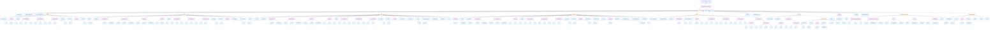

```mermaid
flowchart TD
    root["spectrometer_x_ray_crystal IDS"]

    n1[spectrometer_x_ray_crystal]
    root --> n1
    class n1 normalNode
    n2(channel)
    n1 --> n2
    class n2 complexNode
    n3[exposure_time]
    n2 --> n3
    class n3 leafNode
    n4[energy_bound_lower]
    n2 --> n4
    class n4 leafNode
    n5[energy_bound_upper]
    n2 --> n5
    class n5 leafNode
    n6(aperture)
    n2 --> n6
    class n6 complexNode
    n7[geometry_type]
    n6 --> n7
    class n7 leafNode
    n8[centre]
    n6 --> n8
    class n8 normalNode
    n9[r]
    n8 --> n9
    class n9 leafNode
    n10[phi]
    n8 --> n10
    class n10 leafNode
    n11[z]
    n8 --> n11
    class n11 leafNode
    n12[radius]
    n6 --> n12
    class n12 leafNode
    n13[x1_unit_vector]
    n6 --> n13
    class n13 normalNode
    n14[x]
    n13 --> n14
    class n14 leafNode
    n15[y]
    n13 --> n15
    class n15 leafNode
    n16[z]
    n13 --> n16
    class n16 leafNode
    n17[x2_unit_vector]
    n6 --> n17
    class n17 normalNode
    n18[x]
    n17 --> n18
    class n18 leafNode
    n19[y]
    n17 --> n19
    class n19 leafNode
    n20[z]
    n17 --> n20
    class n20 leafNode
    n21[x3_unit_vector]
    n6 --> n21
    class n21 normalNode
    n22[x]
    n21 --> n22
    class n22 leafNode
    n23[y]
    n21 --> n23
    class n23 leafNode
    n24[z]
    n21 --> n24
    class n24 leafNode
    n25[x1_width]
    n6 --> n25
    class n25 leafNode
    n26[x2_width]
    n6 --> n26
    class n26 leafNode
    n27[outline]
    n6 --> n27
    class n27 normalNode
    n28[x1]
    n27 --> n28
    class n28 leafNode
    n29[x2]
    n27 --> n29
    class n29 leafNode
    n30[surface]
    n6 --> n30
    class n30 leafNode
    n31(reflector)
    n2 --> n31
    class n31 complexNode
    n32[name]
    n31 --> n32
    class n32 leafNode
    n33[description]
    n31 --> n33
    class n33 leafNode
    n34[geometry_type]
    n31 --> n34
    class n34 normalNode
    n35[name]
    n34 --> n35
    class n35 leafNode
    n36[index]
    n34 --> n36
    class n36 leafNode
    n37[description]
    n34 --> n37
    class n37 leafNode
    n38[curvature_type]
    n31 --> n38
    class n38 normalNode
    n39[name]
    n38 --> n39
    class n39 leafNode
    n40[index]
    n38 --> n40
    class n40 leafNode
    n41[description]
    n38 --> n41
    class n41 leafNode
    n42[material]
    n31 --> n42
    class n42 normalNode
    n43[name]
    n42 --> n43
    class n43 leafNode
    n44[index]
    n42 --> n44
    class n44 leafNode
    n45[description]
    n42 --> n45
    class n45 leafNode
    n46[centre]
    n31 --> n46
    class n46 normalNode
    n47[r]
    n46 --> n47
    class n47 leafNode
    n48[phi]
    n46 --> n48
    class n48 leafNode
    n49[z]
    n46 --> n49
    class n49 leafNode
    n50[radius]
    n31 --> n50
    class n50 leafNode
    n51[x1_unit_vector]
    n31 --> n51
    class n51 normalNode
    n52[x]
    n51 --> n52
    class n52 leafNode
    n53[y]
    n51 --> n53
    class n53 leafNode
    n54[z]
    n51 --> n54
    class n54 leafNode
    n55[x2_unit_vector]
    n31 --> n55
    class n55 normalNode
    n56[x]
    n55 --> n56
    class n56 leafNode
    n57[y]
    n55 --> n57
    class n57 leafNode
    n58[z]
    n55 --> n58
    class n58 leafNode
    n59[x3_unit_vector]
    n31 --> n59
    class n59 normalNode
    n60[x]
    n59 --> n60
    class n60 leafNode
    n61[y]
    n59 --> n61
    class n61 leafNode
    n62[z]
    n59 --> n62
    class n62 leafNode
    n63[x1_width]
    n31 --> n63
    class n63 leafNode
    n64[x2_width]
    n31 --> n64
    class n64 leafNode
    n65[outline]
    n31 --> n65
    class n65 normalNode
    n66[x1]
    n65 --> n66
    class n66 leafNode
    n67[x2]
    n65 --> n67
    class n67 leafNode
    n68[x1_curvature]
    n31 --> n68
    class n68 leafNode
    n69[x2_curvature]
    n31 --> n69
    class n69 leafNode
    n70[surface]
    n31 --> n70
    class n70 leafNode
    n71(crystal)
    n2 --> n71
    class n71 complexNode
    n72[name]
    n71 --> n72
    class n72 leafNode
    n73[description]
    n71 --> n73
    class n73 leafNode
    n74[geometry_type]
    n71 --> n74
    class n74 normalNode
    n75[name]
    n74 --> n75
    class n75 leafNode
    n76[index]
    n74 --> n76
    class n76 leafNode
    n77[description]
    n74 --> n77
    class n77 leafNode
    n78[curvature_type]
    n71 --> n78
    class n78 normalNode
    n79[name]
    n78 --> n79
    class n79 leafNode
    n80[index]
    n78 --> n80
    class n80 leafNode
    n81[description]
    n78 --> n81
    class n81 leafNode
    n82[material]
    n71 --> n82
    class n82 normalNode
    n83[name]
    n82 --> n83
    class n83 leafNode
    n84[index]
    n82 --> n84
    class n84 leafNode
    n85[description]
    n82 --> n85
    class n85 leafNode
    n86[centre]
    n71 --> n86
    class n86 normalNode
    n87[r]
    n86 --> n87
    class n87 leafNode
    n88[phi]
    n86 --> n88
    class n88 leafNode
    n89[z]
    n86 --> n89
    class n89 leafNode
    n90[radius]
    n71 --> n90
    class n90 leafNode
    n91[x1_unit_vector]
    n71 --> n91
    class n91 normalNode
    n92[x]
    n91 --> n92
    class n92 leafNode
    n93[y]
    n91 --> n93
    class n93 leafNode
    n94[z]
    n91 --> n94
    class n94 leafNode
    n95[x2_unit_vector]
    n71 --> n95
    class n95 normalNode
    n96[x]
    n95 --> n96
    class n96 leafNode
    n97[y]
    n95 --> n97
    class n97 leafNode
    n98[z]
    n95 --> n98
    class n98 leafNode
    n99[x3_unit_vector]
    n71 --> n99
    class n99 normalNode
    n100[x]
    n99 --> n100
    class n100 leafNode
    n101[y]
    n99 --> n101
    class n101 leafNode
    n102[z]
    n99 --> n102
    class n102 leafNode
    n103[x1_width]
    n71 --> n103
    class n103 leafNode
    n104[x2_width]
    n71 --> n104
    class n104 leafNode
    n105[outline]
    n71 --> n105
    class n105 normalNode
    n106[x1]
    n105 --> n106
    class n106 leafNode
    n107[x2]
    n105 --> n107
    class n107 leafNode
    n108[x1_curvature]
    n71 --> n108
    class n108 leafNode
    n109[x2_curvature]
    n71 --> n109
    class n109 leafNode
    n110[surface]
    n71 --> n110
    class n110 leafNode
    n111[wavelength_bragg]
    n71 --> n111
    class n111 leafNode
    n112[angle_bragg]
    n71 --> n112
    class n112 leafNode
    n113[thickness]
    n71 --> n113
    class n113 leafNode
    n114[cut]
    n71 --> n114
    class n114 leafNode
    n115[mesh_type]
    n71 --> n115
    class n115 normalNode
    n116[name]
    n115 --> n116
    class n116 leafNode
    n117[index]
    n115 --> n117
    class n117 leafNode
    n118[description]
    n115 --> n118
    class n118 leafNode
    n119(filter_window)
    n2 --> n119
    class n119 complexNode
    n120[name]
    n119 --> n120
    class n120 leafNode
    n121[description]
    n119 --> n121
    class n121 leafNode
    n122[geometry_type]
    n119 --> n122
    class n122 normalNode
    n123[name]
    n122 --> n123
    class n123 leafNode
    n124[index]
    n122 --> n124
    class n124 leafNode
    n125[description]
    n122 --> n125
    class n125 leafNode
    n126[curvature_type]
    n119 --> n126
    class n126 normalNode
    n127[name]
    n126 --> n127
    class n127 leafNode
    n128[index]
    n126 --> n128
    class n128 leafNode
    n129[description]
    n126 --> n129
    class n129 leafNode
    n130[centre]
    n119 --> n130
    class n130 normalNode
    n131[r]
    n130 --> n131
    class n131 leafNode
    n132[phi]
    n130 --> n132
    class n132 leafNode
    n133[z]
    n130 --> n133
    class n133 leafNode
    n134[radius]
    n119 --> n134
    class n134 leafNode
    n135[x1_unit_vector]
    n119 --> n135
    class n135 normalNode
    n136[x]
    n135 --> n136
    class n136 leafNode
    n137[y]
    n135 --> n137
    class n137 leafNode
    n138[z]
    n135 --> n138
    class n138 leafNode
    n139[x2_unit_vector]
    n119 --> n139
    class n139 normalNode
    n140[x]
    n139 --> n140
    class n140 leafNode
    n141[y]
    n139 --> n141
    class n141 leafNode
    n142[z]
    n139 --> n142
    class n142 leafNode
    n143[x3_unit_vector]
    n119 --> n143
    class n143 normalNode
    n144[x]
    n143 --> n144
    class n144 leafNode
    n145[y]
    n143 --> n145
    class n145 leafNode
    n146[z]
    n143 --> n146
    class n146 leafNode
    n147[x1_width]
    n119 --> n147
    class n147 leafNode
    n148[x2_width]
    n119 --> n148
    class n148 leafNode
    n149[outline]
    n119 --> n149
    class n149 normalNode
    n150[x1]
    n149 --> n150
    class n150 leafNode
    n151[x2]
    n149 --> n151
    class n151 leafNode
    n152[x1_curvature]
    n119 --> n152
    class n152 leafNode
    n153[x2_curvature]
    n119 --> n153
    class n153 leafNode
    n154[surface]
    n119 --> n154
    class n154 leafNode
    n155[material]
    n119 --> n155
    class n155 normalNode
    n156[name]
    n155 --> n156
    class n156 leafNode
    n157[index]
    n155 --> n157
    class n157 leafNode
    n158[description]
    n155 --> n158
    class n158 leafNode
    n159[thickness]
    n119 --> n159
    class n159 leafNode
    n160[wavelength_lower]
    n119 --> n160
    class n160 leafNode
    n161[wavelength_upper]
    n119 --> n161
    class n161 leafNode
    n162[wavelengths]
    n119 --> n162
    class n162 leafNode
    n163[photon_absorption]
    n119 --> n163
    class n163 leafNode
    n164(camera)
    n2 --> n164
    class n164 complexNode
    n165[pixel_dimensions]
    n164 --> n165
    class n165 leafNode
    n166[pixels_n]
    n164 --> n166
    class n166 leafNode
    n167[pixel_position]
    n164 --> n167
    class n167 normalNode
    n168[r]
    n167 --> n168
    class n168 leafNode
    n169[phi]
    n167 --> n169
    class n169 leafNode
    n170[z]
    n167 --> n170
    class n170 leafNode
    n171[camera_dimensions]
    n164 --> n171
    class n171 leafNode
    n172[centre]
    n164 --> n172
    class n172 normalNode
    n173[r]
    n172 --> n173
    class n173 leafNode
    n174[phi]
    n172 --> n174
    class n174 leafNode
    n175[z]
    n172 --> n175
    class n175 leafNode
    n176[x1_unit_vector]
    n164 --> n176
    class n176 normalNode
    n177[x]
    n176 --> n177
    class n177 leafNode
    n178[y]
    n176 --> n178
    class n178 leafNode
    n179[z]
    n176 --> n179
    class n179 leafNode
    n180[x2_unit_vector]
    n164 --> n180
    class n180 normalNode
    n181[x]
    n180 --> n181
    class n181 leafNode
    n182[y]
    n180 --> n182
    class n182 leafNode
    n183[z]
    n180 --> n183
    class n183 leafNode
    n184[x3_unit_vector]
    n164 --> n184
    class n184 normalNode
    n185[x]
    n184 --> n185
    class n185 leafNode
    n186[y]
    n184 --> n186
    class n186 leafNode
    n187[z]
    n184 --> n187
    class n187 leafNode
    n188[line_of_sight]
    n164 --> n188
    class n188 normalNode
    n189[first_point]
    n188 --> n189
    class n189 normalNode
    n190[r]
    n189 --> n190
    class n190 leafNode
    n191[phi]
    n189 --> n191
    class n191 leafNode
    n192[z]
    n189 --> n192
    class n192 leafNode
    n193[second_point]
    n188 --> n193
    class n193 normalNode
    n194[r]
    n193 --> n194
    class n194 leafNode
    n195[phi]
    n193 --> n195
    class n195 leafNode
    n196[z]
    n193 --> n196
    class n196 leafNode
    n197[z_frames]
    n2 --> n197
    class n197 leafNode
    n198[wavelength_frames]
    n2 --> n198
    class n198 leafNode
    n199[bin]
    n2 --> n199
    class n199 normalNode
    n200[z_pixel_range]
    n199 --> n200
    class n200 leafNode
    n201[wavelength]
    n199 --> n201
    class n201 leafNode
    n202[line_of_sight]
    n199 --> n202
    class n202 normalNode
    n203[first_point]
    n202 --> n203
    class n203 normalNode
    n204[r]
    n203 --> n204
    class n204 leafNode
    n205[phi]
    n203 --> n205
    class n205 leafNode
    n206[z]
    n203 --> n206
    class n206 leafNode
    n207[second_point]
    n202 --> n207
    class n207 normalNode
    n208[r]
    n207 --> n208
    class n208 leafNode
    n209[phi]
    n207 --> n209
    class n209 leafNode
    n210[z]
    n207 --> n210
    class n210 leafNode
    n211(instrument_function)
    n199 --> n211
    class n211 complexNode
    n212[wavelengths]
    n211 --> n212
    class n212 leafNode
    n213[values]
    n211 --> n213
    class n213 leafNode
    n214[type]
    n211 --> n214
    class n214 normalNode
    n215[name]
    n214 --> n215
    class n215 leafNode
    n216[index]
    n214 --> n216
    class n216 leafNode
    n217[description]
    n214 --> n217
    class n217 leafNode
    n218[intensity]
    n211 --> n218
    class n218 leafNode
    n219[centre]
    n211 --> n219
    class n219 leafNode
    n220[sigma]
    n211 --> n220
    class n220 leafNode
    n221[scale]
    n211 --> n221
    class n221 leafNode
    n222[frame]
    n2 --> n222
    class n222 normalNode
    n223[counts_n]
    n222 --> n223
    class n223 leafNode
    n224[counts_bin_n]
    n222 --> n224
    class n224 leafNode
    n225[time]
    n222 --> n225
    class n225 leafNode
    n226[energies]
    n2 --> n226
    class n226 leafNode
    n227[detection_efficiency]
    n2 --> n227
    class n227 leafNode
    n228(profiles_line_integrated)
    n2 --> n228
    class n228 complexNode
    n229[lines_of_sight_second_point]
    n228 --> n229
    class n229 normalNode
    n230[r]
    n229 --> n230
    class n230 leafNode
    n231[phi]
    n229 --> n231
    class n231 leafNode
    n232[z]
    n229 --> n232
    class n232 leafNode
    n233[lines_of_sight_rho_tor_norm]
    n228 --> n233
    class n233 normalNode
    n234[data]
    n233 --> n234
    class n234 leafNode
    n235[validity_timed]
    n233 --> n235
    class n235 leafNode
    n236[validity]
    n233 --> n236
    class n236 leafNode
    n237[t_i]
    n228 --> n237
    class n237 normalNode
    n238[data]
    n237 --> n238
    class n238 leafNode
    n239[validity_timed]
    n237 --> n239
    class n239 leafNode
    n240[validity]
    n237 --> n240
    class n240 leafNode
    n241[t_e]
    n228 --> n241
    class n241 normalNode
    n242[data]
    n241 --> n242
    class n242 leafNode
    n243[validity_timed]
    n241 --> n243
    class n243 leafNode
    n244[validity]
    n241 --> n244
    class n244 leafNode
    n245[velocity_tor]
    n228 --> n245
    class n245 normalNode
    n246[data]
    n245 --> n246
    class n246 leafNode
    n247[validity_timed]
    n245 --> n247
    class n247 leafNode
    n248[validity]
    n245 --> n248
    class n248 leafNode
    n249[time]
    n228 --> n249
    class n249 leafNode
    n250(instrument_function)
    n2 --> n250
    class n250 complexNode
    n251[wavelengths]
    n250 --> n251
    class n251 leafNode
    n252[values]
    n250 --> n252
    class n252 leafNode
    n253[type]
    n250 --> n253
    class n253 normalNode
    n254[name]
    n253 --> n254
    class n254 leafNode
    n255[index]
    n253 --> n255
    class n255 leafNode
    n256[description]
    n253 --> n256
    class n256 leafNode
    n257[intensity]
    n250 --> n257
    class n257 leafNode
    n258[centre]
    n250 --> n258
    class n258 leafNode
    n259[sigma]
    n250 --> n259
    class n259 leafNode
    n260[scale]
    n250 --> n260
    class n260 leafNode
    n261[latency]
    n1 --> n261
    class n261 leafNode
    n262[time]
    n1 --> n262
    class n262 leafNode

    classDef leafNode fill:#e1f5fe
    classDef complexNode fill:#fff3e0
    classDef normalNode fill:#f3e5f5
    classDef moreNode fill:#f5f5f5,stroke-dasharray: 5 5
```