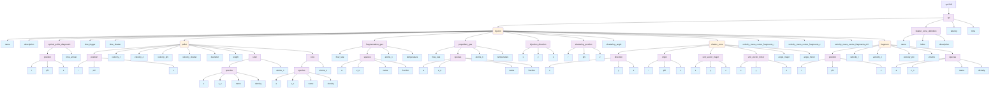

```mermaid
flowchart TD
    root["spi IDS"]

    n1[spi]
    root --> n1
    class n1 normalNode
    n2(injector)
    n1 --> n2
    class n2 complexNode
    n3[name]
    n2 --> n3
    class n3 leafNode
    n4[description]
    n2 --> n4
    class n4 leafNode
    n5[optical_pellet_diagnostic]
    n2 --> n5
    class n5 normalNode
    n6[position]
    n5 --> n6
    class n6 normalNode
    n7[r]
    n6 --> n7
    class n7 leafNode
    n8[phi]
    n6 --> n8
    class n8 leafNode
    n9[z]
    n6 --> n9
    class n9 leafNode
    n10[time_arrival]
    n5 --> n10
    class n10 leafNode
    n11[time_trigger]
    n2 --> n11
    class n11 leafNode
    n12[time_shatter]
    n2 --> n12
    class n12 leafNode
    n13(pellet)
    n2 --> n13
    class n13 complexNode
    n14[position]
    n13 --> n14
    class n14 normalNode
    n15[r]
    n14 --> n15
    class n15 leafNode
    n16[phi]
    n14 --> n16
    class n16 leafNode
    n17[z]
    n14 --> n17
    class n17 leafNode
    n18[velocity_r]
    n13 --> n18
    class n18 leafNode
    n19[velocity_z]
    n13 --> n19
    class n19 leafNode
    n20[velocity_phi]
    n13 --> n20
    class n20 leafNode
    n21[velocity_shatter]
    n13 --> n21
    class n21 leafNode
    n22[diameter]
    n13 --> n22
    class n22 leafNode
    n23[length]
    n13 --> n23
    class n23 leafNode
    n24[shell]
    n13 --> n24
    class n24 normalNode
    n25[species]
    n24 --> n25
    class n25 normalNode
    n26[a]
    n25 --> n26
    class n26 leafNode
    n27[z_n]
    n25 --> n27
    class n27 leafNode
    n28[name]
    n25 --> n28
    class n28 leafNode
    n29[density]
    n25 --> n29
    class n29 leafNode
    n30[atoms_n]
    n24 --> n30
    class n30 leafNode
    n31[core]
    n13 --> n31
    class n31 normalNode
    n32[species]
    n31 --> n32
    class n32 normalNode
    n33[a]
    n32 --> n33
    class n33 leafNode
    n34[z_n]
    n32 --> n34
    class n34 leafNode
    n35[name]
    n32 --> n35
    class n35 leafNode
    n36[density]
    n32 --> n36
    class n36 leafNode
    n37[atoms_n]
    n31 --> n37
    class n37 leafNode
    n38[fragmentation_gas]
    n2 --> n38
    class n38 normalNode
    n39[flow_rate]
    n38 --> n39
    class n39 leafNode
    n40[species]
    n38 --> n40
    class n40 normalNode
    n41[a]
    n40 --> n41
    class n41 leafNode
    n42[z_n]
    n40 --> n42
    class n42 leafNode
    n43[name]
    n40 --> n43
    class n43 leafNode
    n44[fraction]
    n40 --> n44
    class n44 leafNode
    n45[atoms_n]
    n38 --> n45
    class n45 leafNode
    n46[temperature]
    n38 --> n46
    class n46 leafNode
    n47[propellant_gas]
    n2 --> n47
    class n47 normalNode
    n48[flow_rate]
    n47 --> n48
    class n48 leafNode
    n49[species]
    n47 --> n49
    class n49 normalNode
    n50[a]
    n49 --> n50
    class n50 leafNode
    n51[z_n]
    n49 --> n51
    class n51 leafNode
    n52[name]
    n49 --> n52
    class n52 leafNode
    n53[fraction]
    n49 --> n53
    class n53 leafNode
    n54[atoms_n]
    n47 --> n54
    class n54 leafNode
    n55[temperature]
    n47 --> n55
    class n55 leafNode
    n56[injection_direction]
    n2 --> n56
    class n56 normalNode
    n57[x]
    n56 --> n57
    class n57 leafNode
    n58[y]
    n56 --> n58
    class n58 leafNode
    n59[z]
    n56 --> n59
    class n59 leafNode
    n60[shattering_position]
    n2 --> n60
    class n60 normalNode
    n61[r]
    n60 --> n61
    class n61 leafNode
    n62[phi]
    n60 --> n62
    class n62 leafNode
    n63[z]
    n60 --> n63
    class n63 leafNode
    n64[shattering_angle]
    n2 --> n64
    class n64 leafNode
    n65(shatter_cone)
    n2 --> n65
    class n65 complexNode
    n66[direction]
    n65 --> n66
    class n66 normalNode
    n67[x]
    n66 --> n67
    class n67 leafNode
    n68[y]
    n66 --> n68
    class n68 leafNode
    n69[z]
    n66 --> n69
    class n69 leafNode
    n70[origin]
    n65 --> n70
    class n70 normalNode
    n71[r]
    n70 --> n71
    class n71 leafNode
    n72[phi]
    n70 --> n72
    class n72 leafNode
    n73[z]
    n70 --> n73
    class n73 leafNode
    n74[unit_vector_major]
    n65 --> n74
    class n74 normalNode
    n75[x]
    n74 --> n75
    class n75 leafNode
    n76[y]
    n74 --> n76
    class n76 leafNode
    n77[z]
    n74 --> n77
    class n77 leafNode
    n78[unit_vector_minor]
    n65 --> n78
    class n78 normalNode
    n79[x]
    n78 --> n79
    class n79 leafNode
    n80[y]
    n78 --> n80
    class n80 leafNode
    n81[z]
    n78 --> n81
    class n81 leafNode
    n82[angle_major]
    n65 --> n82
    class n82 leafNode
    n83[angle_minor]
    n65 --> n83
    class n83 leafNode
    n84[velocity_mass_centre_fragments_r]
    n2 --> n84
    class n84 leafNode
    n85[velocity_mass_centre_fragments_z]
    n2 --> n85
    class n85 leafNode
    n86[velocity_mass_centre_fragments_phi]
    n2 --> n86
    class n86 leafNode
    n87(fragment)
    n2 --> n87
    class n87 complexNode
    n88[position]
    n87 --> n88
    class n88 normalNode
    n89[r]
    n88 --> n89
    class n89 leafNode
    n90[phi]
    n88 --> n90
    class n90 leafNode
    n91[z]
    n88 --> n91
    class n91 leafNode
    n92[velocity_r]
    n87 --> n92
    class n92 leafNode
    n93[velocity_z]
    n87 --> n93
    class n93 leafNode
    n94[velocity_phi]
    n87 --> n94
    class n94 leafNode
    n95[volume]
    n87 --> n95
    class n95 leafNode
    n96[species]
    n87 --> n96
    class n96 normalNode
    n97[a]
    n96 --> n97
    class n97 leafNode
    n98[z_n]
    n96 --> n98
    class n98 leafNode
    n99[name]
    n96 --> n99
    class n99 leafNode
    n100[density]
    n96 --> n100
    class n100 leafNode
    n101[shatter_cone_definition]
    n1 --> n101
    class n101 normalNode
    n102[name]
    n101 --> n102
    class n102 leafNode
    n103[index]
    n101 --> n103
    class n103 leafNode
    n104[description]
    n101 --> n104
    class n104 leafNode
    n105[latency]
    n1 --> n105
    class n105 leafNode
    n106[time]
    n1 --> n106
    class n106 leafNode

    classDef leafNode fill:#e1f5fe
    classDef complexNode fill:#fff3e0
    classDef normalNode fill:#f3e5f5
    classDef moreNode fill:#f5f5f5,stroke-dasharray: 5 5
```