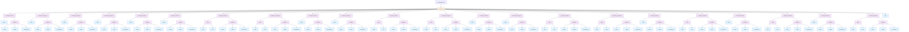

```mermaid
flowchart TD
    root["temporary IDS"]

    n1(temporary)
    root --> n1
    class n1 complexNode
    n2[constant_float0d]
    n1 --> n2
    class n2 normalNode
    n3[value]
    n2 --> n3
    class n3 leafNode
    n4[identifier]
    n2 --> n4
    class n4 normalNode
    n5[name]
    n4 --> n5
    class n5 leafNode
    n6[index]
    n4 --> n6
    class n6 leafNode
    n7[description]
    n4 --> n7
    class n7 leafNode
    n8[constant_integer0d]
    n1 --> n8
    class n8 normalNode
    n9[value]
    n8 --> n9
    class n9 leafNode
    n10[identifier]
    n8 --> n10
    class n10 normalNode
    n11[name]
    n10 --> n11
    class n11 leafNode
    n12[index]
    n10 --> n12
    class n12 leafNode
    n13[description]
    n10 --> n13
    class n13 leafNode
    n14[constant_string0d]
    n1 --> n14
    class n14 normalNode
    n15[value]
    n14 --> n15
    class n15 leafNode
    n16[identifier]
    n14 --> n16
    class n16 normalNode
    n17[name]
    n16 --> n17
    class n17 leafNode
    n18[index]
    n16 --> n18
    class n18 leafNode
    n19[description]
    n16 --> n19
    class n19 leafNode
    n20[constant_integer1d]
    n1 --> n20
    class n20 normalNode
    n21[value]
    n20 --> n21
    class n21 leafNode
    n22[identifier]
    n20 --> n22
    class n22 normalNode
    n23[name]
    n22 --> n23
    class n23 leafNode
    n24[index]
    n22 --> n24
    class n24 leafNode
    n25[description]
    n22 --> n25
    class n25 leafNode
    n26[constant_string1d]
    n1 --> n26
    class n26 normalNode
    n27[value]
    n26 --> n27
    class n27 leafNode
    n28[identifier]
    n26 --> n28
    class n28 normalNode
    n29[name]
    n28 --> n29
    class n29 leafNode
    n30[index]
    n28 --> n30
    class n30 leafNode
    n31[description]
    n28 --> n31
    class n31 leafNode
    n32[constant_float1d]
    n1 --> n32
    class n32 normalNode
    n33[value]
    n32 --> n33
    class n33 leafNode
    n34[identifier]
    n32 --> n34
    class n34 normalNode
    n35[name]
    n34 --> n35
    class n35 leafNode
    n36[index]
    n34 --> n36
    class n36 leafNode
    n37[description]
    n34 --> n37
    class n37 leafNode
    n38[dynamic_float1d]
    n1 --> n38
    class n38 normalNode
    n39[value]
    n38 --> n39
    class n39 normalNode
    n40[data]
    n39 --> n40
    class n40 leafNode
    n41[time]
    n39 --> n41
    class n41 leafNode
    n42[identifier]
    n38 --> n42
    class n42 normalNode
    n43[name]
    n42 --> n43
    class n43 leafNode
    n44[index]
    n42 --> n44
    class n44 leafNode
    n45[description]
    n42 --> n45
    class n45 leafNode
    n46[dynamic_integer1d]
    n1 --> n46
    class n46 normalNode
    n47[value]
    n46 --> n47
    class n47 normalNode
    n48[data]
    n47 --> n48
    class n48 leafNode
    n49[time]
    n47 --> n49
    class n49 leafNode
    n50[identifier]
    n46 --> n50
    class n50 normalNode
    n51[name]
    n50 --> n51
    class n51 leafNode
    n52[index]
    n50 --> n52
    class n52 leafNode
    n53[description]
    n50 --> n53
    class n53 leafNode
    n54[constant_float2d]
    n1 --> n54
    class n54 normalNode
    n55[value]
    n54 --> n55
    class n55 leafNode
    n56[identifier]
    n54 --> n56
    class n56 normalNode
    n57[name]
    n56 --> n57
    class n57 leafNode
    n58[index]
    n56 --> n58
    class n58 leafNode
    n59[description]
    n56 --> n59
    class n59 leafNode
    n60[constant_integer2d]
    n1 --> n60
    class n60 normalNode
    n61[value]
    n60 --> n61
    class n61 leafNode
    n62[identifier]
    n60 --> n62
    class n62 normalNode
    n63[name]
    n62 --> n63
    class n63 leafNode
    n64[index]
    n62 --> n64
    class n64 leafNode
    n65[description]
    n62 --> n65
    class n65 leafNode
    n66[dynamic_float2d]
    n1 --> n66
    class n66 normalNode
    n67[value]
    n66 --> n67
    class n67 normalNode
    n68[data]
    n67 --> n68
    class n68 leafNode
    n69[time]
    n67 --> n69
    class n69 leafNode
    n70[identifier]
    n66 --> n70
    class n70 normalNode
    n71[name]
    n70 --> n71
    class n71 leafNode
    n72[index]
    n70 --> n72
    class n72 leafNode
    n73[description]
    n70 --> n73
    class n73 leafNode
    n74[dynamic_integer2d]
    n1 --> n74
    class n74 normalNode
    n75[value]
    n74 --> n75
    class n75 normalNode
    n76[data]
    n75 --> n76
    class n76 leafNode
    n77[time]
    n75 --> n77
    class n77 leafNode
    n78[identifier]
    n74 --> n78
    class n78 normalNode
    n79[name]
    n78 --> n79
    class n79 leafNode
    n80[index]
    n78 --> n80
    class n80 leafNode
    n81[description]
    n78 --> n81
    class n81 leafNode
    n82[constant_float3d]
    n1 --> n82
    class n82 normalNode
    n83[value]
    n82 --> n83
    class n83 leafNode
    n84[identifier]
    n82 --> n84
    class n84 normalNode
    n85[name]
    n84 --> n85
    class n85 leafNode
    n86[index]
    n84 --> n86
    class n86 leafNode
    n87[description]
    n84 --> n87
    class n87 leafNode
    n88[constant_integer3d]
    n1 --> n88
    class n88 normalNode
    n89[value]
    n88 --> n89
    class n89 leafNode
    n90[identifier]
    n88 --> n90
    class n90 normalNode
    n91[name]
    n90 --> n91
    class n91 leafNode
    n92[index]
    n90 --> n92
    class n92 leafNode
    n93[description]
    n90 --> n93
    class n93 leafNode
    n94[dynamic_float3d]
    n1 --> n94
    class n94 normalNode
    n95[value]
    n94 --> n95
    class n95 normalNode
    n96[data]
    n95 --> n96
    class n96 leafNode
    n97[time]
    n95 --> n97
    class n97 leafNode
    n98[identifier]
    n94 --> n98
    class n98 normalNode
    n99[name]
    n98 --> n99
    class n99 leafNode
    n100[index]
    n98 --> n100
    class n100 leafNode
    n101[description]
    n98 --> n101
    class n101 leafNode
    n102[dynamic_integer3d]
    n1 --> n102
    class n102 normalNode
    n103[value]
    n102 --> n103
    class n103 normalNode
    n104[data]
    n103 --> n104
    class n104 leafNode
    n105[time]
    n103 --> n105
    class n105 leafNode
    n106[identifier]
    n102 --> n106
    class n106 normalNode
    n107[name]
    n106 --> n107
    class n107 leafNode
    n108[index]
    n106 --> n108
    class n108 leafNode
    n109[description]
    n106 --> n109
    class n109 leafNode
    n110[constant_float4d]
    n1 --> n110
    class n110 normalNode
    n111[value]
    n110 --> n111
    class n111 leafNode
    n112[identifier]
    n110 --> n112
    class n112 normalNode
    n113[name]
    n112 --> n113
    class n113 leafNode
    n114[index]
    n112 --> n114
    class n114 leafNode
    n115[description]
    n112 --> n115
    class n115 leafNode
    n116[dynamic_float4d]
    n1 --> n116
    class n116 normalNode
    n117[value]
    n116 --> n117
    class n117 normalNode
    n118[data]
    n117 --> n118
    class n118 leafNode
    n119[time]
    n117 --> n119
    class n119 leafNode
    n120[identifier]
    n116 --> n120
    class n120 normalNode
    n121[name]
    n120 --> n121
    class n121 leafNode
    n122[index]
    n120 --> n122
    class n122 leafNode
    n123[description]
    n120 --> n123
    class n123 leafNode
    n124[constant_float5d]
    n1 --> n124
    class n124 normalNode
    n125[value]
    n124 --> n125
    class n125 leafNode
    n126[identifier]
    n124 --> n126
    class n126 normalNode
    n127[name]
    n126 --> n127
    class n127 leafNode
    n128[index]
    n126 --> n128
    class n128 leafNode
    n129[description]
    n126 --> n129
    class n129 leafNode
    n130[dynamic_float5d]
    n1 --> n130
    class n130 normalNode
    n131[value]
    n130 --> n131
    class n131 normalNode
    n132[data]
    n131 --> n132
    class n132 leafNode
    n133[time]
    n131 --> n133
    class n133 leafNode
    n134[identifier]
    n130 --> n134
    class n134 normalNode
    n135[name]
    n134 --> n135
    class n135 leafNode
    n136[index]
    n134 --> n136
    class n136 leafNode
    n137[description]
    n134 --> n137
    class n137 leafNode
    n138[constant_float6d]
    n1 --> n138
    class n138 normalNode
    n139[value]
    n138 --> n139
    class n139 leafNode
    n140[identifier]
    n138 --> n140
    class n140 normalNode
    n141[name]
    n140 --> n141
    class n141 leafNode
    n142[index]
    n140 --> n142
    class n142 leafNode
    n143[description]
    n140 --> n143
    class n143 leafNode
    n144[dynamic_float6d]
    n1 --> n144
    class n144 normalNode
    n145[value]
    n144 --> n145
    class n145 normalNode
    n146[data]
    n145 --> n146
    class n146 leafNode
    n147[time]
    n145 --> n147
    class n147 leafNode
    n148[identifier]
    n144 --> n148
    class n148 normalNode
    n149[name]
    n148 --> n149
    class n149 leafNode
    n150[index]
    n148 --> n150
    class n150 leafNode
    n151[description]
    n148 --> n151
    class n151 leafNode
    n152[time]
    n1 --> n152
    class n152 leafNode

    classDef leafNode fill:#e1f5fe
    classDef complexNode fill:#fff3e0
    classDef normalNode fill:#f3e5f5
    classDef moreNode fill:#f5f5f5,stroke-dasharray: 5 5
```