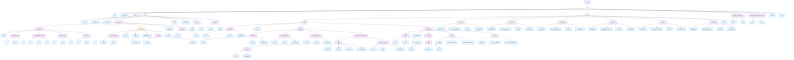

```mermaid
flowchart TD
    root["tf IDS"]

    n1(tf)
    root --> n1
    class n1 complexNode
    n2[r0]
    n1 --> n2
    class n2 leafNode
    n3[is_periodic]
    n1 --> n3
    class n3 leafNode
    n4[coils_n]
    n1 --> n4
    class n4 leafNode
    n5(coil)
    n1 --> n5
    class n5 complexNode
    n6[name]
    n5 --> n6
    class n6 leafNode
    n7[description]
    n5 --> n7
    class n7 leafNode
    n8[identifier]
    n5 --> n8
    class n8 leafNode
    n9[conductor]
    n5 --> n9
    class n9 normalNode
    n10[elements]
    n9 --> n10
    class n10 normalNode
    n11[types]
    n10 --> n11
    class n11 leafNode
    n12[start_points]
    n10 --> n12
    class n12 normalNode
    n13[r]
    n12 --> n13
    class n13 leafNode
    n14[phi]
    n12 --> n14
    class n14 leafNode
    n15[z]
    n12 --> n15
    class n15 leafNode
    n16[intermediate_points]
    n10 --> n16
    class n16 normalNode
    n17[r]
    n16 --> n17
    class n17 leafNode
    n18[phi]
    n16 --> n18
    class n18 leafNode
    n19[z]
    n16 --> n19
    class n19 leafNode
    n20[end_points]
    n10 --> n20
    class n20 normalNode
    n21[r]
    n20 --> n21
    class n21 leafNode
    n22[phi]
    n20 --> n22
    class n22 leafNode
    n23[z]
    n20 --> n23
    class n23 leafNode
    n24[centres]
    n10 --> n24
    class n24 normalNode
    n25[r]
    n24 --> n25
    class n25 leafNode
    n26[phi]
    n24 --> n26
    class n26 leafNode
    n27[z]
    n24 --> n27
    class n27 leafNode
    n28(cross_section)
    n9 --> n28
    class n28 complexNode
    n29[geometry_type]
    n28 --> n29
    class n29 normalNode
    n30[name]
    n29 --> n30
    class n30 leafNode
    n31[index]
    n29 --> n31
    class n31 leafNode
    n32[description]
    n29 --> n32
    class n32 leafNode
    n33[width]
    n28 --> n33
    class n33 leafNode
    n34[height]
    n28 --> n34
    class n34 leafNode
    n35[radius_inner]
    n28 --> n35
    class n35 leafNode
    n36[outline]
    n28 --> n36
    class n36 normalNode
    n37[normal]
    n36 --> n37
    class n37 leafNode
    n38[binormal]
    n36 --> n38
    class n38 leafNode
    n39[area]
    n28 --> n39
    class n39 leafNode
    n40[resistance]
    n9 --> n40
    class n40 leafNode
    n41[voltage]
    n9 --> n41
    class n41 normalNode
    n42[data]
    n41 --> n42
    class n42 leafNode
    n43[time]
    n41 --> n43
    class n43 leafNode
    n44[turns]
    n5 --> n44
    class n44 leafNode
    n45[resistance]
    n5 --> n45
    class n45 leafNode
    n46[current]
    n5 --> n46
    class n46 normalNode
    n47[data]
    n46 --> n47
    class n47 leafNode
    n48[time]
    n46 --> n48
    class n48 leafNode
    n49[voltage]
    n5 --> n49
    class n49 normalNode
    n50[data]
    n49 --> n50
    class n50 leafNode
    n51[time]
    n49 --> n51
    class n51 leafNode
    n52(field_map)
    n1 --> n52
    class n52 complexNode
    n53[grid]
    n52 --> n53
    class n53 normalNode
    n54[identifier]
    n53 --> n54
    class n54 normalNode
    n55[name]
    n54 --> n55
    class n55 leafNode
    n56[index]
    n54 --> n56
    class n56 leafNode
    n57[description]
    n54 --> n57
    class n57 leafNode
    n58[path]
    n53 --> n58
    class n58 leafNode
    n59[space]
    n53 --> n59
    class n59 normalNode
    n60[identifier]
    n59 --> n60
    class n60 normalNode
    n61[name]
    n60 --> n61
    class n61 leafNode
    n62[index]
    n60 --> n62
    class n62 leafNode
    n63[description]
    n60 --> n63
    class n63 leafNode
    n64[geometry_type]
    n59 --> n64
    class n64 normalNode
    n65[name]
    n64 --> n65
    class n65 leafNode
    n66[index]
    n64 --> n66
    class n66 leafNode
    n67[description]
    n64 --> n67
    class n67 leafNode
    n68[coordinates_type]
    n59 --> n68
    class n68 normalNode
    n69[name]
    n68 --> n69
    class n69 leafNode
    n70[index]
    n68 --> n70
    class n70 leafNode
    n71[description]
    n68 --> n71
    class n71 leafNode
    n72[objects_per_dimension]
    n59 --> n72
    class n72 normalNode
    n73[object]
    n72 --> n73
    class n73 normalNode
    n74[boundary]
    n73 --> n74
    class n74 normalNode
    n75[index]
    n74 --> n75
    class n75 leafNode
    n76[neighbours]
    n74 --> n76
    class n76 leafNode
    n77[geometry]
    n73 --> n77
    class n77 leafNode
    n78[nodes]
    n73 --> n78
    class n78 leafNode
    n79[measure]
    n73 --> n79
    class n79 leafNode
    n80[geometry_2d]
    n73 --> n80
    class n80 leafNode
    n81[geometry_content]
    n72 --> n81
    class n81 normalNode
    n82[name]
    n81 --> n82
    class n82 leafNode
    n83[index]
    n81 --> n83
    class n83 leafNode
    n84[description]
    n81 --> n84
    class n84 leafNode
    n85[grid_subset]
    n53 --> n85
    class n85 normalNode
    n86[identifier]
    n85 --> n86
    class n86 normalNode
    n87[name]
    n86 --> n87
    class n87 leafNode
    n88[index]
    n86 --> n88
    class n88 leafNode
    n89[description]
    n86 --> n89
    class n89 leafNode
    n90[dimension]
    n85 --> n90
    class n90 leafNode
    n91[element]
    n85 --> n91
    class n91 normalNode
    n92[object]
    n91 --> n92
    class n92 normalNode
    n93[space]
    n92 --> n93
    class n93 leafNode
    n94[dimension]
    n92 --> n94
    class n94 leafNode
    n95[index]
    n92 --> n95
    class n95 leafNode
    n96[base]
    n85 --> n96
    class n96 normalNode
    n97[jacobian]
    n96 --> n97
    class n97 leafNode
    n98[tensor_covariant]
    n96 --> n98
    class n98 leafNode
    n99[tensor_contravariant]
    n96 --> n99
    class n99 leafNode
    n100[metric]
    n85 --> n100
    class n100 normalNode
    n101[jacobian]
    n100 --> n101
    class n101 leafNode
    n102[tensor_covariant]
    n100 --> n102
    class n102 leafNode
    n103[tensor_contravariant]
    n100 --> n103
    class n103 leafNode
    n104[b_field_r]
    n52 --> n104
    class n104 normalNode
    n105[grid_index]
    n104 --> n105
    class n105 leafNode
    n106[grid_subset_index]
    n104 --> n106
    class n106 leafNode
    n107[values]
    n104 --> n107
    class n107 leafNode
    n108[coefficients]
    n104 --> n108
    class n108 leafNode
    n109[b_field_z]
    n52 --> n109
    class n109 normalNode
    n110[grid_index]
    n109 --> n110
    class n110 leafNode
    n111[grid_subset_index]
    n109 --> n111
    class n111 leafNode
    n112[values]
    n109 --> n112
    class n112 leafNode
    n113[coefficients]
    n109 --> n113
    class n113 leafNode
    n114[b_field_tor]
    n52 --> n114
    class n114 normalNode
    n115[grid_index]
    n114 --> n115
    class n115 leafNode
    n116[grid_subset_index]
    n114 --> n116
    class n116 leafNode
    n117[values]
    n114 --> n117
    class n117 leafNode
    n118[coefficients]
    n114 --> n118
    class n118 leafNode
    n119[a_field_r]
    n52 --> n119
    class n119 normalNode
    n120[grid_index]
    n119 --> n120
    class n120 leafNode
    n121[grid_subset_index]
    n119 --> n121
    class n121 leafNode
    n122[values]
    n119 --> n122
    class n122 leafNode
    n123[coefficients]
    n119 --> n123
    class n123 leafNode
    n124[a_field_z]
    n52 --> n124
    class n124 normalNode
    n125[grid_index]
    n124 --> n125
    class n125 leafNode
    n126[grid_subset_index]
    n124 --> n126
    class n126 leafNode
    n127[values]
    n124 --> n127
    class n127 leafNode
    n128[coefficients]
    n124 --> n128
    class n128 leafNode
    n129[a_field_tor]
    n52 --> n129
    class n129 normalNode
    n130[grid_index]
    n129 --> n130
    class n130 leafNode
    n131[grid_subset_index]
    n129 --> n131
    class n131 leafNode
    n132[values]
    n129 --> n132
    class n132 leafNode
    n133[coefficients]
    n129 --> n133
    class n133 leafNode
    n134[time]
    n52 --> n134
    class n134 leafNode
    n135[b_field_phi_vacuum_r]
    n1 --> n135
    class n135 normalNode
    n136[data]
    n135 --> n136
    class n136 leafNode
    n137[time]
    n135 --> n137
    class n137 leafNode
    n138[delta_b_field_phi_vacuum_r]
    n1 --> n138
    class n138 normalNode
    n139[data]
    n138 --> n139
    class n139 leafNode
    n140[time]
    n138 --> n140
    class n140 leafNode
    n141[latency]
    n1 --> n141
    class n141 leafNode
    n142[time]
    n1 --> n142
    class n142 leafNode

    classDef leafNode fill:#e1f5fe
    classDef complexNode fill:#fff3e0
    classDef normalNode fill:#f3e5f5
    classDef moreNode fill:#f5f5f5,stroke-dasharray: 5 5
```