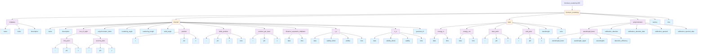

```mermaid
flowchart TD
    root["thomson_scattering IDS"]

    n1(thomson_scattering)
    root --> n1
    class n1 complexNode
    n2[midplane]
    n1 --> n2
    class n2 normalNode
    n3[name]
    n2 --> n3
    class n3 leafNode
    n4[index]
    n2 --> n4
    class n4 leafNode
    n5[description]
    n2 --> n5
    class n5 leafNode
    n6(channel)
    n1 --> n6
    class n6 complexNode
    n7[name]
    n6 --> n7
    class n7 leafNode
    n8[description]
    n6 --> n8
    class n8 leafNode
    n9[line_of_sight]
    n6 --> n9
    class n9 normalNode
    n10[first_point]
    n9 --> n10
    class n10 normalNode
    n11[r]
    n10 --> n11
    class n11 leafNode
    n12[phi]
    n10 --> n12
    class n12 leafNode
    n13[z]
    n10 --> n13
    class n13 leafNode
    n14[second_point]
    n9 --> n14
    class n14 normalNode
    n15[r]
    n14 --> n15
    class n15 leafNode
    n16[phi]
    n14 --> n16
    class n16 leafNode
    n17[z]
    n14 --> n17
    class n17 leafNode
    n18[polychromator_index]
    n6 --> n18
    class n18 leafNode
    n19[scattering_angle]
    n6 --> n19
    class n19 leafNode
    n20[scattering_length]
    n6 --> n20
    class n20 leafNode
    n21[solid_angle]
    n6 --> n21
    class n21 leafNode
    n22[position]
    n6 --> n22
    class n22 normalNode
    n23[r]
    n22 --> n23
    class n23 leafNode
    n24[phi]
    n22 --> n24
    class n24 leafNode
    n25[z]
    n22 --> n25
    class n25 leafNode
    n26[delta_position]
    n6 --> n26
    class n26 normalNode
    n27[r]
    n26 --> n27
    class n27 leafNode
    n28[phi]
    n26 --> n28
    class n28 leafNode
    n29[z]
    n26 --> n29
    class n29 leafNode
    n30[time]
    n26 --> n30
    class n30 leafNode
    n31[position_per_laser]
    n6 --> n31
    class n31 normalNode
    n32[r]
    n31 --> n32
    class n32 leafNode
    n33[phi]
    n31 --> n33
    class n33 leafNode
    n34[z]
    n31 --> n34
    class n34 leafNode
    n35[distance_separatrix_midplane]
    n6 --> n35
    class n35 normalNode
    n36[data]
    n35 --> n36
    class n36 leafNode
    n37[time]
    n35 --> n37
    class n37 leafNode
    n38[t_e]
    n6 --> n38
    class n38 normalNode
    n39[data]
    n38 --> n39
    class n39 leafNode
    n40[validity_timed]
    n38 --> n40
    class n40 leafNode
    n41[validity]
    n38 --> n41
    class n41 leafNode
    n42[time]
    n38 --> n42
    class n42 leafNode
    n43[n_e]
    n6 --> n43
    class n43 normalNode
    n44[data]
    n43 --> n44
    class n44 leafNode
    n45[validity_timed]
    n43 --> n45
    class n45 leafNode
    n46[validity]
    n43 --> n46
    class n46 leafNode
    n47[time]
    n43 --> n47
    class n47 leafNode
    n48[gaussian_fit]
    n6 --> n48
    class n48 leafNode
    n49(laser)
    n1 --> n49
    class n49 complexNode
    n50[energy_in]
    n49 --> n50
    class n50 normalNode
    n51[data]
    n50 --> n51
    class n51 leafNode
    n52[time]
    n50 --> n52
    class n52 leafNode
    n53[energy_out]
    n49 --> n53
    class n53 normalNode
    n54[data]
    n53 --> n54
    class n54 leafNode
    n55[time]
    n53 --> n55
    class n55 leafNode
    n56[start_point]
    n49 --> n56
    class n56 normalNode
    n57[r]
    n56 --> n57
    class n57 leafNode
    n58[phi]
    n56 --> n58
    class n58 leafNode
    n59[z]
    n56 --> n59
    class n59 leafNode
    n60[end_point]
    n49 --> n60
    class n60 normalNode
    n61[r]
    n60 --> n61
    class n61 leafNode
    n62[phi]
    n60 --> n62
    class n62 leafNode
    n63[z]
    n60 --> n63
    class n63 leafNode
    n64[wavelength]
    n49 --> n64
    class n64 leafNode
    n65[area]
    n49 --> n65
    class n65 leafNode
    n66[polychromator]
    n1 --> n66
    class n66 normalNode
    n67[wavelength_band]
    n66 --> n67
    class n67 normalNode
    n68[wavelength_lower]
    n67 --> n68
    class n68 leafNode
    n69[wavelength_upper]
    n67 --> n69
    class n69 leafNode
    n70[wavelengths]
    n67 --> n70
    class n70 leafNode
    n71[detection_efficiency]
    n67 --> n71
    class n71 leafNode
    n72[calibration_absolute]
    n66 --> n72
    class n72 leafNode
    n73[calibration_absolute_date]
    n66 --> n73
    class n73 leafNode
    n74[calibration_spectral]
    n66 --> n74
    class n74 leafNode
    n75[calibration_spectral_date]
    n66 --> n75
    class n75 leafNode
    n76[latency]
    n1 --> n76
    class n76 leafNode
    n77[time]
    n1 --> n77
    class n77 leafNode

    classDef leafNode fill:#e1f5fe
    classDef complexNode fill:#fff3e0
    classDef normalNode fill:#f3e5f5
    classDef moreNode fill:#f5f5f5,stroke-dasharray: 5 5
```