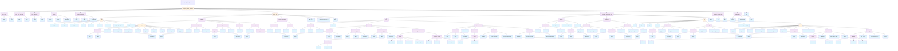

```mermaid
flowchart TD
    root["transport_solver_numerics IDS"]

    n1(transport_solver_numerics)
    root --> n1
    class n1 complexNode
    n2[time_step]
    n1 --> n2
    class n2 normalNode
    n3[data]
    n2 --> n3
    class n3 leafNode
    n4[time]
    n2 --> n4
    class n4 leafNode
    n5[time_step_average]
    n1 --> n5
    class n5 normalNode
    n6[data]
    n5 --> n6
    class n6 leafNode
    n7[time]
    n5 --> n7
    class n7 leafNode
    n8[time_step_min]
    n1 --> n8
    class n8 normalNode
    n9[data]
    n8 --> n9
    class n9 leafNode
    n10[time]
    n8 --> n10
    class n10 leafNode
    n11[solver]
    n1 --> n11
    class n11 normalNode
    n12[name]
    n11 --> n12
    class n12 leafNode
    n13[index]
    n11 --> n13
    class n13 leafNode
    n14[description]
    n11 --> n14
    class n14 leafNode
    n15[primary_coordinate]
    n1 --> n15
    class n15 normalNode
    n16[name]
    n15 --> n16
    class n16 leafNode
    n17[index]
    n15 --> n17
    class n17 leafNode
    n18[description]
    n15 --> n18
    class n18 leafNode
    n19(solver_1d)
    n1 --> n19
    class n19 complexNode
    n20(grid)
    n19 --> n20
    class n20 complexNode
    n21[rho_tor_norm]
    n20 --> n21
    class n21 leafNode
    n22[rho_tor]
    n20 --> n22
    class n22 leafNode
    n23[rho_pol_norm]
    n20 --> n23
    class n23 leafNode
    n24[psi]
    n20 --> n24
    class n24 leafNode
    n25[volume]
    n20 --> n25
    class n25 leafNode
    n26[area]
    n20 --> n26
    class n26 leafNode
    n27[surface]
    n20 --> n27
    class n27 leafNode
    n28[psi_magnetic_axis]
    n20 --> n28
    class n28 leafNode
    n29[psi_boundary]
    n20 --> n29
    class n29 leafNode
    n30[equation]
    n19 --> n30
    class n30 normalNode
    n31(primary_quantity)
    n30 --> n31
    class n31 complexNode
    n32[identifier]
    n31 --> n32
    class n32 normalNode
    n33[name]
    n32 --> n33
    class n33 leafNode
    n34[index]
    n32 --> n34
    class n34 leafNode
    n35[description]
    n32 --> n35
    class n35 leafNode
    n36[ion_index]
    n31 --> n36
    class n36 leafNode
    n37[neutral_index]
    n31 --> n37
    class n37 leafNode
    n38[state_index]
    n31 --> n38
    class n38 leafNode
    n39[profile]
    n31 --> n39
    class n39 leafNode
    n40[d_dr]
    n31 --> n40
    class n40 leafNode
    n41[d2_dr2]
    n31 --> n41
    class n41 leafNode
    n42[d_dt]
    n31 --> n42
    class n42 leafNode
    n43[d_dt_cphi]
    n31 --> n43
    class n43 leafNode
    n44[d_dt_cr]
    n31 --> n44
    class n44 leafNode
    n45[computation_mode]
    n30 --> n45
    class n45 normalNode
    n46[name]
    n45 --> n46
    class n46 leafNode
    n47[index]
    n45 --> n47
    class n47 leafNode
    n48[description]
    n45 --> n48
    class n48 leafNode
    n49[boundary_condition]
    n30 --> n49
    class n49 normalNode
    n50[type]
    n49 --> n50
    class n50 normalNode
    n51[name]
    n50 --> n51
    class n51 leafNode
    n52[index]
    n50 --> n52
    class n52 leafNode
    n53[description]
    n50 --> n53
    class n53 leafNode
    n54[value]
    n49 --> n54
    class n54 leafNode
    n55[position]
    n49 --> n55
    class n55 leafNode
    n56[coefficient]
    n30 --> n56
    class n56 normalNode
    n57[profile]
    n56 --> n57
    class n57 leafNode
    n58[convergence]
    n30 --> n58
    class n58 normalNode
    n59[iterations_n]
    n58 --> n59
    class n59 leafNode
    n60[delta_relative]
    n58 --> n60
    class n60 normalNode
    n61[value]
    n60 --> n61
    class n61 leafNode
    n62[expression]
    n60 --> n62
    class n62 leafNode
    n63[control_parameters]
    n19 --> n63
    class n63 normalNode
    n64[integer0d]
    n63 --> n64
    class n64 normalNode
    n65[name]
    n64 --> n65
    class n65 leafNode
    n66[value]
    n64 --> n66
    class n66 leafNode
    n67[real0d]
    n63 --> n67
    class n67 normalNode
    n68[name]
    n67 --> n68
    class n68 leafNode
    n69[value]
    n67 --> n69
    class n69 leafNode
    n70[drho_tor_dt]
    n19 --> n70
    class n70 leafNode
    n71[d_dvolume_drho_tor_dt]
    n19 --> n71
    class n71 leafNode
    n72[time]
    n19 --> n72
    class n72 leafNode
    n73[boundary_conditions_ggd]
    n1 --> n73
    class n73 normalNode
    n74[grid]
    n73 --> n74
    class n74 normalNode
    n75[identifier]
    n74 --> n75
    class n75 normalNode
    n76[name]
    n75 --> n76
    class n76 leafNode
    n77[index]
    n75 --> n77
    class n77 leafNode
    n78[description]
    n75 --> n78
    class n78 leafNode
    n79[path]
    n74 --> n79
    class n79 leafNode
    n80[space]
    n74 --> n80
    class n80 normalNode
    n81[identifier]
    n80 --> n81
    class n81 normalNode
    n82[name]
    n81 --> n82
    class n82 leafNode
    n83[index]
    n81 --> n83
    class n83 leafNode
    n84[description]
    n81 --> n84
    class n84 leafNode
    n85[geometry_type]
    n80 --> n85
    class n85 normalNode
    n86[name]
    n85 --> n86
    class n86 leafNode
    n87[index]
    n85 --> n87
    class n87 leafNode
    n88[description]
    n85 --> n88
    class n88 leafNode
    n89[coordinates_type]
    n80 --> n89
    class n89 normalNode
    n90[name]
    n89 --> n90
    class n90 leafNode
    n91[index]
    n89 --> n91
    class n91 leafNode
    n92[description]
    n89 --> n92
    class n92 leafNode
    n93[objects_per_dimension]
    n80 --> n93
    class n93 normalNode
    n94[object]
    n93 --> n94
    class n94 normalNode
    n95[boundary]
    n94 --> n95
    class n95 normalNode
    n96[index]
    n95 --> n96
    class n96 leafNode
    n97[neighbours]
    n95 --> n97
    class n97 leafNode
    n98[geometry]
    n94 --> n98
    class n98 leafNode
    n99[nodes]
    n94 --> n99
    class n99 leafNode
    n100[measure]
    n94 --> n100
    class n100 leafNode
    n101[geometry_2d]
    n94 --> n101
    class n101 leafNode
    n102[geometry_content]
    n93 --> n102
    class n102 normalNode
    n103[name]
    n102 --> n103
    class n103 leafNode
    n104[index]
    n102 --> n104
    class n104 leafNode
    n105[description]
    n102 --> n105
    class n105 leafNode
    n106[grid_subset]
    n74 --> n106
    class n106 normalNode
    n107[identifier]
    n106 --> n107
    class n107 normalNode
    n108[name]
    n107 --> n108
    class n108 leafNode
    n109[index]
    n107 --> n109
    class n109 leafNode
    n110[description]
    n107 --> n110
    class n110 leafNode
    n111[dimension]
    n106 --> n111
    class n111 leafNode
    n112[element]
    n106 --> n112
    class n112 normalNode
    n113[object]
    n112 --> n113
    class n113 normalNode
    n114[space]
    n113 --> n114
    class n114 leafNode
    n115[dimension]
    n113 --> n115
    class n115 leafNode
    n116[index]
    n113 --> n116
    class n116 leafNode
    n117[base]
    n106 --> n117
    class n117 normalNode
    n118[jacobian]
    n117 --> n118
    class n118 leafNode
    n119[tensor_covariant]
    n117 --> n119
    class n119 leafNode
    n120[tensor_contravariant]
    n117 --> n120
    class n120 leafNode
    n121[metric]
    n106 --> n121
    class n121 normalNode
    n122[jacobian]
    n121 --> n122
    class n122 leafNode
    n123[tensor_covariant]
    n121 --> n123
    class n123 leafNode
    n124[tensor_contravariant]
    n121 --> n124
    class n124 leafNode
    n125[current]
    n73 --> n125
    class n125 normalNode
    n126[identifier]
    n125 --> n126
    class n126 normalNode
    n127[name]
    n126 --> n127
    class n127 leafNode
    n128[index]
    n126 --> n128
    class n128 leafNode
    n129[description]
    n126 --> n129
    class n129 leafNode
    n130[grid_index]
    n125 --> n130
    class n130 leafNode
    n131[grid_subset_index]
    n125 --> n131
    class n131 leafNode
    n132[values]
    n125 --> n132
    class n132 leafNode
    n133[electrons]
    n73 --> n133
    class n133 normalNode
    n134[particles]
    n133 --> n134
    class n134 normalNode
    n135[identifier]
    n134 --> n135
    class n135 normalNode
    n136[name]
    n135 --> n136
    class n136 leafNode
    n137[index]
    n135 --> n137
    class n137 leafNode
    n138[description]
    n135 --> n138
    class n138 leafNode
    n139[grid_index]
    n134 --> n139
    class n139 leafNode
    n140[grid_subset_index]
    n134 --> n140
    class n140 leafNode
    n141[values]
    n134 --> n141
    class n141 leafNode
    n142[energy]
    n133 --> n142
    class n142 normalNode
    n143[identifier]
    n142 --> n143
    class n143 normalNode
    n144[name]
    n143 --> n144
    class n144 leafNode
    n145[index]
    n143 --> n145
    class n145 leafNode
    n146[description]
    n143 --> n146
    class n146 leafNode
    n147[grid_index]
    n142 --> n147
    class n147 leafNode
    n148[grid_subset_index]
    n142 --> n148
    class n148 leafNode
    n149[values]
    n142 --> n149
    class n149 leafNode
    n150(ion)
    n73 --> n150
    class n150 complexNode
    n151[a]
    n150 --> n151
    class n151 leafNode
    n152[z_ion]
    n150 --> n152
    class n152 leafNode
    n153[z_n]
    n150 --> n153
    class n153 leafNode
    n154[name]
    n150 --> n154
    class n154 leafNode
    n155[particles]
    n150 --> n155
    class n155 normalNode
    n156[identifier]
    n155 --> n156
    class n156 normalNode
    n157[name]
    n156 --> n157
    class n157 leafNode
    n158[index]
    n156 --> n158
    class n158 leafNode
    n159[description]
    n156 --> n159
    class n159 leafNode
    n160[grid_index]
    n155 --> n160
    class n160 leafNode
    n161[grid_subset_index]
    n155 --> n161
    class n161 leafNode
    n162[values]
    n155 --> n162
    class n162 leafNode
    n163[energy]
    n150 --> n163
    class n163 normalNode
    n164[identifier]
    n163 --> n164
    class n164 normalNode
    n165[name]
    n164 --> n165
    class n165 leafNode
    n166[index]
    n164 --> n166
    class n166 leafNode
    n167[description]
    n164 --> n167
    class n167 leafNode
    n168[grid_index]
    n163 --> n168
    class n168 leafNode
    n169[grid_subset_index]
    n163 --> n169
    class n169 leafNode
    n170[values]
    n163 --> n170
    class n170 leafNode
    n171[multiple_states_flag]
    n150 --> n171
    class n171 leafNode
    n172(state)
    n150 --> n172
    class n172 complexNode
    n173[z_min]
    n172 --> n173
    class n173 leafNode
    n174[z_max]
    n172 --> n174
    class n174 leafNode
    n175[name]
    n172 --> n175
    class n175 leafNode
    n176[vibrational_level]
    n172 --> n176
    class n176 leafNode
    n177[vibrational_mode]
    n172 --> n177
    class n177 leafNode
    n178[is_neutral]
    n172 --> n178
    class n178 leafNode
    n179[neutral_type]
    n172 --> n179
    class n179 normalNode
    n180[name]
    n179 --> n180
    class n180 leafNode
    n181[index]
    n179 --> n181
    class n181 leafNode
    n182[description]
    n179 --> n182
    class n182 leafNode
    n183[electron_configuration]
    n172 --> n183
    class n183 leafNode
    n184[particles]
    n172 --> n184
    class n184 normalNode
    n185[identifier]
    n184 --> n185
    class n185 normalNode
    n186[name]
    n185 --> n186
    class n186 leafNode
    n187[index]
    n185 --> n187
    class n187 leafNode
    n188[description]
    n185 --> n188
    class n188 leafNode
    n189[grid_index]
    n184 --> n189
    class n189 leafNode
    n190[grid_subset_index]
    n184 --> n190
    class n190 leafNode
    n191[values]
    n184 --> n191
    class n191 leafNode
    n192[energy]
    n172 --> n192
    class n192 normalNode
    n193[identifier]
    n192 --> n193
    class n193 normalNode
    n194[name]
    n193 --> n194
    class n194 leafNode
    n195[index]
    n193 --> n195
    class n195 leafNode
    n196[description]
    n193 --> n196
    class n196 leafNode
    n197[grid_index]
    n192 --> n197
    class n197 leafNode
    n198[grid_subset_index]
    n192 --> n198
    class n198 leafNode
    n199[values]
    n192 --> n199
    class n199 leafNode
    n200[time]
    n73 --> n200
    class n200 leafNode
    n201[vacuum_toroidal_field]
    n1 --> n201
    class n201 normalNode
    n202[r0]
    n201 --> n202
    class n202 leafNode
    n203[b0]
    n201 --> n203
    class n203 leafNode
    n204[restart_files]
    n1 --> n204
    class n204 normalNode
    n205[names]
    n204 --> n205
    class n205 leafNode
    n206[descriptions]
    n204 --> n206
    class n206 leafNode
    n207[time]
    n204 --> n207
    class n207 leafNode
    n208[time]
    n1 --> n208
    class n208 leafNode

    classDef leafNode fill:#e1f5fe
    classDef complexNode fill:#fff3e0
    classDef normalNode fill:#f3e5f5
    classDef moreNode fill:#f5f5f5,stroke-dasharray: 5 5
```