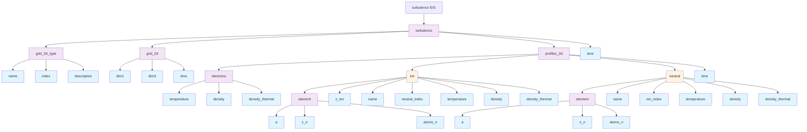

```mermaid
flowchart TD
    root["turbulence IDS"]

    n1[turbulence]
    root --> n1
    class n1 normalNode
    n2[grid_2d_type]
    n1 --> n2
    class n2 normalNode
    n3[name]
    n2 --> n3
    class n3 leafNode
    n4[index]
    n2 --> n4
    class n4 leafNode
    n5[description]
    n2 --> n5
    class n5 leafNode
    n6[grid_2d]
    n1 --> n6
    class n6 normalNode
    n7[dim1]
    n6 --> n7
    class n7 leafNode
    n8[dim2]
    n6 --> n8
    class n8 leafNode
    n9[time]
    n6 --> n9
    class n9 leafNode
    n10[profiles_2d]
    n1 --> n10
    class n10 normalNode
    n11[electrons]
    n10 --> n11
    class n11 normalNode
    n12[temperature]
    n11 --> n12
    class n12 leafNode
    n13[density]
    n11 --> n13
    class n13 leafNode
    n14[density_thermal]
    n11 --> n14
    class n14 leafNode
    n15(ion)
    n10 --> n15
    class n15 complexNode
    n16[element]
    n15 --> n16
    class n16 normalNode
    n17[a]
    n16 --> n17
    class n17 leafNode
    n18[z_n]
    n16 --> n18
    class n18 leafNode
    n19[atoms_n]
    n16 --> n19
    class n19 leafNode
    n20[z_ion]
    n15 --> n20
    class n20 leafNode
    n21[name]
    n15 --> n21
    class n21 leafNode
    n22[neutral_index]
    n15 --> n22
    class n22 leafNode
    n23[temperature]
    n15 --> n23
    class n23 leafNode
    n24[density]
    n15 --> n24
    class n24 leafNode
    n25[density_thermal]
    n15 --> n25
    class n25 leafNode
    n26(neutral)
    n10 --> n26
    class n26 complexNode
    n27[element]
    n26 --> n27
    class n27 normalNode
    n28[a]
    n27 --> n28
    class n28 leafNode
    n29[z_n]
    n27 --> n29
    class n29 leafNode
    n30[atoms_n]
    n27 --> n30
    class n30 leafNode
    n31[name]
    n26 --> n31
    class n31 leafNode
    n32[ion_index]
    n26 --> n32
    class n32 leafNode
    n33[temperature]
    n26 --> n33
    class n33 leafNode
    n34[density]
    n26 --> n34
    class n34 leafNode
    n35[density_thermal]
    n26 --> n35
    class n35 leafNode
    n36[time]
    n10 --> n36
    class n36 leafNode
    n37[time]
    n1 --> n37
    class n37 leafNode

    classDef leafNode fill:#e1f5fe
    classDef complexNode fill:#fff3e0
    classDef normalNode fill:#f3e5f5
    classDef moreNode fill:#f5f5f5,stroke-dasharray: 5 5
```