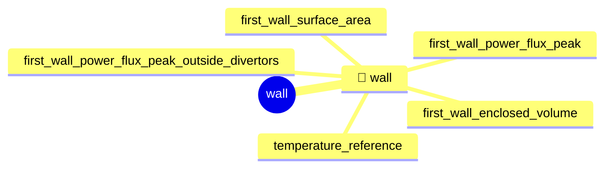

```mermaid
mindmap
  root((wall))
    🔴 wall
      temperature_reference
      first_wall_surface_area
      first_wall_power_flux_peak
      first_wall_power_flux_peak_outside_divertors
      first_wall_enclosed_volume
```