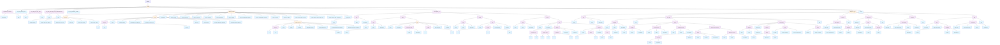

```mermaid
flowchart TD
    root["wall IDS"]

    n1(wall)
    root --> n1
    class n1 complexNode
    n2[temperature_reference]
    n1 --> n2
    class n2 normalNode
    n3[description]
    n2 --> n3
    class n3 leafNode
    n4[data]
    n2 --> n4
    class n4 leafNode
    n5[first_wall_surface_area]
    n1 --> n5
    class n5 leafNode
    n6[first_wall_power_flux_peak]
    n1 --> n6
    class n6 normalNode
    n7[data]
    n6 --> n7
    class n7 leafNode
    n8[time]
    n6 --> n8
    class n8 leafNode
    n9[first_wall_power_flux_peak_outside_divertors]
    n1 --> n9
    class n9 normalNode
    n10[data]
    n9 --> n10
    class n10 leafNode
    n11[time]
    n9 --> n11
    class n11 leafNode
    n12[first_wall_enclosed_volume]
    n1 --> n12
    class n12 leafNode
    n13(global_quantities)
    n1 --> n13
    class n13 complexNode
    n14(electrons)
    n13 --> n14
    class n14 complexNode
    n15[pumping_speed]
    n14 --> n15
    class n15 leafNode
    n16[particle_flux_from_plasma]
    n14 --> n16
    class n16 leafNode
    n17[particle_flux_from_wall]
    n14 --> n17
    class n17 leafNode
    n18[gas_puff]
    n14 --> n18
    class n18 leafNode
    n19[power_inner_target]
    n14 --> n19
    class n19 leafNode
    n20[power_outer_target]
    n14 --> n20
    class n20 leafNode
    n21(neutral)
    n13 --> n21
    class n21 complexNode
    n22[element]
    n21 --> n22
    class n22 normalNode
    n23[a]
    n22 --> n23
    class n23 leafNode
    n24[z_n]
    n22 --> n24
    class n24 leafNode
    n25[atoms_n]
    n22 --> n25
    class n25 leafNode
    n26[name]
    n21 --> n26
    class n26 leafNode
    n27[pumping_speed]
    n21 --> n27
    class n27 leafNode
    n28[particle_flux_from_plasma]
    n21 --> n28
    class n28 leafNode
    n29[particle_flux_from_wall]
    n21 --> n29
    class n29 leafNode
    n30[gas_puff]
    n21 --> n30
    class n30 leafNode
    n31[wall_inventory]
    n21 --> n31
    class n31 leafNode
    n32[recycling_particles_coefficient]
    n21 --> n32
    class n32 leafNode
    n33[recycling_energy_coefficient]
    n21 --> n33
    class n33 leafNode
    n34(incident_species)
    n21 --> n34
    class n34 complexNode
    n35[element]
    n34 --> n35
    class n35 normalNode
    n36[a]
    n35 --> n36
    class n36 leafNode
    n37[z_n]
    n35 --> n37
    class n37 leafNode
    n38[atoms_n]
    n35 --> n38
    class n38 leafNode
    n39[name]
    n34 --> n39
    class n39 leafNode
    n40[angles]
    n34 --> n40
    class n40 leafNode
    n41[energies]
    n34 --> n41
    class n41 leafNode
    n42[sputtering_physical]
    n34 --> n42
    class n42 leafNode
    n43[sputtering_chemical]
    n34 --> n43
    class n43 leafNode
    n44[sputtering_physical_coefficient]
    n34 --> n44
    class n44 leafNode
    n45[sputtering_chemical_coefficient]
    n34 --> n45
    class n45 leafNode
    n46[temperature]
    n13 --> n46
    class n46 leafNode
    n47[power_incident]
    n13 --> n47
    class n47 leafNode
    n48[power_conducted]
    n13 --> n48
    class n48 leafNode
    n49[power_convected]
    n13 --> n49
    class n49 leafNode
    n50[power_radiated]
    n13 --> n50
    class n50 leafNode
    n51[power_black_body]
    n13 --> n51
    class n51 leafNode
    n52[power_neutrals]
    n13 --> n52
    class n52 leafNode
    n53[power_recombination_plasma]
    n13 --> n53
    class n53 leafNode
    n54[power_recombination_neutrals]
    n13 --> n54
    class n54 leafNode
    n55[power_currents]
    n13 --> n55
    class n55 leafNode
    n56[power_to_cooling]
    n13 --> n56
    class n56 leafNode
    n57[power_inner_target_ion_total]
    n13 --> n57
    class n57 leafNode
    n58[power_density_inner_target_max]
    n13 --> n58
    class n58 leafNode
    n59[power_density_outer_target_max]
    n13 --> n59
    class n59 leafNode
    n60[current_phi]
    n13 --> n60
    class n60 leafNode
    n61[description_2d]
    n1 --> n61
    class n61 normalNode
    n62[type]
    n61 --> n62
    class n62 normalNode
    n63[name]
    n62 --> n63
    class n63 leafNode
    n64[index]
    n62 --> n64
    class n64 leafNode
    n65[description]
    n62 --> n65
    class n65 leafNode
    n66[limiter]
    n61 --> n66
    class n66 normalNode
    n67[type]
    n66 --> n67
    class n67 normalNode
    n68[name]
    n67 --> n68
    class n68 leafNode
    n69[index]
    n67 --> n69
    class n69 leafNode
    n70[description]
    n67 --> n70
    class n70 leafNode
    n71(unit)
    n66 --> n71
    class n71 complexNode
    n72[name]
    n71 --> n72
    class n72 leafNode
    n73[description]
    n71 --> n73
    class n73 leafNode
    n74[component_type]
    n71 --> n74
    class n74 normalNode
    n75[name]
    n74 --> n75
    class n75 leafNode
    n76[index]
    n74 --> n76
    class n76 leafNode
    n77[description]
    n74 --> n77
    class n77 leafNode
    n78[outline]
    n71 --> n78
    class n78 normalNode
    n79[r]
    n78 --> n79
    class n79 leafNode
    n80[z]
    n78 --> n80
    class n80 leafNode
    n81[phi_extensions]
    n71 --> n81
    class n81 leafNode
    n82[resistivity]
    n71 --> n82
    class n82 leafNode
    n83[mobile]
    n61 --> n83
    class n83 normalNode
    n84[type]
    n83 --> n84
    class n84 normalNode
    n85[name]
    n84 --> n85
    class n85 leafNode
    n86[index]
    n84 --> n86
    class n86 leafNode
    n87[description]
    n84 --> n87
    class n87 leafNode
    n88[unit]
    n83 --> n88
    class n88 normalNode
    n89[name]
    n88 --> n89
    class n89 leafNode
    n90[outline]
    n88 --> n90
    class n90 normalNode
    n91[r]
    n90 --> n91
    class n91 leafNode
    n92[z]
    n90 --> n92
    class n92 leafNode
    n93[time]
    n90 --> n93
    class n93 leafNode
    n94[phi_extensions]
    n88 --> n94
    class n94 leafNode
    n95[resistivity]
    n88 --> n95
    class n95 leafNode
    n96[vessel]
    n61 --> n96
    class n96 normalNode
    n97[type]
    n96 --> n97
    class n97 normalNode
    n98[name]
    n97 --> n98
    class n98 leafNode
    n99[index]
    n97 --> n99
    class n99 leafNode
    n100[description]
    n97 --> n100
    class n100 leafNode
    n101[unit]
    n96 --> n101
    class n101 normalNode
    n102[name]
    n101 --> n102
    class n102 leafNode
    n103[description]
    n101 --> n103
    class n103 leafNode
    n104[annular]
    n101 --> n104
    class n104 normalNode
    n105[outline_inner]
    n104 --> n105
    class n105 normalNode
    n106[r]
    n105 --> n106
    class n106 leafNode
    n107[z]
    n105 --> n107
    class n107 leafNode
    n108[outline_outer]
    n104 --> n108
    class n108 normalNode
    n109[r]
    n108 --> n109
    class n109 leafNode
    n110[z]
    n108 --> n110
    class n110 leafNode
    n111[centreline]
    n104 --> n111
    class n111 normalNode
    n112[r]
    n111 --> n112
    class n112 leafNode
    n113[z]
    n111 --> n113
    class n113 leafNode
    n114[thickness]
    n104 --> n114
    class n114 leafNode
    n115[resistivity]
    n104 --> n115
    class n115 leafNode
    n116[element]
    n101 --> n116
    class n116 normalNode
    n117[name]
    n116 --> n117
    class n117 leafNode
    n118[outline]
    n116 --> n118
    class n118 normalNode
    n119[r]
    n118 --> n119
    class n119 leafNode
    n120[z]
    n118 --> n120
    class n120 leafNode
    n121[resistivity]
    n116 --> n121
    class n121 leafNode
    n122[j_phi]
    n116 --> n122
    class n122 normalNode
    n123[data]
    n122 --> n123
    class n123 leafNode
    n124[time]
    n122 --> n124
    class n124 leafNode
    n125[resistance]
    n116 --> n125
    class n125 leafNode
    n126(description_ggd)
    n1 --> n126
    class n126 complexNode
    n127[type]
    n126 --> n127
    class n127 normalNode
    n128[name]
    n127 --> n128
    class n128 leafNode
    n129[index]
    n127 --> n129
    class n129 leafNode
    n130[description]
    n127 --> n130
    class n130 leafNode
    n131[grid_ggd]
    n126 --> n131
    class n131 normalNode
    n132[identifier]
    n131 --> n132
    class n132 normalNode
    n133[name]
    n132 --> n133
    class n133 leafNode
    n134[index]
    n132 --> n134
    class n134 leafNode
    n135[description]
    n132 --> n135
    class n135 leafNode
    n136[path]
    n131 --> n136
    class n136 leafNode
    n137[space]
    n131 --> n137
    class n137 normalNode
    n138[identifier]
    n137 --> n138
    class n138 normalNode
    n139[name]
    n138 --> n139
    class n139 leafNode
    n140[index]
    n138 --> n140
    class n140 leafNode
    n141[description]
    n138 --> n141
    class n141 leafNode
    n142[geometry_type]
    n137 --> n142
    class n142 normalNode
    n143[name]
    n142 --> n143
    class n143 leafNode
    n144[index]
    n142 --> n144
    class n144 leafNode
    n145[description]
    n142 --> n145
    class n145 leafNode
    n146[coordinates_type]
    n137 --> n146
    class n146 normalNode
    n147[name]
    n146 --> n147
    class n147 leafNode
    n148[index]
    n146 --> n148
    class n148 leafNode
    n149[description]
    n146 --> n149
    class n149 leafNode
    n150[objects_per_dimension]
    n137 --> n150
    class n150 normalNode
    n151[object]
    n150 --> n151
    class n151 normalNode
    n152[boundary]
    n151 --> n152
    class n152 normalNode
    n153[index]
    n152 --> n153
    class n153 leafNode
    n154[neighbours]
    n152 --> n154
    class n154 leafNode
    n155[geometry]
    n151 --> n155
    class n155 leafNode
    n156[nodes]
    n151 --> n156
    class n156 leafNode
    n157[measure]
    n151 --> n157
    class n157 leafNode
    n158[geometry_2d]
    n151 --> n158
    class n158 leafNode
    n159[geometry_content]
    n150 --> n159
    class n159 normalNode
    n160[name]
    n159 --> n160
    class n160 leafNode
    n161[index]
    n159 --> n161
    class n161 leafNode
    n162[description]
    n159 --> n162
    class n162 leafNode
    n163[grid_subset]
    n131 --> n163
    class n163 normalNode
    n164[identifier]
    n163 --> n164
    class n164 normalNode
    n165[name]
    n164 --> n165
    class n165 leafNode
    n166[index]
    n164 --> n166
    class n166 leafNode
    n167[description]
    n164 --> n167
    class n167 leafNode
    n168[dimension]
    n163 --> n168
    class n168 leafNode
    n169[element]
    n163 --> n169
    class n169 normalNode
    n170[object]
    n169 --> n170
    class n170 normalNode
    n171[space]
    n170 --> n171
    class n171 leafNode
    n172[dimension]
    n170 --> n172
    class n172 leafNode
    n173[index]
    n170 --> n173
    class n173 leafNode
    n174[base]
    n163 --> n174
    class n174 normalNode
    n175[jacobian]
    n174 --> n175
    class n175 leafNode
    n176[tensor_covariant]
    n174 --> n176
    class n176 leafNode
    n177[tensor_contravariant]
    n174 --> n177
    class n177 leafNode
    n178[metric]
    n163 --> n178
    class n178 normalNode
    n179[jacobian]
    n178 --> n179
    class n179 leafNode
    n180[tensor_covariant]
    n178 --> n180
    class n180 leafNode
    n181[tensor_contravariant]
    n178 --> n181
    class n181 leafNode
    n182[time]
    n131 --> n182
    class n182 leafNode
    n183[material]
    n126 --> n183
    class n183 normalNode
    n184[grid_subset]
    n183 --> n184
    class n184 normalNode
    n185[grid_index]
    n184 --> n185
    class n185 leafNode
    n186[grid_subset_index]
    n184 --> n186
    class n186 leafNode
    n187[identifiers]
    n184 --> n187
    class n187 normalNode
    n188[names]
    n187 --> n188
    class n188 leafNode
    n189[indices]
    n187 --> n189
    class n189 leafNode
    n190[descriptions]
    n187 --> n190
    class n190 leafNode
    n191[time]
    n183 --> n191
    class n191 leafNode
    n192[component]
    n126 --> n192
    class n192 normalNode
    n193[identifiers]
    n192 --> n193
    class n193 leafNode
    n194[type]
    n192 --> n194
    class n194 normalNode
    n195[grid_index]
    n194 --> n195
    class n195 leafNode
    n196[grid_subset_index]
    n194 --> n196
    class n196 leafNode
    n197[identifier]
    n194 --> n197
    class n197 normalNode
    n198[name]
    n197 --> n198
    class n198 leafNode
    n199[index]
    n197 --> n199
    class n199 leafNode
    n200[description]
    n197 --> n200
    class n200 leafNode
    n201[time]
    n192 --> n201
    class n201 leafNode
    n202[thickness]
    n126 --> n202
    class n202 normalNode
    n203[grid_subset]
    n202 --> n203
    class n203 normalNode
    n204[grid_index]
    n203 --> n204
    class n204 leafNode
    n205[grid_subset_index]
    n203 --> n205
    class n205 leafNode
    n206[values]
    n203 --> n206
    class n206 leafNode
    n207[coefficients]
    n203 --> n207
    class n207 leafNode
    n208[time]
    n202 --> n208
    class n208 leafNode
    n209[brdf]
    n126 --> n209
    class n209 normalNode
    n210[type]
    n209 --> n210
    class n210 normalNode
    n211[grid_index]
    n210 --> n211
    class n211 leafNode
    n212[grid_subset_index]
    n210 --> n212
    class n212 leafNode
    n213[identifiers]
    n210 --> n213
    class n213 normalNode
    n214[names]
    n213 --> n214
    class n214 leafNode
    n215[indices]
    n213 --> n215
    class n215 leafNode
    n216[descriptions]
    n213 --> n216
    class n216 leafNode
    n217[parameters]
    n209 --> n217
    class n217 normalNode
    n218[grid_index]
    n217 --> n218
    class n218 leafNode
    n219[grid_subset_index]
    n217 --> n219
    class n219 leafNode
    n220[values]
    n217 --> n220
    class n220 leafNode
    n221[coefficients]
    n217 --> n221
    class n221 leafNode
    n222[time]
    n209 --> n222
    class n222 leafNode
    n223[time]
    n1 --> n223
    class n223 leafNode

    classDef leafNode fill:#e1f5fe
    classDef complexNode fill:#fff3e0
    classDef normalNode fill:#f3e5f5
    classDef moreNode fill:#f5f5f5,stroke-dasharray: 5 5
```