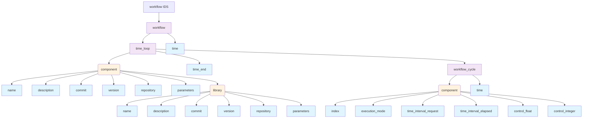

```mermaid
flowchart TD
    root["workflow IDS"]

    n1[workflow]
    root --> n1
    class n1 normalNode
    n2[time_loop]
    n1 --> n2
    class n2 normalNode
    n3(component)
    n2 --> n3
    class n3 complexNode
    n4[name]
    n3 --> n4
    class n4 leafNode
    n5[description]
    n3 --> n5
    class n5 leafNode
    n6[commit]
    n3 --> n6
    class n6 leafNode
    n7[version]
    n3 --> n7
    class n7 leafNode
    n8[repository]
    n3 --> n8
    class n8 leafNode
    n9[parameters]
    n3 --> n9
    class n9 leafNode
    n10(library)
    n3 --> n10
    class n10 complexNode
    n11[name]
    n10 --> n11
    class n11 leafNode
    n12[description]
    n10 --> n12
    class n12 leafNode
    n13[commit]
    n10 --> n13
    class n13 leafNode
    n14[version]
    n10 --> n14
    class n14 leafNode
    n15[repository]
    n10 --> n15
    class n15 leafNode
    n16[parameters]
    n10 --> n16
    class n16 leafNode
    n17[time_end]
    n2 --> n17
    class n17 leafNode
    n18[workflow_cycle]
    n2 --> n18
    class n18 normalNode
    n19(component)
    n18 --> n19
    class n19 complexNode
    n20[index]
    n19 --> n20
    class n20 leafNode
    n21[execution_mode]
    n19 --> n21
    class n21 leafNode
    n22[time_interval_request]
    n19 --> n22
    class n22 leafNode
    n23[time_interval_elapsed]
    n19 --> n23
    class n23 leafNode
    n24[control_float]
    n19 --> n24
    class n24 leafNode
    n25[control_integer]
    n19 --> n25
    class n25 leafNode
    n26[time]
    n18 --> n26
    class n26 leafNode
    n27[time]
    n1 --> n27
    class n27 leafNode

    classDef leafNode fill:#e1f5fe
    classDef complexNode fill:#fff3e0
    classDef normalNode fill:#f3e5f5
    classDef moreNode fill:#f5f5f5,stroke-dasharray: 5 5
```