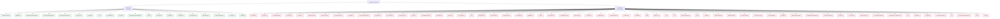

```mermaid
graph TB
    IMAS["IMAS Data Dictionary"]

    SIMPLE["Simple IDS<br/>(< 50 paths)"]
    IMAS --> SIMPLE
    COMPLEX["Complex IDS<br/>(≥ 50 paths)"]
    IMAS --> COMPLEX
    SIMPLE_1["Balance Of Plant"]
    SIMPLE --> SIMPLE_1
    SIMPLE_2["Barometry"]
    SIMPLE --> SIMPLE_2
    SIMPLE_3["B Field Non Axisymmetric"]
    SIMPLE --> SIMPLE_3
    SIMPLE_4["Bremsstrahlung Visible"]
    SIMPLE --> SIMPLE_4
    SIMPLE_5["Coils Non Axisymmetric"]
    SIMPLE --> SIMPLE_5
    SIMPLE_6["Dataset Fair"]
    SIMPLE --> SIMPLE_6
    SIMPLE_7["Disruption"]
    SIMPLE --> SIMPLE_7
    SIMPLE_8["Focs"]
    SIMPLE --> SIMPLE_8
    SIMPLE_9["Gas Pumping"]
    SIMPLE --> SIMPLE_9
    SIMPLE_10["Iron Core"]
    SIMPLE --> SIMPLE_10
    SIMPLE_11["Operational Instrumentation"]
    SIMPLE --> SIMPLE_11
    SIMPLE_12["Pellets"]
    SIMPLE --> SIMPLE_12
    SIMPLE_13["Pf Passive"]
    SIMPLE --> SIMPLE_13
    SIMPLE_14["Pf Plasma"]
    SIMPLE --> SIMPLE_14
    SIMPLE_15["Polarimeter"]
    SIMPLE --> SIMPLE_15
    SIMPLE_16["Real Time Data"]
    SIMPLE --> SIMPLE_16
    SIMPLE_17["Refractometer"]
    SIMPLE --> SIMPLE_17
    SIMPLE_18["Spectrometer Mass"]
    SIMPLE --> SIMPLE_18
    SIMPLE_19["Turbulence"]
    SIMPLE --> SIMPLE_19
    SIMPLE_20["Workflow"]
    SIMPLE --> SIMPLE_20
    COMPLEX_1["Amns Data"]
    COMPLEX --> COMPLEX_1
    COMPLEX_2["Bolometer"]
    COMPLEX --> COMPLEX_2
    COMPLEX_3["Breeding Blanket"]
    COMPLEX --> COMPLEX_3
    COMPLEX_4["Calorimetry"]
    COMPLEX --> COMPLEX_4
    COMPLEX_5["Camera Ir"]
    COMPLEX --> COMPLEX_5
    COMPLEX_6["Camera Visible"]
    COMPLEX --> COMPLEX_6
    COMPLEX_7["Camera X Rays"]
    COMPLEX --> COMPLEX_7
    COMPLEX_8["Charge Exchange"]
    COMPLEX --> COMPLEX_8
    COMPLEX_9["Controllers"]
    COMPLEX --> COMPLEX_9
    COMPLEX_10["Core Instant Changes"]
    COMPLEX --> COMPLEX_10
    COMPLEX_11["Core Profiles"]
    COMPLEX --> COMPLEX_11
    COMPLEX_12["Core Sources"]
    COMPLEX --> COMPLEX_12
    COMPLEX_13["Core Transport"]
    COMPLEX --> COMPLEX_13
    COMPLEX_14["Cryostat"]
    COMPLEX --> COMPLEX_14
    COMPLEX_15["Distribution Sources"]
    COMPLEX --> COMPLEX_15
    COMPLEX_16["Distributions"]
    COMPLEX --> COMPLEX_16
    COMPLEX_17["Divertors"]
    COMPLEX --> COMPLEX_17
    COMPLEX_18["Ec Launchers"]
    COMPLEX --> COMPLEX_18
    COMPLEX_19["Ece"]
    COMPLEX --> COMPLEX_19
    COMPLEX_20["Edge Profiles"]
    COMPLEX --> COMPLEX_20
    COMPLEX_21["Edge Sources"]
    COMPLEX --> COMPLEX_21
    COMPLEX_22["Edge Transport"]
    COMPLEX --> COMPLEX_22
    COMPLEX_23["Em Coupling"]
    COMPLEX --> COMPLEX_23
    COMPLEX_24["Equilibrium"]
    COMPLEX --> COMPLEX_24
    COMPLEX_25["Ferritic"]
    COMPLEX --> COMPLEX_25
    COMPLEX_26["Gas Injection"]
    COMPLEX --> COMPLEX_26
    COMPLEX_27["Gyrokinetics Local"]
    COMPLEX --> COMPLEX_27
    COMPLEX_28["Hard X Rays"]
    COMPLEX --> COMPLEX_28
    COMPLEX_29["Ic Antennas"]
    COMPLEX --> COMPLEX_29
    COMPLEX_30["Interferometer"]
    COMPLEX --> COMPLEX_30
    COMPLEX_31["Langmuir Probes"]
    COMPLEX --> COMPLEX_31
    COMPLEX_32["Lh Antennas"]
    COMPLEX --> COMPLEX_32
    COMPLEX_33["Magnetics"]
    COMPLEX --> COMPLEX_33
    COMPLEX_34["Mhd"]
    COMPLEX --> COMPLEX_34
    COMPLEX_35["Mhd Linear"]
    COMPLEX --> COMPLEX_35
    COMPLEX_36["Mse"]
    COMPLEX --> COMPLEX_36
    COMPLEX_37["Nbi"]
    COMPLEX --> COMPLEX_37
    COMPLEX_38["Neutron Diagnostic"]
    COMPLEX --> COMPLEX_38
    COMPLEX_39["Ntms"]
    COMPLEX --> COMPLEX_39
    COMPLEX_40["Pf Active"]
    COMPLEX --> COMPLEX_40
    COMPLEX_41["Plasma Initiation"]
    COMPLEX --> COMPLEX_41
    COMPLEX_42["Plasma Profiles"]
    COMPLEX --> COMPLEX_42
    COMPLEX_43["Plasma Sources"]
    COMPLEX --> COMPLEX_43
    COMPLEX_44["Plasma Transport"]
    COMPLEX --> COMPLEX_44
    COMPLEX_45["Pulse Schedule"]
    COMPLEX --> COMPLEX_45
    COMPLEX_46["Radiation"]
    COMPLEX --> COMPLEX_46
    COMPLEX_47["Reflectometer Profile"]
    COMPLEX --> COMPLEX_47
    COMPLEX_48["Reflectometer Fluctuation"]
    COMPLEX --> COMPLEX_48
    COMPLEX_49["Runaway Electrons"]
    COMPLEX --> COMPLEX_49
    COMPLEX_50["Sawteeth"]
    COMPLEX --> COMPLEX_50
    COMPLEX_51["Soft X Rays"]
    COMPLEX --> COMPLEX_51
    COMPLEX_52["Spectrometer Uv"]
    COMPLEX --> COMPLEX_52
    COMPLEX_53["Spectrometer Visible"]
    COMPLEX --> COMPLEX_53
    COMPLEX_54["Spectrometer X Ray Crystal"]
    COMPLEX --> COMPLEX_54
    COMPLEX_55["Spi"]
    COMPLEX --> COMPLEX_55
    COMPLEX_56["Summary"]
    COMPLEX --> COMPLEX_56
    COMPLEX_57["Temporary"]
    COMPLEX --> COMPLEX_57
    COMPLEX_58["Thomson Scattering"]
    COMPLEX --> COMPLEX_58
    COMPLEX_59["Tf"]
    COMPLEX --> COMPLEX_59
    COMPLEX_60["Transport Solver Numerics"]
    COMPLEX --> COMPLEX_60
    COMPLEX_61["Wall"]
    COMPLEX --> COMPLEX_61
    COMPLEX_62["Waves"]
    COMPLEX --> COMPLEX_62

    classDef simpleNode fill:#e8f5e8
    classDef complexNode fill:#ffe8e8
    classDef diagnosticNode fill:#e8e8ff
    classDef physicsNode fill:#ffe8ff
    class SIMPLE_1 simpleNode
    class SIMPLE_2 simpleNode
    class SIMPLE_3 simpleNode
    class SIMPLE_4 simpleNode
    class SIMPLE_5 simpleNode
    class SIMPLE_6 simpleNode
    class SIMPLE_7 simpleNode
    class SIMPLE_8 simpleNode
    class SIMPLE_9 simpleNode
    class SIMPLE_10 simpleNode
    class SIMPLE_11 simpleNode
    class SIMPLE_12 simpleNode
    class SIMPLE_13 simpleNode
    class SIMPLE_14 simpleNode
    class SIMPLE_15 simpleNode
    class SIMPLE_16 simpleNode
    class SIMPLE_17 simpleNode
    class SIMPLE_18 simpleNode
    class SIMPLE_19 simpleNode
    class SIMPLE_20 simpleNode
    class COMPLEX_1 complexNode
    class COMPLEX_2 complexNode
    class COMPLEX_3 complexNode
    class COMPLEX_4 complexNode
    class COMPLEX_5 complexNode
    class COMPLEX_6 complexNode
    class COMPLEX_7 complexNode
    class COMPLEX_8 complexNode
    class COMPLEX_9 complexNode
    class COMPLEX_10 complexNode
    class COMPLEX_11 complexNode
    class COMPLEX_12 complexNode
    class COMPLEX_13 complexNode
    class COMPLEX_14 complexNode
    class COMPLEX_15 complexNode
    class COMPLEX_16 complexNode
    class COMPLEX_17 complexNode
    class COMPLEX_18 complexNode
    class COMPLEX_19 complexNode
    class COMPLEX_20 complexNode
    class COMPLEX_21 complexNode
    class COMPLEX_22 complexNode
    class COMPLEX_23 complexNode
    class COMPLEX_24 complexNode
    class COMPLEX_25 complexNode
    class COMPLEX_26 complexNode
    class COMPLEX_27 complexNode
    class COMPLEX_28 complexNode
    class COMPLEX_29 complexNode
    class COMPLEX_30 complexNode
    class COMPLEX_31 complexNode
    class COMPLEX_32 complexNode
    class COMPLEX_33 complexNode
    class COMPLEX_34 complexNode
    class COMPLEX_35 complexNode
    class COMPLEX_36 complexNode
    class COMPLEX_37 complexNode
    class COMPLEX_38 complexNode
    class COMPLEX_39 complexNode
    class COMPLEX_40 complexNode
    class COMPLEX_41 complexNode
    class COMPLEX_42 complexNode
    class COMPLEX_43 complexNode
    class COMPLEX_44 complexNode
    class COMPLEX_45 complexNode
    class COMPLEX_46 complexNode
    class COMPLEX_47 complexNode
    class COMPLEX_48 complexNode
    class COMPLEX_49 complexNode
    class COMPLEX_50 complexNode
    class COMPLEX_51 complexNode
    class COMPLEX_52 complexNode
    class COMPLEX_53 complexNode
    class COMPLEX_54 complexNode
    class COMPLEX_55 complexNode
    class COMPLEX_56 complexNode
    class COMPLEX_57 complexNode
    class COMPLEX_58 complexNode
    class COMPLEX_59 complexNode
    class COMPLEX_60 complexNode
    class COMPLEX_61 complexNode
    class COMPLEX_62 complexNode
```