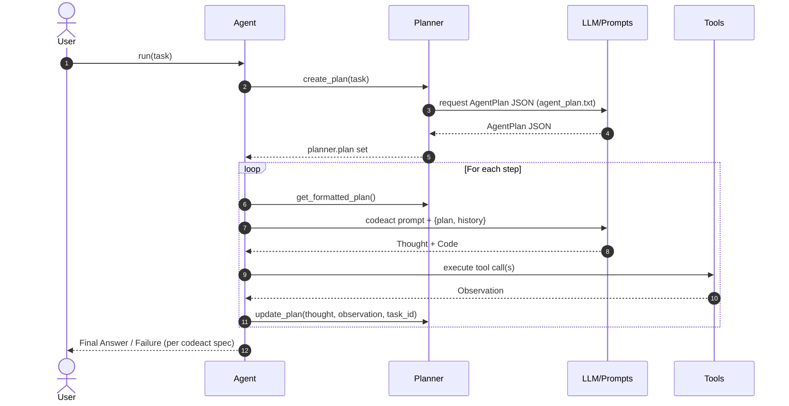

# 🤖 KodeAgent

KodeAgent: A minimalistic approach to building AI agents.


## ✅ Why KodeAgent?

Here are some reasons why you should use KodeAgent:

- **Framework-less**: Unlike some heavy agentic frameworks, KodeAgent stays lightweight, making it easy to integrate and extend.
- **Learn-first design**: Helps developers understand agent-building from scratch.
- **Multimodal**: Supports both text and images in the inputs. 

Written in about 2000 lines (excluding the prompts), KodeAgent comes with built-in ReAct and CodeAct agents. Or you can create your own agent by subclassing `Agent`.

A key motivation beyond KodeAgent is also to teach building agentic frameworks from scratch. KodeAgent introduces a few primitives and code flows that should help you to get an idea about how such frameworks typically work. 


## ✋ Why Not?

Also, here are a few reasons why you shouldn't use KodeAgent:

- KodeAgent is actively evolving, meaning some aspects may change.
- The first priority is simplicity; optimization is secondary.
- You already use some of the well-known frameworks or want to use them.


## 👨‍💻 Usage

Clone the KodeAgent GitHub repository locally:
```bash
git clone https://github.com/barun-saha/kodeagent.git
```

Next, create a virtual environment if you do not have one already and activate it:
```bash
python -m venv venv
source venv/bin/activate
# venv\Scripts\activate.bat  # Windows
```

KodeAgent has only a few direct dependencies. Install them as follows:
```bash
pip install -r requirements.txt
```

Now, in your application code, create a ReAct agent like this:
```python
from kodeagent import ReActAgent


agent = ReActAgent(
    name='Maths agent',
    model_name='gemini/gemini-2.0-flash-lite',
    tools=[calculator],
    max_iterations=3,
)
```

Or if you want to use CodeAct agent:

```python
from kodeagent import CodeActAgent

agent = CodeActAgent(
    name='Web agent',
    model_name='gemini/gemini-2.0-flash-lite',
    tools=[search_web, extract_file_contents_as_markdown],
    run_env='e2b',
    max_iterations=3,
    allowed_imports=['re', 'requests', 'duckduckgo_search', 'markitdown'],
    pip_packages='ddgs~=9.5.2;"markitdown[all]";',
)
```

Now let your agent solve the tasks like this:
```python
for task in [
    'What is 10 + 15, raised to 2, expressed in words?',
]:
    print(f'User: {task}')

    async for response in agent.run(task):
        print_response(response)
```

That's it! Your agent should start solving the task and keep streaming the updates. For more examples, including how to provide files as inputs, see the [kodeagent.py](kodeagent.py) module.

KodeAgent uses [LiteLLM](https://github.com/BerriAI/litellm), enabling it to work with any capable LLM. Currently, KodeAgent has been tested with Gemini 2.5 Flash Lite. For advanced tasks, you can try Gemini 2.5 Pro.

LLM model names, parameters, and keys should be set as per [LiteLLM documentation](https://docs.litellm.ai/docs/set_keys). For example, add `GEMINI_API_KEY` to the `.env` to use Gemini API.

### Code Execution

`CodeActAgent` executes LLM-generated code to leverage the tools. KodeAgent currently supports two different code run environments:
- `host`: The Python code will be run on the system where you created this agent. In other words, where the application is running.
- `e2b`:  The Python code will be run on an [E2B sandbox](https://e2b.dev/). You will need an E2B API key and add to your `.env` file.

With `host` as the code running environment, no special steps are required, since it uses the current Python installation. However, with `e2b`, code (and tools) are copied to a different environment and execute. Therefore, some additional set up may be required.

For example, the Python modules that are allowed to be used in code should be explicitly specified using `allowed_imports`. In addition, any additional Python package that may need to be installed should be specified as a comma-separated list via `pip_packages`.  

KodeAgent is very much experimental. Capabilities are limited. Use with caution.


## Sequence Diagram for CodeAct Agent (via CodeRabbit)



# Run Tests

To run unit tests, use:
```bash
python -m pytest .\tests\unit -v --cov --cov-report=html
```

The current test coverage is 86%, on average.

For integration tests involving calls to APIs, use:
```bash
python -m pytest .\tests\integration -v --cov --cov-report=html
```

Gemini and E2B API keys should be set in the `.env` file for integration tests to work.

A [Kaggle notebook](https://www.kaggle.com/code/barunsaha/kodeagent-benchmark/) for benchmarking KodeAgent is also available.


## 🚀 Publishing to PyPI

This project uses [Trusted Publishing](https://docs.pypi.org/trusted-publishers/using-a-publisher/) to automatically publish to PyPI when a new release is created on GitHub. To set this up, follow these steps:

1.  **Configure Trusted Publisher on PyPI:**
    *   Log in to your PyPI account and go to the "Publishing" page for the `kodeagent` package.
    *   Add a new "Trusted Publisher" with the following settings:
        *   **Owner:** The GitHub organization or username that owns the repository (e.g., `barun-saha`).
        *   **Repository name:** `kodeagent`
        *   **Workflow name:** `publish-to-pypi.yml`

2.  **Create a New Release on GitHub:**
    *   Go to the "Releases" page in your GitHub repository and click "Draft a new release".
    *   Create a new tag for the release (e.g., `v0.0.1`).
    *   Add a title and description for the release.
    *   Click "Publish release".

Once the release is published, the GitHub Actions workflow will automatically build the package and upload it to PyPI.


## 🗺️ Roadmap & Contributions

To be updated.


## 🙏 Acknowledgement

KodeAgent heavily borrows code and ideas from different places, such as:
- [LlamaIndex](https://docs.llamaindex.ai/en/stable/examples/agent/react_agent/)
- [Smolagents](https://github.com/huggingface/smolagents/tree/main)
- [LangGraph](https://github.com/langchain-ai/langgraph)
- [Building ReAct Agents from Scratch: A Hands-On Guide using Gemini](https://medium.com/google-cloud/building-react-agents-from-scratch-a-hands-on-guide-using-gemini-ffe4621d90ae)
- [LangGraph Tutorial: Build Your Own AI Coding Agent](https://medium.com/@mariumaslam499/build-your-own-ai-coding-agent-with-langgraph-040644343e73)
