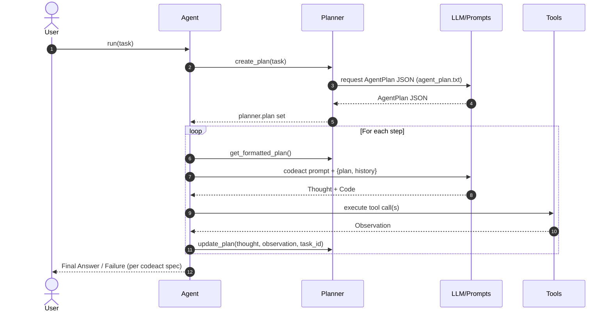

# 🤖 KodeAgent

KodeAgent: A minimalistic approach to building AI agents.


## ✅ Why KodeAgent?

Here are some reasons why you should use KodeAgent:

- **Framework-less**: Unlike some heavy agentic frameworks, KodeAgent is lightweight, making it easy to integrate and extend.
- **Learn-first design**: Helps developers understand agent-building from scratch, focusing on the agent loop and various data structures.
- **Multimodal**: Supports both text and images in the inputs. 

Written in about 2000 lines (excluding the prompts), KodeAgent comes with built-in [ReAct](https://arxiv.org/abs/2210.03629) and [CodeAct](https://arxiv.org/abs/2402.01030) agents. Or you can create your own agent by subclassing `Agent`. The ReAct and CodeAct agents are supported by `Planner` and `Observer`.

A key motivation beyond KodeAgent is also to teach building agent-like frameworks from scratch. KodeAgent introduces a few primitives and code flows that should help you to get an idea about how such frameworks typically work.

KodeAgent is stateless. It is generally suitable for use as part of larger systems to execute specific tasks.


## ✋ Why Not?

Also, here are a few reasons why you shouldn't use KodeAgent:

- KodeAgent is actively evolving, meaning some aspects may change.
- The priority of KodeAgent is simplicity; optimization is secondary.
- You want to use some of the well-known frameworks.


## 👨‍💻 Usage

Install [KodeAgent](https://pypi.org/project/kodeagent/) via pip:
```bash
pip install kodeagent
```

Or if you want to clone the KodeAgent GitHub repository locally and run from there, use:
```bash
git clone https://github.com/barun-saha/kodeagent.git

python -m venv venv
source venv/bin/activate
# venv\Scripts\activate.bat  # Windows

pip install -r requirements.txt
```

Now, in your application code, create a ReAct agent like and run a task using the agent like this:
```python
from kodeagent import ReActAgent, calculator, print_response


agent = ReActAgent(
    name='Maths agent',
    model_name='gemini/gemini-2.0-flash-lite',
    tools=[calculator],
    max_iterations=3,
)

for task in [
    'What is 10 + 15, raised to 2, expressed in words?',
]:
    print(f'User: {task}')

    async for response in agent.run(task):
        print_response(response)
```

Or if you want to use CodeAct agent:

```python
from kodeagent import CodeActAgent, search_web, extract_file_contents_as_markdown


agent = CodeActAgent(
    name='Web agent',
    model_name='gemini/gemini-2.0-flash-lite',
    tools=[search_web, extract_file_contents_as_markdown],
    run_env='host',
    max_iterations=5,
    allowed_imports=['re', 'requests', 'duckduckgo_search', 'markitdown'],
    pip_packages='ddgs~=9.5.2;"markitdown[all]";',
)
```

That's it! Your agent should start solving the task and keep streaming the updates. For more examples, including how to provide files as inputs, see the [kodeagent.py](kodeagent.py) module.

KodeAgent uses [LiteLLM](https://github.com/BerriAI/litellm), enabling it to work with any capable LLM. Currently, KodeAgent has been tested with Gemini 2.5 Flash Lite. For advanced tasks, you can try Gemini 2.5 Pro.

LLM model names, parameters, and keys should be set as per [LiteLLM documentation](https://docs.litellm.ai/docs/set_keys). For example, add `GEMINI_API_KEY` to the `.env` to use Gemini API.

### Code Execution

`CodeActAgent` executes LLM-generated code to leverage the tools. KodeAgent currently supports two different code run environments:
- `host`: The Python code will be run on the system where you created this agent. In other words, where the application is running.
- `e2b`:  The Python code will be run on an [E2B sandbox](https://e2b.dev/). You will need an E2B API key and add to your `.env` file.

With `host` as the code running environment, no special steps are required, since it uses the current Python installation. However, with `e2b`, code (and tools) are copied to a different environment and execute. Therefore, some additional set up may be required.

For example, the Python modules that are allowed to be used in code should be explicitly specified using `allowed_imports`. In addition, any additional Python package that may need to be installed should be specified as a comma-separated list via `pip_packages`.  

KodeAgent is very much experimental. Capabilities are limited. Use with caution.


## Sequence Diagram for CodeAct Agent (via CodeRabbit)



# Run Tests

To run unit tests, use:
```bash
python -m pytest .\tests\unit -v --cov --cov-report=html
```

The current test coverage is 86%, on average.

For integration tests involving calls to APIs, use:
```bash
python -m pytest .\tests\integration -v --cov --cov-report=html
```

Gemini and E2B API keys should be set in the `.env` file for integration tests to work.

A [Kaggle notebook](https://www.kaggle.com/code/barunsaha/kodeagent-benchmark/) for benchmarking KodeAgent is also available.


## 🗺️ Roadmap & Contributions

To be updated.


## 🙏 Acknowledgement

KodeAgent heavily borrows code and ideas from different places, such as:
- [LlamaIndex](https://docs.llamaindex.ai/en/stable/examples/agent/react_agent/)
- [Smolagents](https://github.com/huggingface/smolagents/tree/main)
- [LangGraph](https://github.com/langchain-ai/langgraph)
- [Building ReAct Agents from Scratch: A Hands-On Guide using Gemini](https://medium.com/google-cloud/building-react-agents-from-scratch-a-hands-on-guide-using-gemini-ffe4621d90ae)
- [LangGraph Tutorial: Build Your Own AI Coding Agent](https://medium.com/@mariumaslam499/build-your-own-ai-coding-agent-with-langgraph-040644343e73)
