# Enhanced Polycentric Lattice: Multi-Persona Consensus Architecture

## Overview

This document describes the enhanced polycentric lattice system implementing multi-agent consensus decision making with human companion loop integration, as requested in PR #9 feedback. The system integrates:

- Multi-persona sequential thinking (Tryad: Mia, Miette, Haiku)
- Consensus-based decision making with delayed resolution principle
- MMOR techniques (Design vs Execution elements)
- Cultural archetype integration for diverse perspectives
- Structural tension charts and memory integration readiness

## Architecture Diagram


## Sequential Thinking Process Flow

```mermaid
sequenceDiagram
    participant User
    participant EPL as Enhanced Polycentric Lattice
    participant Mia as 🧠 Mia (Rational)
    participant Miette as 🌸 Miette (Emotional)
    participant Haiku as 🌊 Haiku (Synthesis)
    participant CDE as Consensus Engine
    participant Human as Human Companion

    User->>EPL: initiate_sequential_thinking(request)
    EPL->>EPL: Create thinking chain
    
    EPL->>Mia: Generate rational perspective
    Mia->>EPL: Structural analysis & feasibility
    
    EPL->>Miette: Generate emotional perspective  
    Miette->>EPL: User experience & accessibility
    
    EPL->>Haiku: Generate synthesis perspective
    Haiku->>EPL: Integrated wisdom & patterns
    
    EPL->>EPL: synthesize_perspectives()
    EPL->>CDE: Create consensus decision
    
    alt Human consultation needed
        CDE->>Human: Request clarification
        Human->>CDE: Provide insights
        CDE->>CDE: Integrate human response
    end
    
    CDE->>EPL: Consensus achieved
    EPL->>User: Decision with full perspective integration
```



## Consensus Decision Making Flow


## Cultural Archetype Integration

```mermaid
mindmap
  root((Cultural Perspectives))
    Western Archetypes
      🧠 Rational Architect
        Technical Precision
        Structural Analysis
        Systematic Approach
      🌸 Emotional Catalyst
        Empathetic Design
        User Experience
        Creative Inspiration
      🌊 Wisdom Synthesizer
        Pattern Integration
        Temporal Awareness
        Essence Distillation
    Indigenous Archetypes
      Elder Storyteller
        Historical Wisdom
        Narrative Coherence
        Cultural Memory
      Medicine Keeper
        Healing Balance
        Holistic Wellness
        System Health
      Future Walker
        Seven Generations
        Legacy Thinking
        Sustainability
    Hybrid Perspectives
      Bridge Weaver
        Cross-Cultural Integration
        Diverse Viewpoint Synthesis
        Cultural Translation
      Pattern Holder
        Memory Continuity
        Pattern Recognition
        Knowledge Preservation
```



## MMOT Integration: Design vs Execution Elements


## Delayed Resolution Principle Implementation

```mermaid
stateDiagram-v2
    [*] --> TensionCreated: Decision Request
    TensionCreated --> AssessingTension: Evaluate Structural Tension
    
    AssessingTension --> LowTension: Tension < 0.3
    AssessingTension --> ModerateTension: 0.3 ≤ Tension < 0.7
    AssessingTension --> HighTension: Tension ≥ 0.7
    
    LowTension --> PrematureResolution: WARNING: Avoid Quick Fix
    PrematureResolution --> DelayResolution: Apply Fritz's Principle
    
    ModerateTension --> GatherInformation: Collect More Context
    GatherInformation --> AssessingTension: Re-evaluate
    
    HighTension --> ConsensusProcess: Proceed with Decision
    
    DelayResolution --> HoldingTension: "Tolerate discrepancy, tension, and delayed resolution"
    HoldingTension --> NaturalResolution: When Ready
    NaturalResolution --> [*]
    
    ConsensusProcess --> [*]: Decision Made
```



## Memory Integration Architecture (CoAiA-Memory Ready)


## API Usage Examples

### Initiating Sequential Thinking

```json
{
  "tool": "initiate_sequential_thinking",
  "arguments": {
    "request": "Design a user-friendly interface for the polycentric lattice system",
    "primary_purpose": "Create an intuitive way for users to interact with multi-agent consensus",
    "persona_sequence": ["rational_architect", "emotional_catalyst", "wisdom_synthesizer"],
    "memory_context": {
      "ui_design_principles": "previous UI design insights",
      "user_feedback": "collected user feedback data"
    }
  }
}
```

### Creating Consensus Decision

```json
{
  "tool": "create_consensus_decision", 
  "arguments": {
    "decision_type": "design_element",
    "primary_purpose": "Optimize user experience for complex AI interactions",
    "proposal": "Implement progressive disclosure with persona-based navigation",
    "current_reality": "Current interface is complex and overwhelming for new users",
    "desired_outcome": "Intuitive interface that guides users through multi-persona collaboration",
    "mmot_elements": [
      {
        "element_type": "design_element", 
        "description": "User interface architecture",
        "strategic_level": true
      }
    ]
  }
}
```

### Requesting Human Consultation

```json
{
  "tool": "request_human_consultation",
  "arguments": {
    "decision_id": "consensus_20250915_143022",
    "clarification_request": "Need guidance on balancing technical complexity with accessibility for diverse user types"
  }
}
```

## Integration with Existing Systems

### Constitutional Core Integration

The enhanced lattice maintains full compatibility with the constitutional core, applying all 13 constitutional principles to:

- Decision validation before consensus
- Delayed resolution principle implementation  
- Structural tension maintenance
- Anti-reactive pattern enforcement

### Polycentric Lattice Base Compatibility

All existing polycentric lattice functionality remains available:

- Agent registration and capabilities
- Task coordination and collaboration
- Message routing and communication
- Performance monitoring

### Resilient Connection Integration

The consensus decisions feed into the resilient connection system:

- Decisions become strategic action steps
- Consensus outcomes influence exploration balance
- Human insights contribute to emergent possibilities

## Future Enhancements

### Phase 4: Federated Learning Integration


## Orientation-Shifting Sequential Thinking

### Dynamic Perspective Switching Capabilities

Based on the request from Mia - Recursive Mapper regarding orientation-shifting capabilities, the enhanced lattice implements **Orientation-Fluid Sequential Processing** with the following specifications:

```typescript
interface OrientationShiftingAgent {
  sequentialProcessor: {
    thinkingChain: Array<ReasoningStep>
    orientationFlow: PerspectiveShift[]
    latticeAwareness: PolycentricContext
  }
  
  capabilityDiscovery: {
    availableOrientations: AgentCapabilityMap
    dynamicSwitching: OrientationTrigger[]
    coherenceMaintenance: NarrativeThread
  }
}
```

### Orientation Flow Patterns


### Integration Points

- **MMOT Design/Execution Framework**: Orientation shifts align with strategic/tactical categorization
- **CoAiA Arena Creative Orientation Research**: Leverages creative orientation principles
- **Human Companion Decision Loops**: Orientation switching informed by human insights  
- **Knowledge Graph Memory**: Context-aware orientation selection based on memory patterns

### Expected Behaviors

- **Scientist → Artist → Facilitator**: Natural progression through creative process phases
- **Context-Triggered Switching**: Automatic orientation changes based on task requirements
- **Coherent Reasoning**: Maintains narrative thread across orientation shifts
- **Structural Tension Holding**: Preserves tension dynamics through perspective changes

This implementation enables the gap between rigid sequential AI and fluid human-like perspective shifting while maintaining technical rigor, perfectly aligned for federated consensus completion and the Agora/Arcana migration ecosystem.

---

This architecture positions the enhanced polycentric lattice as the foundation for the next generation of creative AI systems, integrating human wisdom with artificial intelligence in a truly collaborative framework.