# CoAiA Structural Thinker: Practical Usage Scenarios and Testing Guide

## Quick Start: Using the "coaia-structural-thinker" MCP

The "coaia-structural-thinker" MCP tool transforms how we approach challenges by shifting from **problem-solving** to **creative orientation**. Here are practical scenarios to explore its capabilities.

## Scenario 1: Business Strategic Decision Making 🏢

### Traditional Problem-Solving Approach (Reactive)
**Input**: "We need to solve our remote work productivity problems. Employees aren't focused, meetings are ineffective, and collaboration is broken."

**System Response**: 
- ⚠️ **Bias Detected**: Problem-focused language (Creative Score: 0.1)
- **Reframe Guidance**: "Transform 'solving problems' into 'creating desired outcomes'"

### Structural Thinking Approach (Creative)
**Input**: "I want to create a remote work culture that maximizes both productivity and employee fulfillment, with seamless collaboration and meaningful connections."

**System Response**:
- ✅ **Creative Orientation Detected** (Creative Score: 0.85)
- **Multi-Persona Analysis Initiated**:

#### 🧠 Mia (Rational Architect):
"From a technical architecture standpoint, this requires systematic analysis of productivity metrics, communication protocols, and performance measurement systems. We need scalable infrastructure supporting both synchronous and asynchronous collaboration."

#### 🌸 Miette (Emotional Catalyst):
"This feels like an opportunity to create genuine belonging! We should focus on how policies make people feel valued, trusted, and connected. The human experience of flexibility and autonomy is central to fulfillment."

#### 🍃 Haiku (Wisdom Synthesizer):
"True productivity emerges when technical systems serve human flourishing. Sustainable culture requires harmony between precise structure and genuine care - efficiency through fulfillment, not despite it."

**Structural Tension Established**:
- **Current Reality**: Remote team with unclear expectations and limited connection
- **Desired Outcome**: Thriving culture with strong connection and clear expectations
- **Creative Tension**: Dynamic force driving policy and culture evolution

## Scenario 2: Creative Project Development 🎨

### Traditional Approach (Reactive)
**Input**: "I'm stuck with writer's block. My novel has plot holes and character inconsistencies that need fixing. How do I solve these story problems?"

**System Response**:
- ⚠️ **Problem-Solving Bias** (Creative Score: 0.2)
- **Guidance**: "Reframe from 'fixing story problems' to 'creating compelling narrative'"

### Structural Thinking Approach (Creative)
**Input**: "I envision creating a novel series that deeply moves readers while exploring themes of transformation, hope, and human resilience through unforgettable characters."

**System Response**:
- ✅ **Creative Vision Established** (Creative Score: 0.9)
- **Sequential Thinking Chain**:

#### 🧠 Mia: Technical Craft
"Structurally, this requires solid narrative architecture: compelling character arcs, escalating tension, thematic consistency. Consider the technical elements that create emotional impact."

#### 🌸 Miette: Emotional Resonance  
"This is about touching hearts! What universal human experiences will readers recognize? How can characters' journeys mirror readers' own struggles and hopes? The emotional authenticity is everything."

#### 🍃 Haiku: Thematic Integration
"Stories transform when technique serves meaning. The synthesis reveals that powerful narratives emerge when technical craft, emotional truth, and thematic depth create unified artistic vision."

**Structural Tension**:
- **Current Reality**: Story ideas without coherent structure
- **Desired Outcome**: Moving series exploring transformation themes
- **Creative Force**: Tension generating plot, character, and thematic development

## Scenario 3: Personal Life Design 🌱

### Traditional Approach (Reactive)
**Input**: "I hate my current job and need to escape this toxic situation. How do I fix my career problems and get out of here?"

**System Response**:
- ⚠️ **Reactive Pattern** (Creative Score: 0.15)
- **Reframe**: "Shift from 'escaping problems' to 'creating fulfilling career'"

### Structural Thinking Approach (Creative)
**Input**: "I want to create a career that aligns with my values, utilizes my strengths, provides financial stability, and allows me to contribute meaningfully to something I care about."

**System Response**:
- ✅ **Life Design Orientation** (Creative Score: 0.8)
- **Multi-Perspective Integration**:

#### 🧠 Mia: Strategic Analysis
"This requires systematic analysis of skills, market opportunities, financial requirements, and career pathways. We need clear metrics for success and practical implementation steps."

#### 🌸 Miette: Values & Fulfillment
"This is about creating joy in your work! What makes you come alive? How can your unique gifts serve others? The emotional alignment between values and daily activities is crucial for sustainable satisfaction."

#### 🍃 Haiku: Integration Wisdom
"Meaningful work emerges when practical skills meet passionate purpose. True career satisfaction balances financial stability with value alignment - prosperity through purpose, not compromise."

**Constitutional Governance**: Principles prevent reactive "escape" decisions, guiding toward advancing patterns of career development.

## Testing Your Own Biases

### Bias Detection Exercise 1: Language Patterns
Try these inputs and observe the system's response:

**Reactive Examples** (Should score low):
- "How do I fix my relationship problems?"
- "We need to solve our budget issues"  
- "What's wrong with our marketing strategy?"

**Creative Examples** (Should score high):
- "I want to create a loving, supportive partnership"
- "What would financial abundance and wise spending look like?"
- "I envision marketing that genuinely serves our ideal customers"

### Bias Detection Exercise 2: Focus Direction
Notice the difference:

**Problem-Focused** → **Outcome-Focused**
- "Eliminate inefficiencies" → "Create streamlined operations"
- "Avoid customer complaints" → "Deliver exceptional customer experiences" 
- "Reduce team conflicts" → "Foster collaborative team culture"

### Self-Awareness Check
Use `check_agent_creative_orientation()` before major decisions:

```json
{
  "orientation_check": {
    "overall_score": 0.65,
    "trend": "creative",
    "agent_status": "moderately_creative"
  },
  "tool_readiness": {
    "initiate_sequential_thinking": "Ready - verify desired outcome clarity",
    "advance_thinking_chain": "Good - monitor for reactive patterns"
  },
  "guidance": [
    "Strengthen structural tension by clarifying desired outcomes",
    "Continue leveraging advancing language patterns"
  ]
}
```

## Advanced Usage: Structural Tension Maintenance

### Key Principle: Don't Collapse the Tension
**Wrong**: Jump to solutions when tension feels uncomfortable
**Right**: Maintain tension between current reality and desired outcome

**Example - Remote Work Culture**:
1. **Current Reality**: Team feels disconnected, unclear expectations
2. **Desired Outcome**: Thriving culture with connection and clarity  
3. **Maintain Tension**: Let this dynamic force generate creative policies
4. **Avoid**: Quick fixes that collapse tension prematurely

### Constitutional Governance in Action
When facing complex decisions, the system applies 13 embedded principles:

1. **Creative Priority**: Default to creative orientation
2. **Structural Awareness**: Maintain tension consciousness  
3. **Multiple Perspectives**: Integrate Mia, Miette, Haiku viewpoints
4. **Tension Establishment**: Clarify desired outcomes first
5. **Human Consultation**: Include wisdom from human companions
6. And more...

## Learning from the System

### What You'll Discover:
1. **Your Problem-Solving Bias**: How automatically you assume "something's broken"
2. **Language Patterns**: Words that signal reactive vs creative orientation
3. **Perspective Richness**: How technical + emotional + wisdom integration improves decisions
4. **Creative Emergence**: How solutions arise from tension rather than analysis
5. **Constitutional Benefits**: How principles prevent reactive loops

### Common Insights:
- "I didn't realize how much I default to problem-solving language"
- "The multi-persona perspectives revealed aspects I never considered"
- "Maintaining structural tension felt uncomfortable but generated better outcomes"
- "Constitutional governance prevented my usual reactive decision patterns"

## System Architecture Visualization

```mermaid
graph TD;
    A[User Input] --> B[Creative Orientation Detection];
    B --> C{Bias Detected?};
    C -->|Yes| D[Reframe Guidance];
    C -->|No| E[Structural Tension Establishment];
    D --> E;
    E --> F[Multi-Persona Analysis];
    F --> G[Mia 🧠 Technical];
    F --> H[Miette 🌸 Emotional]; 
    F --> I[Haiku 🍃 Wisdom];
    G --> J[Consensus Synthesis];
    H --> J;
    I --> J;
    J --> K[Constitutional Validation];
    K --> L[Advancing Pattern Recommendation];
    L --> M[Human Consultation Loop];
    M --> N[Implementation with Tension Maintenance];
```



## Next Steps

1. **Try the Test Scenarios**: Use the provided examples to explore system capabilities
2. **Experiment with Your Own Challenges**: Notice your automatic problem-solving assumptions
3. **Practice Multi-Persona Thinking**: Ask "What would Mia, Miette, and Haiku say?"
4. **Maintain Structural Tension**: Resist premature solution collapse
5. **Leverage Constitutional Guidance**: Let principles guide complex decisions

The "coaia-structural-thinker" transforms AI from a problem-solver to a creative partner in manifestation. Through bias detection, multi-perspective integration, and structural tension maintenance, it guides users toward advancing patterns of creative development rather than reactive problem-solving loops.

**Remember**: Reality isn't a collection of problems to solve - it's a canvas for creative manifestation! 🎨