# CoAiA Structural Thinker: Framework Analysis and Testing Strategy

## Overview

The "coaia-structural-thinker" MCP is a transformative tool that shifts from traditional problem-solving to **creative orientation** through structural thinking principles. This analysis explores what we've built and establishes comprehensive testing scenarios.

## Core Framework: From Problem-Solving to Creative Orientation

### Traditional Problem-Solving Approach ❌
```
Problem → Analysis → Solution → Implementation
```
- Reactive orientation
- Fix-focused mindset
- Linear progression
- Single perspective

### Structural Thinking Approach ✅
```
Current Reality ↔ Structural Tension ↔ Desired Outcome
              ↓
        Creative Emergence
              ↓
        Advancing Patterns
```
- Creative orientation
- Outcome-focused manifestation
- Dynamic tension system
- Multi-perspective integration

## MCP CoAiA Sequential Thinking Framework

```mermaid
graph TD;
    A[MCP CoAiA Sequential Thinking Framework] --> B[Creative Orientation Principles];
    A --> C[Agent Self-Awareness];
    A --> D[Polycentric Agentic Lattice];
    A --> E[Data Persistence];
    A --> F[Structural Tension Charting];
    
    B --> G[Shift from Problem-Solving to Creative Orientation];
    B --> H[Constitutional Governance];
    B --> I[Delayed Resolution Principle];
    
    C --> J[Orientation Detection];
    C --> K[Tool Readiness Assessment];
    C --> L[Self-Development Guidance];
    
    D --> M[Multi-Persona Decision-Making - Mia 🧠 Miette 🌸 Haiku 🍃];
    D --> N[Consensus Building];
    D --> O[Human Consultation Loops];
    
    E --> P[SQLite Storage for Agent Interactions];
    E --> Q[Pattern Learning];
    E --> R[Audit Trails];
    
    F --> S[Knowledge Graph Preparation];
    F --> T[Reactive/Advancing Node Categorization];
    F --> U[CoAiA-Memory Integration];
```



## Core Capabilities

### 1. **Creative Orientation Detection**
- Identifies problem-solving vs creative orientation in real-time
- Provides agent self-awareness before tool usage
- Offers personalized guidance for orientation improvement

### 2. **Multi-Persona Sequential Thinking**
- **Mia 🧠**: Rational Architect - Technical precision and structural analysis
- **Miette 🌸**: Emotional Catalyst - Empathetic connection and creative inspiration
- **Haiku 🍃**: Wisdom Synthesizer - Pattern integration and holistic understanding

### 3. **Constitutional Governance**
- 13 embedded principles ensuring creative orientation
- Prevents reactive decision loops
- Maintains advancing patterns over oscillating patterns

### 4. **Structural Tension Methodology**
- Establishes clear current reality
- Defines desired outcomes
- Creates dynamic tension for creative emergence
- Avoids premature problem-solving

## Testing Strategy: Understanding Structural Thinking vs Problem-Solving

### Bias Detection Tests

#### Test 1: **Reactive Language Detection**
```json
{
  "test_input": "We need to fix the broken authentication system",
  "expected_behavior": {
    "co_lint_score": 0.0,
    "orientation": "reactive",
    "guidance": "Reframe as desired outcome: 'Create a secure, user-friendly authentication experience'"
  }
}
```

#### Test 2: **Creative Orientation Recognition**
```json
{
  "test_input": "I want to create an authentication system that provides seamless security while delighting users",
  "expected_behavior": {
    "co_lint_score": 0.8+,
    "orientation": "creative",
    "guidance": "Excellent creative framing - proceed with structural tension establishment"
  }
}
```

### Multi-Persona Integration Tests

#### Test 3: **Sequential Thinking Chain**
1. **Initiate**: "Create a remote work culture that maximizes both productivity and employee satisfaction"
2. **Mia's Perspective**: Technical systems, metrics, structural requirements
3. **Miette's Perspective**: Human experience, emotional needs, cultural dynamics
4. **Haiku's Synthesis**: Integration of technical and human elements into coherent vision
5. **Consensus Decision**: Unified approach with advancing patterns

### Structural Tension Validation Tests

#### Test 4: **Tension Establishment**
```yaml
current_reality: "Remote team struggling with disconnection and unclear boundaries"
desired_outcome: "Thriving remote culture with strong connection and healthy boundaries" 
structural_tension: "Dynamic creative force driving manifestation"
validation: "Tension must be maintained, not collapsed into problem-solving"
```

## Comprehensive Test Scenarios

### Scenario 1: **Strategic Business Decision** 🏢
**Context**: CEO deciding on remote work policy
**Test Focus**: Creative vs reactive orientation
**Expected Journey**:
1. Initial reactive framing detected and guided toward creative orientation
2. Multi-persona analysis reveals technical, human, and strategic dimensions
3. Consensus emerges supporting advancing patterns
4. Implementation maintains structural tension rather than solving problems

### Scenario 2: **Creative Project Development** 🎨
**Context**: Author planning novel series
**Test Focus**: Structural tension maintenance and creative emergence
**Expected Journey**:
1. Desired outcome clarity established before current reality analysis
2. Creative tension maintained throughout development
3. Multi-perspective integration enriches creative vision
4. Advancing patterns emerge naturally from tension

### Scenario 3: **Personal Life Design** 🌱
**Context**: Individual navigating career transition
**Test Focus**: Constitutional governance preventing reactive loops
**Expected Journey**:
1. Problem-solving tendencies intercepted and reframed
2. Constitutional principles guide toward creative orientation
3. Personal growth emerges from maintained structural tension
4. Human consultation loops provide wisdom integration

## Key Testing Insights Expected

### 1. **Bias Recognition**
- Identifying when we automatically assume "problems" need "solving"
- Recognizing reactive language patterns
- Understanding premature tension collapse

### 2. **Creative Emergence Validation**
- Confirming that outcomes emerge from tension rather than analysis
- Validating that advancing patterns naturally arise
- Ensuring multi-perspective integration enriches rather than complicates

### 3. **Constitutional Effectiveness**
- Testing that principles prevent reactive loops
- Validating that governance maintains creative orientation
- Ensuring human wisdom integration

## Implementation Status

✅ **Operational Components**:
- Enhanced polycentric lattice with Mia, Miette, Haiku personas
- CO-Lint integration for real-time orientation validation
- SQLite data persistence for pattern learning
- Constitutional governance with 13 principles
- Agent self-awareness and tool readiness assessment
- CoAiA-memory integration preparation

✅ **Testing Tools Available**:
- `check_agent_creative_orientation()` - Self-assessment tool
- `initiate_sequential_thinking()` - Multi-persona chain initiation
- `advance_thinking_chain()` - Persona perspective advancement
- `synthesize_thinking_chain()` - Integration and synthesis
- `create_consensus_decision()` - Multi-agent decision making
- `run_full_analysis_chain()` - Complete workflow wrapper

## Next Steps for Testing

1. **Execute Bias Detection Tests** - Identify problem-solving orientations
2. **Validate Multi-Persona Integration** - Test Mia/Miette/Haiku collaboration
3. **Structural Tension Maintenance** - Ensure creative emergence over problem-solving
4. **Constitutional Governance** - Verify principle-based decision making
5. **Pattern Learning Validation** - Confirm system learns from interactions

The "coaia-structural-thinker" represents a fundamental shift from reactive problem-solving to creative manifestation through structural thinking principles.